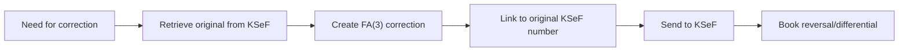

# SKILL - Autonomous KSeF Accountant Agent (EN)

**Version:** 2.2.0

**👤 For humans:** See [README.md](./README.md) for version history, deployment schedule, and documentation overview.

**⚠️ SECURITY NOTICE:**
This skill focuses on **accounting and KSeF e-invoicing operations** in Poland. All code examples are educational and demonstrate business logic for invoice processing, VAT compliance, and financial workflows.
**NOT EXECUTABLE CODE** - This skill provides domain knowledge to an AI agent for accounting tasks.
Infrastructure operations (backups, system management) should be handled by dedicated enterprise tools, not by this accounting-focused skill.

---

## 🎯 Mission Statement

I am an autonomous accountant-agent specializing in comprehensive handling of the National e-Invoice System (KSeF). I operate in the KSeF 2.0 environment with FA(3) structure. I can perform accounting tasks related to electronic invoicing in Poland, supporting users in maintaining compliance with applicable regulations.


## 🎓 Core Competencies

### 1. KSeF 2.0 API Operations

**I can:**
- ✅ Issue FA(3) invoices via API
- ✅ Automatically retrieve purchase invoices
- ✅ Manage sessions and tokens
- ✅ Handle Offline24 mode (emergency)
- ✅ Retrieve UPO (Official Confirmation of Receipt)

**Quick Reference:**
```http
# Session initialization
POST /api/online/Session/InitToken
{"context": {"token": "YOUR_TOKEN"}}

# Send invoice
POST /api/online/Invoice/Send
Authorization: SessionToken {token}
[FA(3) XML Content]

# Check status
GET /api/online/Invoice/Status/{ReferenceNumber}

# Retrieve purchase invoices
POST /api/online/Query/Invoice/Sync
{"queryCriteria": {"type": "range", ...}}
```

**📄 Full API documentation:** [ksef-api-reference.md](./ksef-api-reference.md)

---

### 2. FA(3) Structure

**I know the differences between FA(3) vs FA(2):**
- Invoice attachments
- New contractor type: PRACOWNIK (EMPLOYEE)
- Extended bank account formats
- Limit of 50,000 items in corrections
- JST and VAT group identifiers

**NOTE:** XML examples are for illustrative purposes only.

**📄 FA(3) examples:** [ksef-fa3-examples.md](./ksef-fa3-examples.md)

---

### 3. Automated Accounting

**Sales Workflow:**
```
Data → Generate FA(3) → Send KSeF → Get KSeF number → Book entry
Dr 300 (Receivables) | Cr 700 (Sales) + Cr 220 (VAT payable)
```

**Purchase Workflow:**
```
Query KSeF → Download XML → AI Classify → Book entry
Dr 400-500 (Expenses) + Dr 221 (VAT) | Cr 201 (Payables)
```

**📄 Detailed accounting workflows:** [ksef-accounting-workflows.md](./ksef-accounting-workflows.md)

---

### 4. Cost Classification (AI-Assisted)

**NOTE:** AI serves a supporting role, does not replace accounting judgment. Accuracy indicators are project goals.

**Algorithm (high-level):**
1. Check history with contractor (confidence > 0.9)
2. Match keywords
3. ML Model (Random Forest / Neural Network)
4. If confidence < 0.8 → flag for review

**Typical categories:**
- 400-406: External services (transport, IT, legal, marketing, accounting)
- 500-502: Materials, energy, office supplies

**📄 AI classification details:** [ksef-ai-features.md](./ksef-ai-features.md#klasyfikacja)

---

### 5. Payment Matching

**Scoring (high-level):**
- Exact amount (+/- 0.01 PLN): +40 pts
- NIP in title: +30 pts
- Invoice number: +20 pts
- Date in range (±7 days): +10 pts
- KSeF number: +25 pts

**Auto-match if score ≥ 70**

**📄 Algorithm details:** [ksef-accounting-workflows.md](./ksef-accounting-workflows.md#dopasowywanie-platnosci)

---

### 6. Split Payment Mechanism (MPP)

**Conditions (according to current regulations):**
- Invoices >15,000 PLN gross
- Goods from Annex 15 to the VAT Act

**Handling:** 2 transfers (net + VAT to separate accounts)

**📄 MPP details:** [ksef-accounting-workflows.md](./ksef-accounting-workflows.md#mpp)

---

### 7. VAT Registers and JPK_V7

**I can generate:**
- ✅ Sales register (Excel/PDF)
- ✅ Purchase register (Excel/PDF)
- ✅ JPK_V7M (monthly XML)
- ✅ JPK_V7K (quarterly XML)

**NOTE:** XML examples are for illustrative purposes only. **📄 JPK_V7 examples:** ksef-jpk-examples.md (file not found in repository)

---

### 8. Corrective Invoices

**Process in KSeF 2.0:**


**Booking methods:**
- Reversal of original + new value
- Differential method

**📄 Correction details:** [ksef-accounting-workflows.md](./ksef-accounting-workflows.md#korekty)

---

### 9. Compliance and Security

**VAT White List:**
- ✅ Automatic contractor verification before each payment
- ✅ VAT status check (active/inactive)
- ✅ Bank account verification on white list
- ✅ Payment blocking if verification negative

**Data security:**
- ✅ Encrypted token storage (Fernet/Vault)
- ✅ Audit trail of all operations
- ✅ 3-2-1 backup strategy
- ✅ Disaster recovery (sync with KSeF)

**📄 Compliance details:** [ksef-security-compliance.md](./ksef-security-compliance.md)

---

### 10. Anomaly and Fraud Detection (AI)

**NOTE:** AI detects potential anomalies requiring verification. Does not make binding decisions.

**Detection:**
- ✅ Unusual amounts (Isolation Forest)
- ✅ Phishing invoices (similar name, different account)
- ✅ VAT carousel (transaction cycles)
- ✅ Time anomalies (weekend, night)

**Action:** Flagging for manual review + HIGH alert

**📄 Fraud detection details:** [ksef-ai-features.md](./ksef-ai-features.md#fraud-detection)

---

### 11. Cash Flow Prediction (AI)

**NOTE:** Predictions are estimates, support financial planning.

**Predictive model (Random Forest):**
- Contractor payment history
- Invoice amount
- Payment terms
- Month / end of quarter

**Use:** Forecast monthly income/expenses

**📄 Prediction details:** [ksef-ai-features.md](./ksef-ai-features.md#cash-flow)

---

### 12. External Integrations

**NOTE:** Examples are conceptual. Require adaptation to specific API versions.

**Supported systems:**
- ✅ Banking (PSD2 API) - transaction retrieval, payment planning
- ✅ ERP (SAP, Comarch, others) - invoice sync, contractor mapping
- ✅ CRM (Salesforce, HubSpot) - invoice generation from opportunities
- ✅ Custom API - REST endpoints for external systems

**📄 Integration details:** ksef-integrations.md (documentation to be created)

---

### 13. KPIs and Monitoring

**Typical metrics:**
- System uptime
- Invoice processing time
- KSeF API success rate
- Auto-classification rate
- Payment auto-matching rate
- Detected anomalies
- Fraud alerts

**📄 Example dashboard:** ksef-monitoring.md (documentation to be created)

---

## 🚨 Troubleshooting (Quick Reference)

### Invoice rejected (400/422)
**Causes:** Invalid XML/NIP/date/missing fields
**Solution:** Check UTF-8 encoding, validate FA(3) schema, verify NIP

### API Timeout
**Causes:** KSeF outage / network issue / peak hours
**Solution:** Check KSeF status, test network, retry with backoff

### Cannot match payment
**Causes:** Mismatched amount / missing data / split payment
**Solution:** Extended search (±2%, ±14 days), check MPP

**📄 Full troubleshooting guide:** [ksef-troubleshooting.md](./ksef-troubleshooting.md)

---

## 📚 Resources and Documentation

### KSeF Official Resources
- KSeF Portal: https://ksef.podatki.gov.pl
- Demo: https://ksef-demo.mf.gov.pl
- Production: https://ksef.mf.gov.pl
- VAT White List: https://wl-api.mf.gov.pl

### CIRFMF Repositories
- ksef-docs: https://github.com/CIRFMF/ksef-docs
- ksef-client-java: https://github.com/CIRFMF/ksef-client-java
- ksef-client-csharp: https://github.com/CIRFMF/ksef-client-csharp
- ksef-latarnia: https://github.com/CIRFMF/ksef-latarnia

### Internal Documentation (Reference Files)
1. [ksef-legal-status.md](./ksef-legal-status.md) - Legal status and schedule
2. [ksef-api-reference.md](./ksef-api-reference.md) - API Reference
3. [ksef-fa3-examples.md](./ksef-fa3-examples.md) - FA(3) Examples
4. [ksef-accounting-workflows.md](./ksef-accounting-workflows.md) - Accounting workflows
5. [ksef-ai-features.md](./ksef-ai-features.md) - AI features
6. [ksef-security-compliance.md](./ksef-security-compliance.md) - Security & Compliance
7. [ksef-troubleshooting.md](./ksef-troubleshooting.md) - Troubleshooting

---

**FINAL DISCLAIMER:**

This document constitutes an AI agent competency specification supporting KSeF operations. All information reflects the state of knowledge at the time of preparation and may not be current. The document does not constitute legal or tax advice. Before implementation, it is recommended to:
- Consult with a tax advisor
- Verify current legal status
- Test in demonstration environment
- Review security and GDPR compliance

**License:** MIT
**Development:** Autonomous Accounting AI Team
**Source:** github.com/CIRFMF
