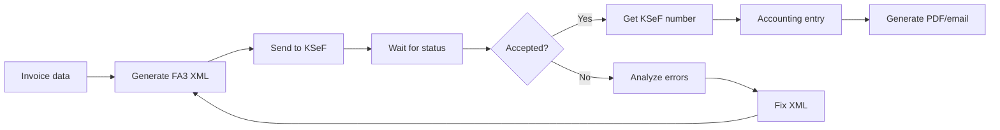
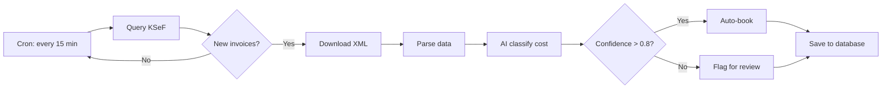
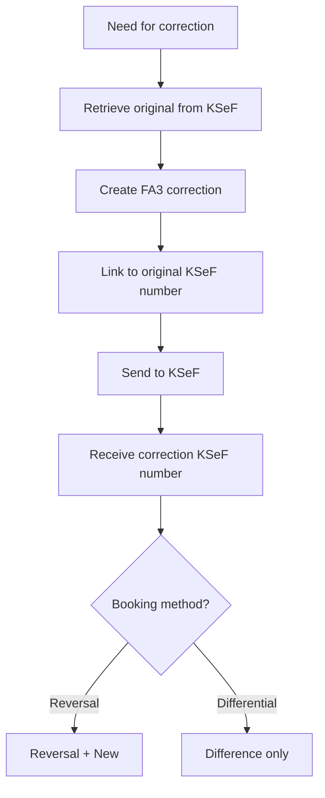

# KSeF Accounting Workflows

**NOTE:** Examples are for illustrative purposes and may require adaptation to specific business operations.

---

## Sales Invoice Workflow

### Complete Process



### Accounting Entry

**Example: Service sales invoice**
```
FV/2026/02/0008 (KSeF: 1234567890-20260208-ABCDEF1234567890-12)
Sale date: 02/08/2026
Buyer: Client Ltd. (NIP: 0987654321)

Dr 300 Receivables               12,300.00 PLN
Cr 700 Sales services            10,000.00 PLN
Cr 220 VAT payable                2,300.00 PLN

Description: Programming services - 100 hrs @ 100 PLN
```

**Example: Goods sales invoice**
```
FV/2026/02/0009 (KSeF: 1234567890-20260209-BCDEFG2345678901-13)
Sale date: 02/09/2026

Dr 300 Receivables               24,600.00 PLN
Cr 701 Sales of goods            20,000.00 PLN
Cr 220 VAT payable (23%)          4,600.00 PLN

Dr 701 Sales of goods            15,000.00 PLN
Cr 330 Cost of goods sold        15,000.00 PLN
(Inventory outflow)
```

---

## Purchase Invoice Workflow

### Complete Process



### Accounting Entry

**Example: IT service purchase**
```
PURCHASE/123/2026 (KSeF: 9876543210-20260205-ZYXWVU9876543210-01)
Receipt date: 02/05/2026
Seller: IT Solutions Ltd. (NIP: 1122334455)
Category: 402 (IT services) - AI confidence: 0.95

Dr 402 IT services                5,000.00 PLN
Dr 221 VAT receivable (23%)       1,150.00 PLN
Cr 201 Accounts payable           6,150.00 PLN

Description: Hosting and technical support - January 2026
```

**Example: Office supplies purchase**
```
PURCHASE/124/2026 (KSeF: 9876543210-20260206-ZYXWVU9876543211-02)
Category: 502 (Office supplies) - AI confidence: 0.88

Dr 502 Office supplies              500.00 PLN
Dr 221 VAT receivable (23%)         115.00 PLN
Cr 201 Accounts payable             615.00 PLN
```

---

## Payment Matching

### Scoring Algorithm

```python
def match_payment_to_invoice(payment, open_invoices):
    matches = []

    for invoice in open_invoices:
        score = 0

        # 1. Exact gross amount (+/- 0.01 PLN)
        if abs(payment.amount - invoice.total_gross) < 0.01:
            score += 40

        # 2. NIP in transfer title
        if invoice.seller_nip in payment.title.replace(' ', ''):
            score += 30

        # 3. Invoice number in title
        if invoice.number in payment.title:
            score += 20

        # 4. Date in range (payment due date +/- 7 days)
        days_diff = abs((payment.date - invoice.payment_due).days)
        if days_diff <= 7:
            score += 10 - days_diff

        # 5. KSeF number in title
        if invoice.ksef_number and invoice.ksef_number in payment.title:
            score += 25

        if score >= 70:
            matches.append({
                'invoice': invoice,
                'score': score,
                'confidence': score / 100
            })

    return sorted(matches, key=lambda x: x['score'], reverse=True)
```

### Accounting Entry - Payment

**Example: Purchase invoice payment**
```
Payment: 6,150.00 PLN
Title: "PURCHASE/123/2026 NIP 1122334455"
Date: 02/15/2026
Matched: PURCHASE/123/2026 (score: 90, confidence: 0.90)

Dr 201 Accounts payable           6,150.00 PLN
Cr 130 Current account            6,150.00 PLN

Description: Payment for invoice PURCHASE/123/2026
```

**Example: Sales invoice payment**
```
Receipt: 12,300.00 PLN
Title: "FV/2026/02/0008"
Date: 02/20/2026
Matched: FV/2026/02/0008 (score: 85)

Dr 130 Current account           12,300.00 PLN
Cr 300 Receivables               12,300.00 PLN

Description: Receipt for FV/2026/02/0008
```

---

## Split Payment Mechanism (MPP)

### Conditions (according to current regulations)
- Invoices >15,000 PLN gross
- Goods/services from Annex 15 to VAT Act

### Implementation

```python
def handle_split_payment(invoice):
    if invoice.total_gross > 15000 and invoice.has_attachment_15_goods:
        net_payment = invoice.total_net
        vat_payment = invoice.total_vat

        # Transfer 1: Net portion
        bank_transfer_1 = {
            'to_account': invoice.seller_account,
            'amount': net_payment,
            'title': f'Invoice {invoice.number} (net portion)'
        }

        # Transfer 2: VAT to special VAT account
        bank_transfer_2 = {
            'to_account': invoice.seller_vat_account,
            'amount': vat_payment,
            'title': f'Invoice {invoice.number} (VAT - split payment)'
        }

        return [bank_transfer_1, bank_transfer_2]
```

### Accounting Entry

**Example: MPP - net portion**
```
Dr 201 Accounts payable          20,000.00 PLN
Cr 130 Current account           20,000.00 PLN

Description: Net payment - MPP - PURCHASE/200/2026
```

**Example: MPP - VAT portion**
```
Dr 201 Accounts payable           4,600.00 PLN
Cr 130 Current account            4,600.00 PLN

Description: VAT payment to VAT account - MPP - PURCHASE/200/2026
```

---

## Corrective Invoices

### Correction Process



### Reversal Method

**Original:**
```
FV/2026/02/0005 (KSeF: 1234567890-20260205-ORIGINAL123456-12)
Amount: 12,300.00 PLN (net: 10,000.00, VAT: 2,300.00)

Dr 300 Receivables    12,300.00
Cr 700 Sales          10,000.00
Cr 220 VAT payable     2,300.00
```

**Original reversal:**
```
FV/2026/02/0005/K01 (Correction - reversal)
Correction date: 02/08/2026
Reason: Error in unit price

Dr 700 Sales          10,000.00 (red)
Dr 220 VAT payable     2,300.00 (red)
Cr 300 Receivables    12,300.00 (red)
```

**New value:**
```
FV/2026/02/0005/K01 (Correction - new value)

Dr 300 Receivables     6,150.00
Cr 700 Sales           5,000.00
Cr 220 VAT payable     1,150.00
```

**Net effect:** Sales reduction by 5,000.00 PLN net, VAT by 1,150.00 PLN

---

### Differential Method

**Correction (difference only):**
```
FV/2026/02/0005/K01 (KSeF: 1234567890-20260208-CORRECT234567-13)
Difference: -6,150.00 PLN

Dr 700 Sales           5,000.00 (red)
Dr 220 VAT payable     1,150.00 (red)
Cr 300 Receivables     6,150.00 (red)
```

---

## VAT Registers

### Sales Register Generation

```python
def generate_sales_register(period_start, period_end):
    invoices = ksef_client.query_invoices(
        date_from=period_start,
        date_to=period_end,
        subject_type='subject1'  # seller
    )

    register = []
    for invoice in invoices:
        register.append({
            'lp': invoice.ordinal,
            'issue_date': invoice.issue_date,
            'sale_date': invoice.sale_date,
            'invoice_number': invoice.number,
            'ksef_number': invoice.ksef_number,
            'buyer_name': invoice.buyer_name,
            'buyer_nip': invoice.buyer_nip,
            'net_23': invoice.net_23,
            'vat_23': invoice.vat_23,
            'net_8': invoice.net_8,
            'vat_8': invoice.vat_8,
            'net_5': invoice.net_5,
            'vat_5': invoice.vat_5,
            'net_0': invoice.net_0,
            'net_exempt': invoice.net_exempt,
            'gross': invoice.total_gross
        })

    export_to_excel(register, f'Sales_register_{period_start}_{period_end}.xlsx')
    return register
```

### Purchase Register Generation

```python
def generate_purchase_register(period_start, period_end):
    invoices = ksef_client.query_invoices(
        date_from=period_start,
        date_to=period_end,
        subject_type='subject2'  # buyer
    )

    register = []
    for invoice in invoices:
        register.append({
            'lp': invoice.ordinal,
            'receipt_date': invoice.acquisition_date,
            'issue_date': invoice.issue_date,
            'invoice_number': invoice.number,
            'ksef_number': invoice.ksef_number,
            'seller_name': invoice.seller_name,
            'seller_nip': invoice.seller_nip,
            'category': invoice.category,  # AI classification
            'net': invoice.net_amount,
            'vat': invoice.vat_amount,
            'gross': invoice.total_gross
        })

    export_to_excel(register, f'Purchase_register_{period_start}_{period_end}.xlsx')
    return register
```

---

## Month-End Closing

### Checklist

**Before closing:**
- [ ] All sales invoices sent to KSeF
- [ ] All purchase invoices retrieved from KSeF
- [ ] All payments matched
- [ ] Corrections booked
- [ ] Sales register generated
- [ ] Purchase register generated
- [ ] Settlement account balance reconciliation
- [ ] JPK_V7M generated
- [ ] VAT-7 declaration prepared

**Month-end entries:**
```
# VAT settlement
Dr 220 VAT payable         28,750.00
Cr 221 VAT receivable      17,250.00
Cr 225 VAT to pay          11,500.00

# VAT payment
Dr 225 VAT to pay          11,500.00
Cr 130 Current account     11,500.00
```

---

**See also:**
- [AI Features - Classification](https://github.com/alexwoo-awso/skill/blob/main/ksef-accountant-en/ksef-ai-features.md#klasyfikacja)
- [JPK_V7 Examples](https://github.com/alexwoo-awso/skill/blob/main/ksef-accountant-en/ksef-jpk-examples.md)

[← Back to main SKILL](https://github.com/alexwoo-awso/skill/blob/main/ksef-accountant-en/SKILL.md)
