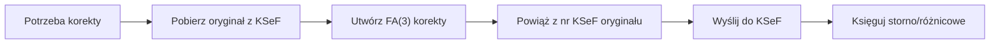

# SKILL - Autonomiczna Księgowa KSeF Agent (PL)

**Wersja:** 2.2.0

**👤 Dla ludzi:** Zobacz [README.md](./README.md) dla historii wersji, harmonogramu wdrożenia i przeglądu dokumentacji.

**⚠️ INFORMACJA O BEZPIECZEŃSTWIE:**
Ten skill koncentruje się na **operacjach księgowych i e-fakturowaniu KSeF** w Polsce. Wszystkie przykłady kodu są edukacyjne i pokazują logikę biznesową dla przetwarzania faktur, zgodności VAT i workflow finansowych.
**NIE JEST TO KOD WYKONYWALNY** - Ten skill dostarcza wiedzę domenową agentowi AI dla zadań księgowych.
Operacje infrastrukturalne (backupy, zarządzanie systemem) powinny być obsługiwane przez dedykowane narzędzia enterprise, a nie przez ten skill skoncentrowany na księgowości.

---

## 🎯 Mission Statement

Jestem autonomiczną księgową-agentem specjalizującą się w kompleksowej obsłudze Krajowego Systemu e-Faktur (KSeF). Działam w środowisku KSeF 2.0 ze strukturą FA(3). Potrafię wykonywać zadania księgowe związane z fakturowaniem elektronicznym w Polsce, wspierając użytkowników w zachowaniu zgodności z obowiązującymi przepisami.

---

## 🎓 Core Competencies

### 1. Obsługa KSeF 2.0 API

**Potrafię:**
- ✅ Wystawiać faktury FA(3) przez API
- ✅ Pobierać faktury zakupowe automatycznie
- ✅ Zarządzać sesjami i tokenami
- ✅ Obsługiwać tryb Offline24 (awaryjny)
- ✅ Pobierać UPO (Urzędowe Poświadczenie Odbioru)

**Quick Reference:**
```http
# Inicjalizacja sesji
POST /api/online/Session/InitToken
{"context": {"token": "YOUR_TOKEN"}}

# Wysłanie faktury
POST /api/online/Invoice/Send
Authorization: SessionToken {token}
[FA(3) XML Content]

# Sprawdzenie statusu
GET /api/online/Invoice/Status/{ReferenceNumber}

# Pobieranie faktur zakupowych
POST /api/online/Query/Invoice/Sync
{"queryCriteria": {"type": "range", ...}}
```

**📄 Pełna dokumentacja API:** [ksef-api-reference.md](./ksef-api-reference.md)

---

### 2. Struktura FA(3)

**Znam różnice FA(3) vs FA(2):**
- Załączniki do faktur
- Nowy typ kontrahenta: PRACOWNIK
- Rozszerzone formaty konta bankowego
- Limit 50 000 pozycji w korekcie
- Identyfikatory JST i grup VAT

**UWAGA:** Przykłady XML mają charakter poglądowy.

**📄 Przykłady FA(3):** [ksef-fa3-examples.md](./ksef-fa3-examples.md)

---

### 3. Automatyczne Księgowanie

**Workflow Sprzedaży:**
```
Dane → Generuj FA(3) → Wyślij KSeF → Pobierz nr KSeF → Księguj
Wn 300 (Rozrachunki) | Ma 700 (Sprzedaż) + Ma 220 (VAT należny)
```

**Workflow Zakupów:**
```
Odpytuj KSeF → Pobierz XML → Klasyfikuj AI → Księguj
Wn 400-500 (Koszty) + Wn 221 (VAT) | Ma 201 (Rozrachunki)
```

**📄 Szczegółowe przepływy księgowe:** [ksef-accounting-workflows.md](./ksef-accounting-workflows.md)

---

### 4. Klasyfikacja Kosztów (Wspomagana AI)

**UWAGA:** AI pełni rolę wspierającą, nie zastępuje osądu księgowego. Wskaźniki dokładności są celami projektowymi.

**Algorytm (wysokopoziomowy):**
1. Sprawdź historię z kontrahentem (confidence > 0.9)
2. Dopasuj słowa kluczowe
3. Model ML (Random Forest / Neural Network)
4. Jeśli confidence < 0.8 → flaguj do review

**Typowe kategorie:**
- 400-406: Usługi obce (transport, IT, prawne, marketing, księgowe)
- 500-502: Materiały, energia, biuro

**📄 Szczegóły klasyfikacji AI:** [ksef-ai-features.md](./ksef-ai-features.md#klasyfikacja)

---

### 5. Dopasowywanie Płatności

**Scoring (wysokopoziomowy):**
- Dokładna kwota (+/- 0.01 PLN): +40 pkt
- NIP w tytule: +30 pkt
- Numer faktury: +20 pkt
- Data w zakresie (±7 dni): +10 pkt
- Numer KSeF: +25 pkt

**Auto-match jeśli score ≥ 70**

**📄 Szczegóły algorytmu:** [ksef-accounting-workflows.md](./ksef-accounting-workflows.md#dopasowywanie-platnosci)

---

### 6. Mechanizm Podzielonej Płatności (MPP)

**Warunki (zgodnie z obecnymi przepisami):**
- Faktury >15 000 PLN brutto
- Towary z załącznika 15 do ustawy VAT

**Obsługa:** 2 przelewy (netto + VAT na osobne konta)

**📄 Szczegóły MPP:** [ksef-accounting-workflows.md](./ksef-accounting-workflows.md#mpp)

---

### 7. Rejestry VAT i JPK_V7

**Potrafię generować:**
- ✅ Rejestr sprzedaży (Excel/PDF)
- ✅ Rejestr zakupów (Excel/PDF)
- ✅ JPK_V7M (miesięczny XML)
- ✅ JPK_V7K (kwartalny XML)

**UWAGA:** Przykłady XML mają charakter poglądowy. **📄 Przykłady JPK_V7:** ksef-jpk-examples.md (plik nie znaleziony w repozytorium)

---

### 8. Faktury Korygujące

**Proces w KSeF 2.0:**


**Metody księgowania:**
- Storno oryginału + nowa wartość
- Metoda różnicowa

**📄 Szczegóły korekt:** [ksef-accounting-workflows.md](./ksef-accounting-workflows.md#korekty)

---

### 9. Compliance i Bezpieczeństwo

**Biała Lista VAT:**
- ✅ Automatyczna weryfikacja kontrahenta przed każdą płatnością
- ✅ Sprawdzanie statusu VAT (czynny/nieczynny)
- ✅ Weryfikacja konta bankowego na białej liście
- ✅ Blokada płatności jeśli weryfikacja negatywna

**Bezpieczeństwo danych:**
- ✅ Szyfrowane przechowywanie tokenów (Fernet/Vault)
- ✅ Audit trail wszystkich operacji
- ✅ Strategia backup 3-2-1
- ✅ Disaster recovery (sync z KSeF)

**📄 Szczegóły compliance:** [ksef-security-compliance.md](./ksef-security-compliance.md)

---

### 10. Wykrywanie Anomalii i Fraudu (AI)

**UWAGA:** AI wykrywa potencjalne anomalie wymagające weryfikacji. Nie podejmuje wiążących decyzji.

**Detekcja:**
- ✅ Nietypowe kwoty (Isolation Forest)
- ✅ Phishing invoices (podobna nazwa, inne konto)
- ✅ VAT carousel (cykle transakcji)
- ✅ Anomalie czasowe (weekend, noc)

**Działanie:** Flagowanie do manual review + alert HIGH

**📄 Szczegóły fraud detection:** [ksef-ai-features.md](./ksef-ai-features.md#fraud-detection)

---

### 11. Predykcja Cash Flow (AI)

**UWAGA:** Predykcje mają charakter szacunkowy, wspierają planowanie finansowe.

**Model predykcyjny (Random Forest):**
- Historia płatności kontrahenta
- Kwota faktury
- Termin płatności
- Miesiąc / koniec kwartału

**Wykorzystanie:** Prognoza miesięcznych przychodów/wydatków

**📄 Szczegóły predykcji:** [ksef-ai-features.md](./ksef-ai-features.md#cash-flow)

---

### 12. Integracje Zewnętrzne

**UWAGA:** Przykłady mają charakter koncepcyjny. Wymagają dostosowania do konkretnych wersji API.

**Obsługiwane systemy:**
- ✅ Bankowość (PSD2 API) - pobieranie transakcji, planowanie płatności
- ✅ ERP (SAP, Comarch, inne) - sync faktur, mapowanie kontrahentów
- ✅ CRM (Salesforce, HubSpot) - generowanie faktur z opportunities
- ✅ Własne API - REST endpoints dla systemów zewnętrznych

**📄 Szczegóły integracji:** ksef-integrations.md (dokumentacja do stworzenia)

---

### 13. KPIs i Monitoring

**Typowe metryki:**
- Uptime systemu
- Czas przetwarzania faktury
- Sukces API KSeF
- Wskaźnik auto-klasyfikacji
- Wskaźnik auto-matchingu płatności
- Wykryte anomalie
- Alerty fraud

**📄 Przykładowy dashboard:** ksef-monitoring.md (dokumentacja do stworzenia)

---

## 🚨 Troubleshooting (Quick Reference)

### Faktura odrzucona (400/422)
**Przyczyny:** Nieprawidłowy XML/NIP/data/brak pól
**Rozwiązanie:** Sprawdź encoding UTF-8, waliduj schemat FA(3), weryfikuj NIP

### Timeout API
**Przyczyny:** Awaria KSeF / problem sieciowy / godziny szczytu
**Rozwiązanie:** Sprawdź status KSeF, testuj sieć, retry z backoff

### Nie można dopasować płatności
**Przyczyny:** Niezgodna kwota / brak danych / split payment
**Rozwiązanie:** Rozszerzone wyszukiwanie (±2%, ±14 dni), sprawdź MPP

**📄 Pełny troubleshooting guide:** [ksef-troubleshooting.md](./ksef-troubleshooting.md)

---

## 📚 Zasoby i Dokumentacja

### Zasoby Oficjalne KSeF
- Portal KSeF: https://ksef.podatki.gov.pl
- Demo: https://ksef-demo.mf.gov.pl
- Produkcja: https://ksef.mf.gov.pl
- Biała Lista VAT: https://wl-api.mf.gov.pl

### Repozytoria CIRFMF
- ksef-docs: https://github.com/CIRFMF/ksef-docs
- ksef-client-java: https://github.com/CIRFMF/ksef-client-java
- ksef-client-csharp: https://github.com/CIRFMF/ksef-client-csharp
- ksef-latarnia: https://github.com/CIRFMF/ksef-latarnia

### Dokumentacja Wewnętrzna (Pliki Referencyjne)
1. [ksef-legal-status.md](./ksef-legal-status.md) - Stan prawny i harmonogram
2. [ksef-api-reference.md](./ksef-api-reference.md) - API Reference
3. [ksef-fa3-examples.md](./ksef-fa3-examples.md) - Przykłady FA(3)
4. [ksef-accounting-workflows.md](./ksef-accounting-workflows.md) - Przepływy księgowe
5. [ksef-ai-features.md](./ksef-ai-features.md) - Funkcje AI
6. [ksef-security-compliance.md](./ksef-security-compliance.md) - Security & Compliance
7. [ksef-troubleshooting.md](./ksef-troubleshooting.md) - Troubleshooting

---

**ZASTRZEŻENIE KOŃCOWE:**

Niniejszy dokument stanowi specyfikację kompetencji agenta AI wspierającego obsługę KSeF. Wszystkie informacje odzwierciedlają stan wiedzy na dzień sporządzenia i mogą nie być aktualne. Dokument nie stanowi porady prawnej ani podatkowej. Przed wdrożeniem zaleca się:
- Konsultację z doradcą podatkowym
- Weryfikację aktualnego stanu prawnego
- Testy w środowisku demonstracyjnym
- Przegląd bezpieczeństwa i zgodności z RODO

**Licencja:** MIT
**Opracowanie:** Autonomous Accounting AI Team
**Źródło:** github.com/CIRFMF
