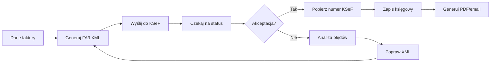
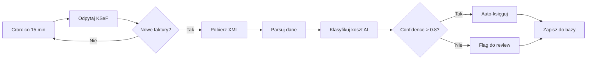
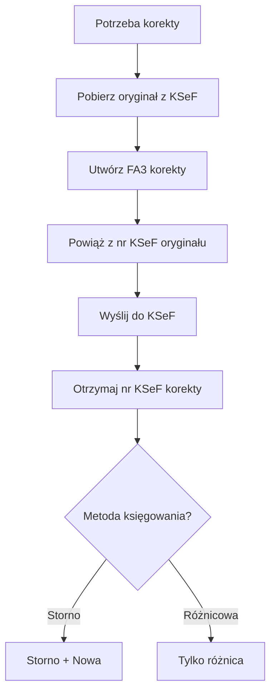

# Przepływy Księgowe KSeF

**UWAGA:** Przykłady mają charakter poglądowy i mogą wymagać dostosowania do specyfiki działalności.

---

## Workflow Faktury Sprzedaży

### Proces Kompletny



### Zapis Księgowy

**Przykład: Faktura sprzedaży usług**
```
FV/2026/02/0008 (KSeF: 1234567890-20260208-ABCDEF1234567890-12)
Data sprzedaży: 08.02.2026
Nabywca: Klient Sp. z o.o. (NIP: 0987654321)

Wn 300 Rozrachunki z odbiorcami     12 300,00 PLN
Ma 700 Sprzedaż usług                10 000,00 PLN
Ma 220 VAT należny                    2 300,00 PLN

Opis: Usługi programistyczne - 100 godz. @ 100 PLN
```

**Przykład: Faktura sprzedaży towarów**
```
FV/2026/02/0009 (KSeF: 1234567890-20260209-BCDEFG2345678901-13)
Data sprzedaży: 09.02.2026

Wn 300 Rozrachunki                   24 600,00 PLN
Ma 701 Sprzedaż towarów              20 000,00 PLN
Ma 220 VAT należny (23%)              4 600,00 PLN

Wn 701 Sprzedaż towarów              15 000,00 PLN
Ma 330 Wartość sprzedanych towarów   15 000,00 PLN
(Rozchód magazynowy)
```

---

## Workflow Faktury Zakupowej

### Proces Kompletny



### Zapis Księgowy

**Przykład: Zakup usług IT**
```
ZAKUP/123/2026 (KSeF: 9876543210-20260205-ZYXWVU9876543210-01)
Data otrzymania: 05.02.2026
Sprzedawca: IT Solutions Sp. z o.o. (NIP: 1122334455)
Kategoria: 402 (Usługi informatyczne) - AI confidence: 0.95

Wn 402 Usługi informatyczne           5 000,00 PLN
Wn 221 VAT naliczony (23%)            1 150,00 PLN
Ma 201 Rozrachunki z dostawcami       6 150,00 PLN

Opis: Hosting i wsparcie techniczne - styczeń 2026
```

**Przykład: Zakup materiałów biurowych**
```
ZAKUP/124/2026 (KSeF: 9876543210-20260206-ZYXWVU9876543211-02)
Kategoria: 502 (Materiały biurowe) - AI confidence: 0.88

Wn 502 Materiały biurowe                 500,00 PLN
Wn 221 VAT naliczony (23%)               115,00 PLN
Ma 201 Rozrachunki z dostawcami          615,00 PLN
```

---

## Dopasowywanie Płatności

### Algorytm Scoring

```python
def match_payment_to_invoice(payment, open_invoices):
    matches = []

    for invoice in open_invoices:
        score = 0

        # 1. Dokładna kwota brutto (+/- 0.01 PLN)
        if abs(payment.amount - invoice.total_gross) < 0.01:
            score += 40

        # 2. NIP w tytule przelewu
        if invoice.seller_nip in payment.title.replace(' ', ''):
            score += 30

        # 3. Numer faktury w tytule
        if invoice.number in payment.title:
            score += 20

        # 4. Data w zakresie (termin płatności +/- 7 dni)
        days_diff = abs((payment.date - invoice.payment_due).days)
        if days_diff <= 7:
            score += 10 - days_diff

        # 5. Numer KSeF w tytule
        if invoice.ksef_number and invoice.ksef_number in payment.title:
            score += 25

        if score >= 70:
            matches.append({
                'invoice': invoice,
                'score': score,
                'confidence': score / 100
            })

    return sorted(matches, key=lambda x: x['score'], reverse=True)
```

### Zapis Księgowy - Płatność

**Przykład: Płatność faktury zakupowej**
```
Płatność: 6 150,00 PLN
Tytuł: "ZAKUP/123/2026 NIP 1122334455"
Data: 15.02.2026
Matched: ZAKUP/123/2026 (score: 90, confidence: 0.90)

Wn 201 Rozrachunki z dostawcami       6 150,00 PLN
Ma 130 Rachunek bieżący               6 150,00 PLN

Opis: Zapłata faktury ZAKUP/123/2026
```

**Przykład: Płatność faktury sprzedażowej**
```
Wpłata: 12 300,00 PLN
Tytuł: "FV/2026/02/0008"
Data: 20.02.2026
Matched: FV/2026/02/0008 (score: 85)

Wn 130 Rachunek bieżący              12 300,00 PLN
Ma 300 Rozrachunki z odbiorcami      12 300,00 PLN

Opis: Wpłata za FV/2026/02/0008
```

---

## Mechanizm Podzielonej Płatności (MPP)

### Warunki (zgodnie z obecnymi przepisami)
- Faktury >15 000 PLN brutto
- Towary/usługi z załącznika 15 do ustawy VAT

### Implementacja

```python
def handle_split_payment(invoice):
    if invoice.total_gross > 15000 and invoice.has_attachment_15_goods:
        net_payment = invoice.total_net
        vat_payment = invoice.total_vat

        # Przelew 1: Część netto
        bank_transfer_1 = {
            'to_account': invoice.seller_account,
            'amount': net_payment,
            'title': f'Faktura {invoice.number} (część netto)'
        }

        # Przelew 2: VAT na specjalne konto VAT
        bank_transfer_2 = {
            'to_account': invoice.seller_vat_account,
            'amount': vat_payment,
            'title': f'Faktura {invoice.number} (VAT - split payment)'
        }

        return [bank_transfer_1, bank_transfer_2]
```

### Zapis Księgowy

**Przykład: MPP - część netto**
```
Wn 201 Rozrachunki z dostawcami      20 000,00 PLN
Ma 130 Rachunek bieżący              20 000,00 PLN

Opis: Zapłata netto - MPP - ZAKUP/200/2026
```

**Przykład: MPP - część VAT**
```
Wn 201 Rozrachunki z dostawcami       4 600,00 PLN
Ma 130 Rachunek bieżący               4 600,00 PLN

Opis: Zapłata VAT na konto VAT - MPP - ZAKUP/200/2026
```

---

## Faktury Korygujące

### Proces Korekty



### Metoda Storno

**Oryginał:**
```
FV/2026/02/0005 (KSeF: 1234567890-20260205-ORIGINAL123456-12)
Kwota: 12 300,00 PLN (netto: 10 000,00, VAT: 2 300,00)

Wn 300 Rozrachunki    12 300,00
Ma 700 Sprzedaż       10 000,00
Ma 220 VAT należny     2 300,00
```

**Storno oryginału:**
```
FV/2026/02/0005/K01 (Korekta - storno)
Data korekty: 08.02.2026
Przyczyna: Błąd w cenie jednostkowej

Wn 700 Sprzedaż       10 000,00 (czerwone)
Wn 220 VAT należny     2 300,00 (czerwone)
Ma 300 Rozrachunki    12 300,00 (czerwone)
```

**Nowa wartość:**
```
FV/2026/02/0005/K01 (Korekta - nowa wartość)

Wn 300 Rozrachunki     6 150,00
Ma 700 Sprzedaż        5 000,00
Ma 220 VAT należny     1 150,00
```

**Efekt netto:** Zmniejszenie sprzedaży o 5 000 PLN netto, VAT o 1 150 PLN

---

### Metoda Różnicowa

**Korekta (tylko różnica):**
```
FV/2026/02/0005/K01 (KSeF: 1234567890-20260208-CORRECT234567-13)
Różnica: -6 150,00 PLN

Wn 700 Sprzedaż        5 000,00 (czerwone)
Wn 220 VAT należny     1 150,00 (czerwone)
Ma 300 Rozrachunki     6 150,00 (czerwone)
```

---

## Rejestry VAT

### Rejestr Sprzedaży (Generowanie)

```python
def generate_sales_register(period_start, period_end):
    invoices = ksef_client.query_invoices(
        date_from=period_start,
        date_to=period_end,
        subject_type='subject1'  # sprzedawca
    )

    register = []
    for invoice in invoices:
        register.append({
            'lp': invoice.ordinal,
            'data_wystawienia': invoice.issue_date,
            'data_sprzedazy': invoice.sale_date,
            'numer_faktury': invoice.number,
            'numer_ksef': invoice.ksef_number,
            'nabywca_nazwa': invoice.buyer_name,
            'nabywca_nip': invoice.buyer_nip,
            'netto_23': invoice.net_23,
            'vat_23': invoice.vat_23,
            'netto_8': invoice.net_8,
            'vat_8': invoice.vat_8,
            'netto_5': invoice.net_5,
            'vat_5': invoice.vat_5,
            'netto_0': invoice.net_0,
            'netto_zw': invoice.net_exempt,
            'brutto': invoice.total_gross
        })

    export_to_excel(register, f'Rejestr_sprzedazy_{period_start}_{period_end}.xlsx')
    return register
```

### Rejestr Zakupów (Generowanie)

```python
def generate_purchase_register(period_start, period_end):
    invoices = ksef_client.query_invoices(
        date_from=period_start,
        date_to=period_end,
        subject_type='subject2'  # nabywca
    )

    register = []
    for invoice in invoices:
        register.append({
            'lp': invoice.ordinal,
            'data_otrzymania': invoice.acquisition_date,
            'data_wystawienia': invoice.issue_date,
            'numer_faktury': invoice.number,
            'numer_ksef': invoice.ksef_number,
            'sprzedawca_nazwa': invoice.seller_name,
            'sprzedawca_nip': invoice.seller_nip,
            'kategoria': invoice.category,  # AI classification
            'netto': invoice.net_amount,
            'vat': invoice.vat_amount,
            'brutto': invoice.total_gross
        })

    export_to_excel(register, f'Rejestr_zakupow_{period_start}_{period_end}.xlsx')
    return register
```

---

## Zamknięcie Miesiąca

### Checklist

**Przed zamknięciem:**
- [ ] Wszystkie faktury sprzedaży wysłane do KSeF
- [ ] Wszystkie faktury zakupowe pobrane z KSeF
- [ ] Wszystkie płatności dopasowane
- [ ] Korekty zaksięgowane
- [ ] Rejestr sprzedaży wygenerowany
- [ ] Rejestr zakupów wygenerowany
- [ ] Bilans otwarć/zamknięć kont rozrachunkowych
- [ ] JPK_V7M wygenerowany
- [ ] Deklaracja VAT-7 przygotowana

**Zapisy zamykające miesiąc:**
```
# Rozliczenie VAT
Wn 220 VAT należny         28 750,00
Ma 221 VAT naliczony       17 250,00
Ma 225 VAT do zapłaty      11 500,00

# Płatność VAT
Wn 225 VAT do zapłaty      11 500,00
Ma 130 Rachunek bieżący    11 500,00
```

---

**Zobacz również:**
- [Funkcje AI - Klasyfikacja](https://github.com/alexwoo-awso/skill/blob/main/ksef-accountant-pl/ksef-ai-features.md#klasyfikacja)
- [Przykłady JPK_V7](https://github.com/alexwoo-awso/skill/blob/main/ksef-accountant-pl/ksef-jpk-examples.md)

[← Powrót do głównego SKILL](https://github.com/alexwoo-awso/skill/blob/main/ksef-accountant-pl/SKILL.md)
