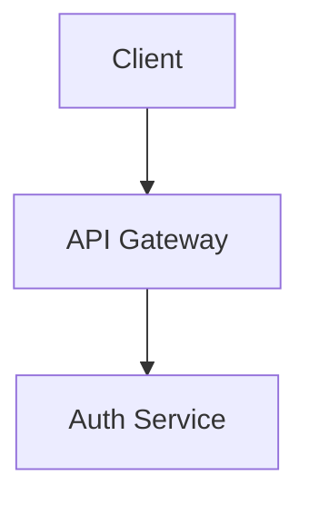

# Living Docs Navigator

Access project knowledge stored in `.specweave/docs/internal/`.

## Quick Navigation

**When you need context**, read relevant files from these locations:

### 📋 Specifications (Features & User Stories)
```
.specweave/docs/internal/specs/
```
- Feature specifications with user stories
- Acceptance criteria
- Implementation history

**Find specs**: `ls .specweave/docs/internal/specs/`

### 📐 Architecture Decisions (ADRs)
```
.specweave/docs/internal/architecture/adr/
```
- WHY decisions were made
- Trade-offs considered
- Context for design choices

**Find ADRs**: `ls .specweave/docs/internal/architecture/adr/`

### 🏗️ System Architecture
```
.specweave/docs/internal/architecture/
```
- High-level design (HLD)
- System diagrams
- Component architecture

**Find architecture docs**: `ls .specweave/docs/internal/architecture/*.md`

### 📊 Operations
```
.specweave/docs/internal/operations/
```
- Runbooks
- SLOs
- Incident procedures

### 💼 Strategy
```
.specweave/docs/internal/strategy/
```
- Business requirements
- Product vision
- PRDs

### 🛡️ Governance
```
.specweave/docs/internal/governance/
```
- Security policies
- Coding standards
- Compliance docs

---

## How to Use

### Before Implementing a Feature

1. **Check for related specs**:
   ```bash
   grep -ril "keyword" .specweave/docs/internal/specs/
   ```

2. **Read relevant ADRs**:
   ```bash
   grep -l "topic" .specweave/docs/internal/architecture/adr/*.md
   ```

3. **Load the context** by reading the files found.

### Before Making Design Decisions

1. **Check existing ADRs** to avoid contradicting past decisions
2. **Read architecture docs** to understand current patterns
3. **Follow established conventions**

### Example Workflow

```
Task: "Implement user authentication"

1. Search for related docs:
   grep -ril "auth" .specweave/docs/internal/

2. Found:
   - .specweave/docs/internal/specs/backend/us-001-authentication.md
   - .specweave/docs/internal/architecture/adr/0001-jwt-vs-sessions.md
   - .specweave/docs/internal/architecture/auth-flow.md

3. Read each file for context before implementing.
```

---

## Progressive Disclosure Pattern

This skill follows **progressive disclosure**:

1. **Metadata only** (this SKILL.md) loads initially (~200 tokens)
2. **You search** for relevant docs using grep/ls
3. **You read** only the specific files you need
4. **Result**: Minimal tokens, maximum context

**No RAG needed** - Claude's native file reading is more accurate.

---

## Integration with /sw:do

When executing `/sw:do`:

1. Extract topic keywords from spec.md
2. Search living docs for matches
3. Read relevant ADRs and architecture docs
4. Apply context during implementation

---

## Tips

- **ADRs are critical** - always check before design decisions
- **Specs show history** - see what was already built
- **Use grep liberally** - find docs by keyword, not guessing paths
- **Cross-reference** - related documents link to each other

---

## Stakeholder Views

Living docs serve different audiences. Navigate by role:

### For Business Stakeholders

Quick access to high-level, non-technical documentation:

```
.specweave/docs/internal/
├── strategy/                    # Business context
│   ├── executive-summary.md     # Project overview for leadership
│   ├── feature-dashboard.md     # Feature status tracking
│   ├── roadmap.md               # Product roadmap
│   └── business-impact/         # Per-feature impact statements
├── operations/                  # System health
│   └── health-dashboard.md      # Current system status
└── specs/
    └── _feature-status.md       # Active features & completion %
```

**Use case**: Board reports, investor updates, quarterly reviews

### For Technical Leads

Quick access to architecture and decisions:

```bash
# Recent architectural decisions
ls -lt .specweave/docs/internal/architecture/adr/ | head -10

# Search for decisions about specific topics
grep -ril "authentication" .specweave/docs/internal/architecture/adr/

# Find system architecture diagrams
ls .specweave/docs/internal/architecture/*.md
```

**Use case**: Design reviews, tech debt assessment, onboarding

### For Product Managers

Quick access to specifications and progress:

```bash
# Feature specifications
ls .specweave/docs/internal/specs/

# Find features by keyword
grep -ril "checkout" .specweave/docs/internal/specs/

# Check increment status
ls .specweave/increments/*/metadata.json
```

**Use case**: Sprint planning, release notes, stakeholder updates

---

## Executive Summary Generation

Living docs can be transformed into executive-friendly formats:

### Automatic Generation

Use the **stakeholder-docs** skill to generate:
- Executive summaries from technical specs
- Feature status dashboards
- Business impact statements
- Release summaries

```
"Create an executive summary of our current project status"
"Generate a feature status dashboard for Q1"
```

### Manual Navigation

For quick stakeholder context:

1. **Project Overview**: `.specweave/docs/internal/strategy/executive-summary.md`
2. **Feature Status**: `.specweave/docs/internal/strategy/feature-dashboard.md`
3. **Recent Decisions**: Latest 3 ADRs in `architecture/adr/`

---

## Visual Documentation

When documentation needs diagrams or illustrations:

### Architecture Diagrams
Use Mermaid in markdown files:
```markdown

```

### AI-Generated Illustrations
Use the `/sw:image-generation` skill for professional visuals:
```
"Generate an architecture diagram illustration for the API docs"
"Create a feature illustration for the living docs"
```

Brand colors: Purple #7c3aed, Light purple #a78bfa

---

## Related Skills

- **stakeholder-docs**: Generate executive-friendly views
- **docs-writer**: Create detailed documentation
- **image-generation**: Add visuals via `/sw:image-generation`
- **docusaurus**: Preview docs as website via `/sw-docs:view`
