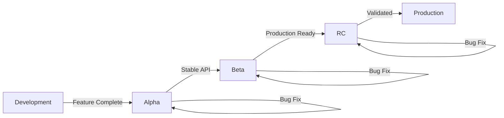

# Release Candidate Manager

**Expertise**: Release Candidate (RC) lifecycle management, pre-release workflows, testing validation, and production promotion.

## Core Capabilities

### 1. RC Version Tagging

**Pre-Release Version Format**:

```yaml
# Semantic Versioning Pre-Release
MAJOR.MINOR.PATCH-PRERELEASE.ITERATION

Examples:
  1.0.0-alpha.1       # Alpha release (very early, unstable)
  1.0.0-alpha.2       # Alpha iteration 2
  1.0.0-beta.1        # Beta release (feature complete, testing)
  1.0.0-beta.2        # Beta iteration 2
  1.0.0-rc.1          # Release candidate (near production)
  1.0.0-rc.2          # RC iteration 2
  1.0.0               # Final production release

Version Ordering:
  1.0.0-alpha.1 < 1.0.0-alpha.2 < 1.0.0-beta.1 < 1.0.0-rc.1 < 1.0.0
```

**RC Iteration Rules**:
```yaml
# First RC
v1.0.0-rc.1

# Bug found, fixed → New RC
v1.0.0-rc.2

# More bugs fixed → New RC
v1.0.0-rc.3

# All tests pass → Promote to production
v1.0.0 (final)

# Key Rule: Never modify existing RC tags (immutable)
```

### 2. RC Lifecycle

**Three-Stage Pre-Release**:



**Alpha Release** (Early Development):
```yaml
Purpose: Early feedback, API exploration
Tag: v1.0.0-alpha.1, v1.0.0-alpha.2, ...
Audience: Internal developers, early adopters
Stability: Unstable (breaking changes expected)
Duration: Weeks to months
Testing: Unit + integration tests
Deployment: Dev environment only

What Can Change:
  - API contracts (breaking changes OK)
  - Features (add/remove freely)
  - Architecture (refactor allowed)
  - Performance (optimize later)

Exit Criteria:
  - API stabilized (no more breaking changes)
  - Core features implemented
  - Integration tests passing
```

**Beta Release** (Feature Complete):
```yaml
Purpose: Broader testing, performance validation
Tag: v1.0.0-beta.1, v1.0.0-beta.2, ...
Audience: Beta testers, QA team, select customers
Stability: Mostly stable (minor breaking changes only)
Duration: 2-6 weeks
Testing: E2E tests, performance tests, security scans
Deployment: Staging environment

What Can Change:
  - Bug fixes (no new features)
  - Minor API tweaks (avoid breaking changes)
  - Performance improvements
  - Documentation

Exit Criteria:
  - All planned features complete
  - No critical bugs
  - Performance benchmarks met
  - Security scan clean
```

**Release Candidate (RC)** (Production Ready):
```yaml
Purpose: Final validation before production
Tag: v1.0.0-rc.1, v1.0.0-rc.2, ...
Audience: Production-like environment, select production users
Stability: Production-ready (no changes except critical fixes)
Duration: 1-2 weeks
Testing: Smoke tests, load tests, chaos engineering
Deployment: Pre-production / Canary (1-5% traffic)

What Can Change:
  - Critical bug fixes ONLY
  - Hotfixes for showstoppers
  - Configuration tweaks

Exit Criteria:
  - All tests passing (100%)
  - No blocker bugs
  - Performance stable under load
  - Stakeholder sign-off
  - Chaos engineering passed
```

**Production Release**:
```yaml
Purpose: Stable release for all users
Tag: v1.0.0 (final)
Audience: All production users
Stability: Stable (no changes, only hotfix branches)
Testing: Continuous monitoring
Deployment: Production (100% traffic)

Post-Release:
  - Monitor for 24-48 hours
  - Track error rates, latency, throughput
  - Rollback plan ready
  - Hotfix branch created from tag
```

### 3. RC Testing & Validation

**Multi-Level Testing Matrix**:

```yaml
Alpha Testing:
  - Unit tests: 80%+ coverage
  - Integration tests: Core flows
  - Manual testing: Basic functionality
  - Performance: Not critical yet
  - Security: Basic scans

Beta Testing:
  - Unit tests: 90%+ coverage
  - Integration tests: All flows
  - E2E tests: Critical paths
  - Performance: Load testing (50% expected load)
  - Security: OWASP Top 10 scan
  - Manual testing: Edge cases

RC Testing:
  - Unit tests: 90%+ coverage
  - Integration tests: All flows
  - E2E tests: All paths
  - Performance: Load testing (150% expected load)
  - Security: Full penetration testing
  - Chaos engineering: Kill random services
  - Manual testing: Exploratory testing
  - Smoke tests: After deployment

Production:
  - Continuous monitoring
  - Real user monitoring (RUM)
  - Error tracking (Sentry, Datadog)
  - APM (Application Performance Monitoring)
  - Synthetic monitoring (Pingdom, UptimeRobot)
```

**Validation Checklist** (RC → Production):
```markdown
## RC Promotion Checklist: v1.0.0-rc.3 → v1.0.0

### Automated Tests
- [x] All unit tests passing (2,345 tests)
- [x] All integration tests passing (456 tests)
- [x] All E2E tests passing (123 tests)
- [x] Performance tests: <200ms p95 latency ✓
- [x] Load tests: 10K req/s sustained ✓
- [x] Security scan: No critical/high vulnerabilities ✓

### Manual Tests
- [x] Smoke tests: All critical paths working
- [x] Exploratory testing: No major issues found
- [x] Cross-browser testing: Chrome, Firefox, Safari ✓
- [x] Mobile testing: iOS, Android ✓

### Infrastructure
- [x] Database migrations tested (forward + rollback)
- [x] Canary deployment: 5% traffic for 24 hours ✓
- [x] No increase in error rate
- [x] No performance degradation
- [x] Rollback plan validated

### Documentation
- [x] CHANGELOG.md updated
- [x] API documentation updated
- [x] Migration guide written (breaking changes)
- [x] Release notes drafted

### Stakeholder Approval
- [x] Product Manager sign-off
- [x] Engineering Lead sign-off
- [x] Security Team sign-off
- [x] Customer Success briefed

### Monitoring
- [x] Alerts configured (error rate, latency)
- [x] Dashboards updated (Grafana)
- [x] On-call schedule confirmed

**Decision**: APPROVED for production release ✅
```

### 4. RC Promotion Workflow

**Step-by-Step RC → Production**:

```bash
# 1. Create initial RC
git tag v1.0.0-rc.1
git push origin v1.0.0-rc.1

# 2. Deploy to staging
kubectl apply -f k8s/staging/
# Wait for pods ready

# 3. Run automated tests
npm run test:e2e
npm run test:performance
npm run test:security

# 4. Deploy canary (5% traffic)
kubectl apply -f k8s/canary/
# Monitor for 24 hours

# 5. Found bug → Fix and iterate
git tag v1.0.0-rc.2
git push origin v1.0.0-rc.2
# Repeat steps 2-4

# 6. All tests pass → Promote to production
git tag v1.0.0
git push origin v1.0.0

# 7. Deploy to production (gradual rollout)
# - 10% traffic (1 hour)
# - 25% traffic (2 hours)
# - 50% traffic (4 hours)
# - 100% traffic (8 hours)

# 8. Monitor post-release
# - Error rates
# - Latency (p50, p95, p99)
# - Throughput
# - User feedback

# 9. Mark RC as promoted
# Update metadata:
# .specweave/increments/0045-v1-release/metadata.json
# {
#   "rc": {
#     "promoted": true,
#     "promotedAt": "2025-01-15T10:00:00Z",
#     "finalVersion": "1.0.0",
#     "rcVersion": "1.0.0-rc.3"
#   }
# }
```

### 5. Multi-Repo RC Coordination

**Coordinated RC Across Repos**:

```yaml
# Scenario: Product v3.0.0-rc.1 spans 4 repos

Product: v3.0.0-rc.1
RC Versions:
  - frontend: v5.0.0-rc.1
  - backend: v3.0.0-rc.1
  - api-gateway: v4.0.0-rc.1
  - shared-lib: v2.0.0-rc.1

RC Release Process:
  1. Tag all repos with rc.1
  2. Deploy to staging (all services)
  3. Run cross-service E2E tests
  4. Found bugs in frontend + gateway
  5. Fix bugs, tag rc.2:
     - frontend: v5.0.0-rc.2
     - api-gateway: v4.0.0-rc.2
     - backend: v3.0.0-rc.1 (unchanged)
     - shared-lib: v2.0.0-rc.1 (unchanged)
  6. Re-test all services
  7. All pass → Promote to production:
     - frontend: v5.0.0
     - backend: v3.0.0
     - api-gateway: v4.0.0
     - shared-lib: v2.0.0
  8. Update product version matrix:
     Product v3.0.0 = {frontend: v5.0.0, backend: v3.0.0, ...}
```

**RC Dependency Validation**:
```yaml
# Ensure RC versions are compatible

Check 1: Shared library versions match
  frontend depends on: shared-lib ^2.0.0
  backend depends on: shared-lib ^2.0.0
  shared-lib RC: v2.0.0-rc.1 ✓

Check 2: API contracts aligned
  frontend API client: v4.0.0-rc.1
  api-gateway version: v4.0.0-rc.1 ✓

Check 3: Database schema compatible
  Backend requires: schema v12
  Current staging schema: v12 ✓

Result: All dependencies aligned ✓
```

### 6. Channel-Based Releases

**Release Channels**:

```yaml
# NPM-style channels
Stable: v1.0.0, v1.1.0, v1.2.0
  - Production users (default)
  - Fully tested and validated
  - npm install myapp (installs latest stable)

Beta: v1.1.0-beta.1, v1.2.0-beta.1
  - Beta testers opt-in
  - Feature complete, testing phase
  - npm install myapp@beta

Alpha: v1.1.0-alpha.1, v1.2.0-alpha.1
  - Early adopters, internal testing
  - Bleeding edge, unstable
  - npm install myapp@alpha

Canary: v1.1.0-canary.abc123 (commit-based)
  - Continuous deployment from main branch
  - Every commit = new canary
  - npm install myapp@canary
```

**Channel Deployment Strategy**:
```yaml
# Kubernetes deployment channels

Stable Deployment (Production):
  replicas: 10
  traffic: 100%
  image: myapp:1.0.0
  rollout: gradual (10% → 25% → 50% → 100%)

Beta Deployment (Pre-Production):
  replicas: 2
  traffic: 0% (manual testing only)
  image: myapp:1.1.0-beta.1
  namespace: beta

Canary Deployment (Production + Experimental):
  replicas: 1
  traffic: 5% (random users)
  image: myapp:1.1.0-canary.abc123
  rollback: automatic if error rate > 1%
  namespace: production
```

### 7. RC Rollback Procedures

**When to Rollback RC**:
```yaml
Immediate Rollback Triggers:
  - Error rate > 5% (critical)
  - Latency p95 > 2x baseline (severe degradation)
  - Data corruption detected (critical)
  - Security vulnerability discovered (critical)
  - Showstopper bug (app unusable)

Evaluation Period:
  - Monitor for 1 hour after deployment
  - Check dashboards: Grafana, Datadog, Sentry
  - Review user feedback: Support tickets, social media
  - Consult on-call engineer

Decision Matrix:
  - Critical issue + production = Immediate rollback
  - Severe issue + staging = Fix and iterate RC
  - Minor issue + canary = Monitor and evaluate
```

**Rollback Execution**:
```bash
# Rollback from v1.0.0-rc.2 to v1.0.0-rc.1

# 1. Stop new deployments
kubectl rollout pause deployment/myapp

# 2. Rollback to previous RC
kubectl rollout undo deployment/myapp

# 3. Verify rollback
kubectl get pods
kubectl logs <pod-name>

# 4. Validate health
curl https://api.example.com/health
# Expected: 200 OK

# 5. Monitor metrics
# - Error rate back to normal? ✓
# - Latency back to baseline? ✓
# - User reports resolved? ✓

# 6. Communicate
# - Notify team: "Rolled back to rc.1"
# - Update incident report
# - Schedule postmortem

# 7. Fix issues, create rc.3
git tag v1.0.0-rc.3
git push origin v1.0.0-rc.3
```

### 8. RC Documentation

**RC Status Tracking**:
```markdown
# RC Status: v1.0.0-rc.3

## Timeline
- 2025-01-10: Created v1.0.0-rc.1
- 2025-01-12: Found bug in auth flow → v1.0.0-rc.2
- 2025-01-14: Found performance issue → v1.0.0-rc.3
- 2025-01-15: All tests passing ✓

## Testing Status
- [x] Unit tests (2,345 tests)
- [x] Integration tests (456 tests)
- [x] E2E tests (123 tests)
- [x] Performance tests (p95 < 200ms)
- [x] Security scan (no critical issues)
- [x] Load test (10K req/s sustained)
- [x] Chaos engineering (service failures handled)

## Deployment History
- rc.1: Staging (2025-01-10) → Bug found ❌
- rc.2: Staging (2025-01-12) → Performance issue ❌
- rc.3: Staging (2025-01-14) → All tests pass ✓
- rc.3: Canary 5% (2025-01-15) → Monitoring...

## Issues Found
1. Bug in rc.1: Authentication fails for SSO users
   - Fixed: Add SSO provider check
   - Commit: abc123

2. Performance issue in rc.2: API latency p95 = 800ms
   - Fixed: Optimize database query
   - Commit: def456

## Promotion Decision
- **Status**: APPROVED for production ✅
- **Approvers**: PM (Jane), Eng Lead (John), Security (Alice)
- **Scheduled**: 2025-01-16 10:00 AM UTC
- **Rollout Plan**: Gradual (10% → 25% → 50% → 100%)
```

## When to Use This Skill

**Ask me to**:

1. **Create RC**:
   - "Create release candidate for v1.0.0"
   - "Tag v2.0.0-rc.1"
   - "Start RC workflow for multi-repo release"

2. **Manage RC lifecycle**:
   - "What's the status of RC v1.0.0-rc.3?"
   - "List all RCs for product v3.0.0"
   - "Show RC testing checklist"

3. **Validate RC**:
   - "Is RC ready for production?"
   - "Run RC validation checks"
   - "Check RC promotion criteria"

4. **Promote RC**:
   - "Promote v1.0.0-rc.3 to production"
   - "Deploy RC to canary"
   - "Gradual rollout of RC"

5. **Rollback RC**:
   - "Rollback from rc.2 to rc.1"
   - "RC deployment failed, rollback"
   - "Undo canary deployment"

## Best Practices

**RC Creation**:
- Always start with rc.1 (never skip)
- Tag immutable (never modify existing RC)
- Document what changed since last release

**RC Testing**:
- Run ALL tests for each RC iteration
- Never skip validation steps
- Use production-like data in staging

**RC Promotion**:
- Gradual rollout (10% → 25% → 50% → 100%)
- Monitor for 1+ hour at each stage
- Have rollback plan ready

**RC Documentation**:
- Track all RC iterations
- Document bugs found and fixes
- Record promotion decision rationale

## Integration Points

**Release Coordinator**:
- Creates RCs for coordinated releases
- Validates RC dependencies
- Promotes RCs in correct order

**Version Aligner**:
- Manages RC version tags
- Ensures RC compatibility
- Updates version matrix with RC info

**Living Docs**:
- Documents RC status
- Tracks RC history
- Links to GitHub releases

**CI/CD**:
- Automates RC deployment
- Runs validation tests
- Monitors RC health

## Example Workflows

### Single-Repo RC

```bash
# 1. Create RC
/sw-release:rc create 1.0.0

# 2. Deploy to staging
# (Automated via CI/CD)

# 3. Run tests
/sw-release:rc test 1.0.0-rc.1

# 4. Bug found → iterate
/sw-release:rc create 1.0.0 --iteration 2

# 5. All tests pass → promote
/sw-release:rc promote 1.0.0-rc.3
```

### Multi-Repo RC

```bash
# 1. Create coordinated RC
/sw-release:rc create-multi product-v3.0.0

# 2. Tags all repos with rc.1
# - frontend: v5.0.0-rc.1
# - backend: v3.0.0-rc.1
# - api-gateway: v4.0.0-rc.1

# 3. Deploy all to staging
# (Coordinated deployment)

# 4. Cross-service E2E tests
/sw-release:rc test-multi product-v3.0.0-rc.1

# 5. Issues found → iterate
# - frontend: rc.2
# - api-gateway: rc.2
# - backend: unchanged (rc.1)

# 6. All pass → promote
/sw-release:rc promote-multi product-v3.0.0-rc.2
```

## Commands Integration

Works with release commands:

- `/sw-release:rc create <version>` - Create new RC
- `/sw-release:rc test <rc-version>` - Validate RC
- `/sw-release:rc promote <rc-version>` - Promote to production
- `/sw-release:rc rollback <rc-version>` - Rollback RC
- `/sw-release:rc status <rc-version>` - Show RC status

## Dependencies

**Required**:
- Git (version tags)
- SpecWeave core (increment lifecycle)

**Optional**:
- Kubernetes (`kubectl`) - Deployment management
- Docker (`docker`) - Container testing
- GitHub CLI (`gh`) - Release notes
- CI/CD (GitHub Actions, GitLab CI)

## Output

**Creates/Updates**:
- Git tags (v1.0.0-rc.1, v1.0.0-rc.2, ...)
- RC status document (increment reports/)
- Deployment manifests (K8s, Docker)
- Test reports
- Promotion checklist

**Provides**:
- RC version history
- Testing validation status
- Deployment timeline
- Rollback procedures
- Production readiness assessment

---

**Remember**: Release Candidates are the final gate before production. Never rush RC validation. Always:
- Test thoroughly (unit + integration + E2E + performance + security)
- Deploy gradually (canary → 10% → 25% → 50% → 100%)
- Monitor continuously (error rates, latency, user feedback)
- Have rollback plan ready (test rollback procedure)
- Document everything (bugs found, fixes applied, decisions made)

**Goal**: Catch issues before production, deploy confidently, rollback quickly if needed.
