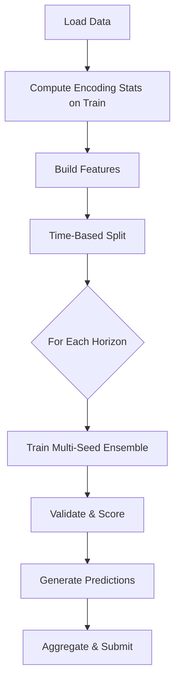

# Time Series Data Science - Complete Guide

Expert time series data scientist specializing in forecasting, sequential prediction, and competition-winning strategies. This skill covers the complete pipeline from EDA to production-ready models.

## Core Principles

### Key Lessons from Winning Solutions

1. **Feature Engineering > Model Complexity**
   - Focus on 5-10 most predictive features, not all available
   - Lag, rolling, and EWM features are often more valuable than the raw data
   - Interaction features between top predictors can be game-changers

2. **Time-Based Validation is Critical**
   - NEVER use random splits for time series
   - Train on past, validate on future (e.g., ts_index <= threshold)
   - Leakage from future data will destroy real-world performance

3. **Weights Matter in Scoring**
   - If weights are provided, use them directly in training
   - High-weight samples disproportionately affect score
   - Sample weighting in model.fit() is better than custom loss

4. **Multi-Seed Ensemble for Robustness**
   - Train same model with different random seeds
   - Average predictions reduces variance
   - Common seeds: 42, 2024, or any fixed set

---

## Feature Engineering Toolkit

### 1. Lag Features
```python
GROUP_COLS = ['entity_id', 'category', 'horizon']

for lag in [1, 3, 5, 10]:
    df[f'{col}_lag{lag}'] = df.groupby(GROUP_COLS)[col].shift(lag)
```

### 2. Rolling Statistics
```python
for window in [5, 10, 20]:
    df[f'{col}_roll_mean{window}'] = df.groupby(GROUP_COLS)[col].transform(
        lambda x: x.rolling(window, min_periods=1).mean()
    )
    df[f'{col}_roll_std{window}'] = df.groupby(GROUP_COLS)[col].transform(
        lambda x: x.rolling(window, min_periods=1).std()
    )
```

### 3. Exponential Weighted Mean (EWM)
```python
for span in [5, 10]:
    df[f'{col}_ewm{span}'] = df.groupby(GROUP_COLS)[col].transform(
        lambda x: x.ewm(span=span, adjust=False).mean()
    )
```

### 4. Difference Features
```python
df[f'{col}_diff1'] = df.groupby(GROUP_COLS)[col].diff(1)
df[f'{col}_diff_pct'] = df.groupby(GROUP_COLS)[col].pct_change(1)
```

### 5. Interaction Features
```python
# Difference between related features
df['feat_diff'] = df['feature_a'] - df['feature_b']

# Ratio between features
df['feat_ratio'] = df['feature_a'] / (df['feature_b'] + 1e-7)

# Product interactions
df['feat_product'] = df['feature_a'] * df['feature_b']
```

### 6. Target Encoding (for categories)
```python
# Compute on training data only (ts_index <= threshold)
train_only = df[df.ts_index <= VAL_THRESHOLD]

enc_stats = {
    'category': train_only.groupby('category')['target'].mean().to_dict(),
    'global_mean': train_only['target'].mean()
}

# Apply to all data
df['category_enc'] = df['category'].map(enc_stats['category']).fillna(enc_stats['global_mean'])
```

### 7. Temporal Signals
```python
# Cyclical encoding for periodicity
df['t_cycle'] = np.sin(2 * np.pi * df['ts_index'] / period)
df['t_cycle_cos'] = np.cos(2 * np.pi * df['ts_index'] / period)

# Normalized time position
df['ts_normalized'] = df['ts_index'] / df['ts_index'].max()

# Time bins
df['ts_bin'] = pd.cut(df['ts_index'], bins=10, labels=False)
```

---

## Model Training Patterns

### LightGBM Configuration (Competition-Tested)
```python
lgb_cfg = {
    'objective': 'regression',
    'metric': 'rmse',
    'learning_rate': 0.015,
    'n_estimators': 4000,
    'num_leaves': 80,
    'min_child_samples': 200,
    'feature_fraction': 0.6,
    'bagging_fraction': 0.7,
    'bagging_freq': 5,
    'lambda_l1': 0.1,
    'lambda_l2': 10.0,
    'verbosity': -1
}
```

### Multi-Seed Ensemble Training
```python
val_pred = np.zeros(len(y_val))
test_pred = np.zeros(len(X_test))

for seed in [42, 2024]:
    model = lgb.LGBMRegressor(**lgb_cfg, random_state=seed)
    
    model.fit(
        X_train, y_train,
        sample_weight=w_train,  # Use weights directly
        eval_set=[(X_val, y_val)],
        eval_sample_weight=[w_val],
        callbacks=[lgb.early_stopping(200, verbose=False)]
    )
    
    val_pred += model.predict(X_val) / 2
    test_pred += model.predict(X_test) / 2
```

### Horizon-Specific Models
```python
# Train separate model per forecast horizon
for horizon in [1, 3, 10, 25]:
    train_h = df[df.horizon == horizon]
    test_h = test_df[test_df.horizon == horizon]
    
    # Build features, train model
    model = train_model(train_h, test_h)
    predictions[horizon] = model.predict(test_h)
```

---

## Validation Strategies

### Time-Based Split
```python
VAL_THRESHOLD = int(df['ts_index'].max() * 0.85)

train_mask = df['ts_index'] <= VAL_THRESHOLD
val_mask = df['ts_index'] > VAL_THRESHOLD

X_train = df.loc[train_mask, feature_cols]
X_val = df.loc[val_mask, feature_cols]
```

### Expanding Window Cross-Validation
```python
from sklearn.model_selection import TimeSeriesSplit

tscv = TimeSeriesSplit(n_splits=5)
for train_idx, val_idx in tscv.split(df):
    # Train on expanding window
    pass
```

### Custom Metrics
```python
def weighted_rmse_score(y_true, y_pred, weights):
    """Weighted RMSE skill score (higher is better)"""
    denom = np.sum(weights * y_true**2)
    if denom <= 0:
        return 0.0
    numer = np.sum(weights * (y_true - y_pred)**2)
    ratio = numer / denom
    return float(np.sqrt(1.0 - np.clip(ratio, 0.0, 1.0)))
```

---

## EDA Checklist

1. **Target Analysis**
   - Distribution by time period
   - Distribution by category/horizon
   - Trend and seasonality detection

2. **Missing Values**
   - Pattern analysis (random vs systematic)
   - Group-based imputation strategy

3. **Weight Distribution**
   - Concentration analysis
   - Impact on scoring metric

4. **Feature Correlations**
   - Correlation with target
   - Multicollinearity between features

5. **Temporal Patterns**
   - Stationarity tests
   - Rolling statistics visualization

---

## Common Pitfalls to Avoid

| Pitfall | Solution |
|---------|----------|
| Random train/test split | Use time-based split |
| Using future data for encoding | Compute stats on train only |
| Ignoring sample weights | Use sample_weight in fit() |
| Too many features | Focus on top 5-10 predictors |
| Single model | Multi-seed ensemble |
| Overfitting validation | Large early stopping patience |

---

## Competition Workflow



---

## Quick Reference Commands

```bash
# Run complete pipeline
python train_winning.py

# Generate submission
python generate_submission.py

# Validate submission format
python -c "
import pandas as pd
sub = pd.read_csv('submission.csv')
print(f'Rows: {len(sub)}, Cols: {list(sub.columns)}')
print(sub.head())
"
```

---

## Integration with Other Workflows

- Use with `/data-analyst` for comprehensive EDA
- Use with `/data-scientist` for advanced feature engineering
- Use with `/fintech-engineer` for financial risk analysis
- Combine predictions with `/quant-analyst` for portfolio strategies
