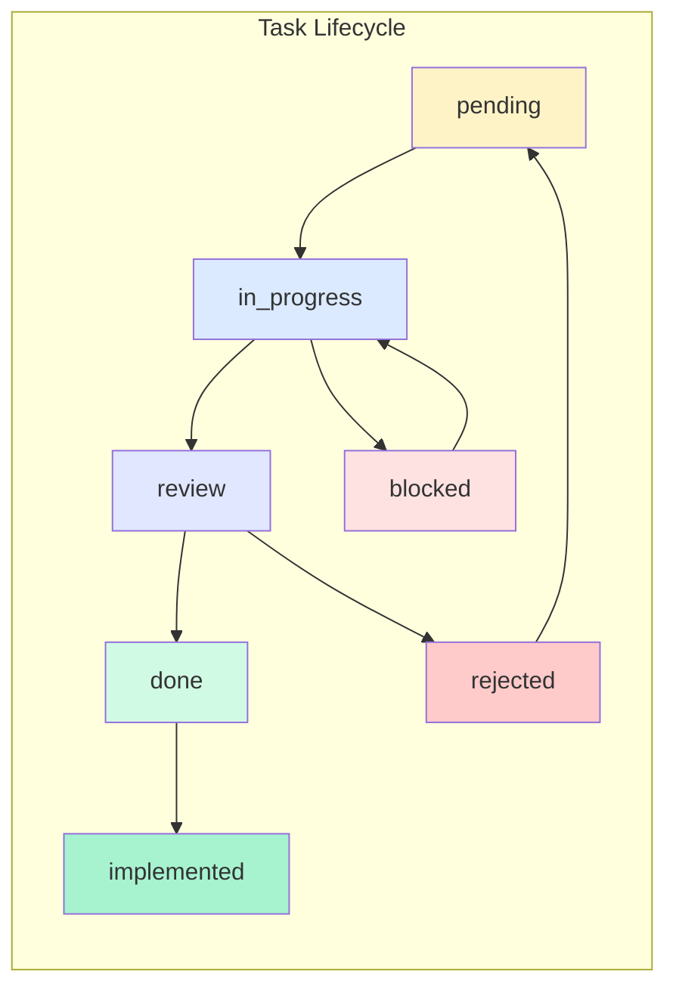
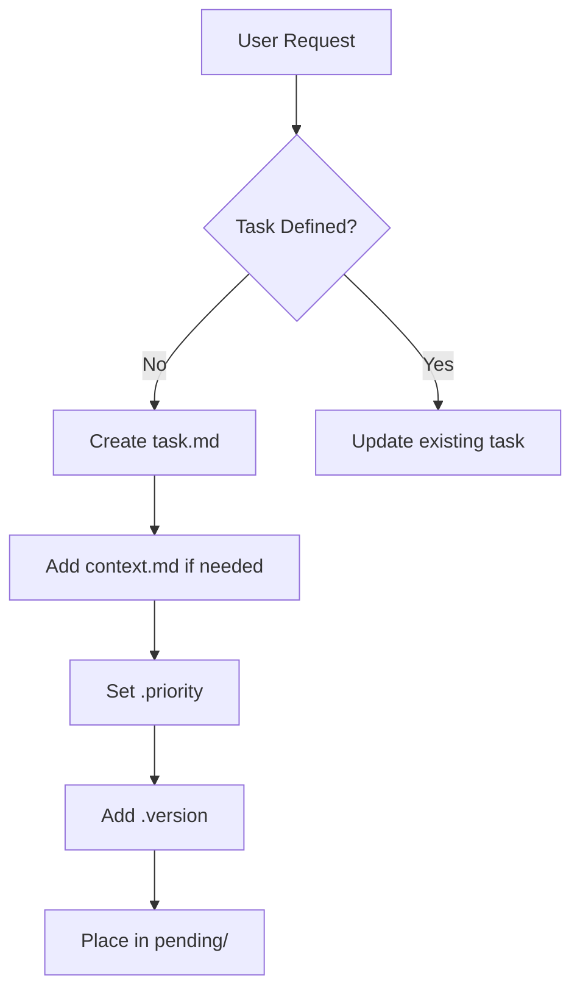

# OGT Docs - Create Task

Complete guide for creating and managing tasks in the docs-first workflow.

## Overview

Tasks are the unit of work in the docs-first system. Each task is a **folder** that moves through workflow stages, accumulating documentation and signals as it progresses.



## Folder Structure

```
docs/todo/
├── pending/                    # Tasks not yet started
│   └── {task_slug}/
│       ├── task.md             # Primary task definition
│       ├── context.md          # Background information (optional)
│       ├── .version            # Schema version
│       └── .priority           # Priority level (content: critical|high|medium|low)
│
├── in_progress/                # Tasks being actively worked on
│   └── {task_slug}/
│       ├── task.md
│       ├── progress.md         # Work log and updates
│       ├── .version
│       ├── .priority
│       ├── .assigned_to_{agent}  # Who's working on it
│       └── .started_at         # Timestamp when started
│
├── review/                     # Tasks awaiting review
│   └── {task_slug}/
│       ├── task.md
│       ├── progress.md
│       ├── implementation.md   # What was done
│       ├── .version
│       ├── .ready_for_review   # Empty signal
│       ├── .pr_link            # PR URL if applicable
│       └── .review_requested_at
│
├── blocked/                    # Tasks that cannot proceed
│   └── {task_slug}/
│       ├── task.md
│       ├── progress.md
│       ├── .version
│       ├── .blocked            # Empty signal
│       ├── .blocked_reason     # Why blocked (content)
│       ├── .blocked_at         # When blocked
│       └── .depends_on         # What it's waiting for
│
├── done/                       # Completed and verified tasks
│   └── {task_slug}/
│       ├── task.md
│       ├── progress.md
│       ├── implementation.md
│       ├── verification.md     # How it was verified
│       ├── .version
│       ├── .verified           # Empty signal - REQUIRED
│       ├── .completed_at       # Completion timestamp
│       └── .verified_by_{agent}  # Who verified
│
├── rejected/                   # Tasks that were declined
│   └── {task_slug}/
│       ├── task.md
│       ├── .version
│       ├── .rejected           # Empty signal
│       ├── .rejected_reason    # Why rejected (content)
│       └── .rejected_at        # When rejected
│
└── implemented/                # Done tasks that are deployed/released
    └── {task_slug}/
        ├── task.md
        ├── implementation.md
        ├── verification.md
        ├── .version
        ├── .verified
        ├── .completed_at
        ├── .implemented_at     # When deployed
        └── .release_version    # Which release included it
```

---

## Stage: pending/

Tasks that are defined but not yet started.

### Example: pending/fuzzy_search/

```
pending/
└── fuzzy_search/
    ├── task.md
    ├── context.md
    ├── .version
    └── .priority
```

#### task.md

```markdown
# Task: Fuzzy Search Implementation

## Summary

Replace substring search with fuzzy indexed search using MiniSearch.

## Objectives

- Install MiniSearch library
- Create SearchIndexService
- Refactor GlobalSearch component
- Add debounce to search input

## Acceptance Criteria

- [ ] Typing "fir" returns "Fireball", "Fire Elemental", etc.
- [ ] Results ranked by relevance
- [ ] Search responds within 16ms
- [ ] TypeScript compiles clean

## Dependencies

- None

## Estimated Effort

Medium (2-4 hours)

## References

- MiniSearch docs: https://lucaong.github.io/minisearch/
- Current search: front/components/features/GlobalSearch.tsx
```

#### context.md

```markdown
# Context: Fuzzy Search

## Current State

GlobalSearch.tsx uses `String.toLowerCase().includes()` for matching.
No ranking, no debounce, no fuzzy matching.

## User Request

"Global search with ctrl+k, should be instant, indexed, fuzzy.
If I search fire just by typing fir I should get instantly a list."

## Technical Decision

MiniSearch chosen over:

- Fuse.js (heavier, slower on large datasets)
- Lunr (no fuzzy matching)

MiniSearch is 6KB gzipped, used by VitePress.
```

#### .version

```json
{ "schema": "1.0", "created": "2026-02-05T10:00:00Z" }
```

#### .priority

```
high
```

---

## Stage: in_progress/

Tasks actively being worked on.

### Example: in_progress/card_variants/

```
in_progress/
└── card_variants/
    ├── task.md
    ├── progress.md
    ├── .version
    ├── .priority
    ├── .assigned_to_claude
    └── .started_at
```

#### task.md

```markdown
# Task: Card Variant System Expansion

## Summary

Add Condensed, ListItemCondensed, and stub Quaternary/Penta card variants.

## Objectives

- Update UICardFrameType enum
- Create \*Condensed.tsx components
- Create \*ListItemCondensed.tsx components
- Stub Quaternary and Penta variants
- Update all \*CardMain.tsx orchestrators

## Acceptance Criteria

- [ ] Condensed renders 48-64px tile with art, border, icon badge
- [ ] ListItemCondensed renders 32px single-line row
- [ ] Quaternary/Penta exist as stubs
- [ ] All orchestrators route to new variants
- [ ] TypeScript compiles clean

## Dependencies

- None

## Estimated Effort

Large (4-8 hours)
```

#### progress.md

```markdown
# Progress: Card Variants

## 2026-02-05 10:30 - Started

- Read existing card components
- Identified 8 entity types needing variants
- Created implementation plan

## 2026-02-05 11:00 - UICardFrameType Updated

- Added Condensed, Penta, ListItem, ListItemCondensed to type
- File: front/data/app-generics.ts:82

## 2026-02-05 11:30 - CreatureCardCondensed Created

- Created front/components/compendium/CreatureCardCondensed.tsx
- 64x64 portrait, rarity border, type icon badge
- Tooltip on hover shows name

## Current Status

- [x] Type definition updated
- [x] CreatureCardCondensed
- [ ] ItemCardCondensed
- [ ] AbilityCardCondensed
- [ ] Remaining entity types
- [ ] ListItemCondensed variants
- [ ] Quaternary/Penta stubs
- [ ] Orchestrator updates
```

#### .assigned_to_claude

```
(empty file - presence indicates assignment)
```

#### .started_at

```
2026-02-05T10:30:00Z
```

---

## Stage: review/

Tasks completed and awaiting review.

### Example: review/spell_routes/

```
review/
└── spell_routes/
    ├── task.md
    ├── progress.md
    ├── implementation.md
    ├── .version
    ├── .ready_for_review
    ├── .pr_link
    └── .review_requested_at
```

#### task.md

```markdown
# Task: Wire SpellDetailView into Router

## Summary

SpellDetailView.tsx exists but is not routed. Wire it into the app router.

## Objectives

- Add route to APP_ROUTES
- Add Route element in App.tsx
- Verify component loads correctly

## Acceptance Criteria

- [ ] /spells/:slug route works
- [ ] SpellDetailView renders with spell data
- [ ] Navigation from spell cards works
- [ ] TypeScript compiles clean
```

#### progress.md

```markdown
# Progress: Spell Routes

## 2026-02-05 09:00 - Started

- Located SpellDetailView at front/app/(main)/compendium/SpellDetailView.tsx
- Reviewed existing route patterns

## 2026-02-05 09:15 - Implementation Complete

- Added spell_detail to APP_ROUTES in app-configs.ts
- Added Route element in App.tsx
- Tested with /spells/fireball - works
- TypeScript compiles clean
```

#### implementation.md

````markdown
# Implementation: Spell Routes

## Files Changed

### front/data/app-configs.ts

Added route configuration:

```typescript
spell_detail: {
  path: '/spells/:slug',
  label: 'Spell Detail',
}
```
````

### front/app/App.tsx

Added import and route:

```typescript
import SpellDetailView from './(main)/compendium/SpellDetailView';
// ...
<Route path="/spells/:slug" element={<SpellDetailView />} />
```

## Testing

- Manual test: /spells/fireball loads correctly
- Manual test: /spells/magic-missile loads correctly
- TypeScript: No errors

```

#### .ready_for_review
```

(empty file)

```

#### .pr_link
```

https://github.com/org/repo/pull/123

```

#### .review_requested_at
```

2026-02-05T09:30:00Z

```

---

## Stage: blocked/

Tasks that cannot proceed due to dependencies or blockers.

### Example: blocked/auth_refactor/

```

blocked/
└── auth_refactor/
├── task.md
├── progress.md
├── .version
├── .blocked
├── .blocked_reason
├── .blocked_at
└── .depends_on

````

#### task.md
```markdown
# Task: Auth Service Refactor

## Summary
Refactor AuthService to support multiple OAuth providers.

## Objectives
- Abstract provider-specific logic
- Add Steam OAuth support
- Implement token refresh flow
- Update all auth consumers

## Acceptance Criteria
- [ ] Google OAuth still works
- [ ] Discord OAuth still works
- [ ] Steam OAuth works
- [ ] Token refresh is automatic
- [ ] No breaking changes to API
````

#### progress.md

```markdown
# Progress: Auth Refactor

## 2026-02-03 14:00 - Started

- Analyzed current AuthService implementation
- Identified 3 provider-specific code paths

## 2026-02-03 15:00 - BLOCKED

- Steam OAuth requires server-side changes
- Backend team needs to add Steam provider to Strapi
- Cannot proceed until backend work is complete

## Waiting For

- Backend task: "Add Steam OAuth Provider to Strapi"
- ETA: Unknown
```

#### .blocked

```
(empty file)
```

#### .blocked_reason

```
Requires backend changes: Steam OAuth provider must be added to Strapi before frontend can implement Steam login flow. Backend task not yet created.
```

#### .blocked_at

```
2026-02-03T15:00:00Z
```

#### .depends_on

```
- backend/steam_oauth_provider (not yet created)
- Strapi plugin configuration
```

---

## Stage: done/

Completed tasks that have been **verified**.

### Example: done/ogt_cli_commands/

```
done/
└── ogt_cli_commands/
    ├── task.md
    ├── progress.md
    ├── implementation.md
    ├── verification.md
    ├── .version
    ├── .verified
    ├── .completed_at
    └── .verified_by_claude
```

#### task.md

```markdown
# Task: OGT CLI Check Commands

## Summary

Create generic file/data validation CLI tools under `ogt check`.

## Objectives

- ogt check assets - Check for missing files
- ogt check slugs - Verify slug conventions
- ogt check indexed - Verify index.ts exports
- ogt check data - Validate against schema

## Acceptance Criteria

- [x] All commands have --help
- [x] Commands return proper exit codes
- [x] JSON output option available
- [x] TypeScript compiles clean
```

#### verification.md

````markdown
# Verification: OGT CLI Commands

## Verification Date

2026-01-30

## Tests Performed

### Command Existence

```bash
$ ogt check --help
# ✅ Shows subcommands: assets, slugs, indexed, data, from-list

$ ogt check assets --help
# ✅ Shows usage and flags

$ ogt check slugs --help
# ✅ Shows usage and flags

$ ogt check indexed --help
# ✅ Shows usage and flags

$ ogt check data --help
# ✅ Shows usage and flags
```
````

### Functional Tests

```bash
$ ogt check indexed creatures
# ✅ Returns JSON with 197 total, 197 passed

$ ogt check slugs front/data/app-creatures -r
# ✅ Returns JSON with slug validation results

$ ogt check assets static/public/creatures portrait.png -r
# ✅ Returns JSON listing missing portraits
```

### Exit Codes

```bash
$ ogt check indexed creatures && echo "pass"
# ✅ Exits 0, prints "pass"

$ ogt check indexed nonexistent || echo "fail"
# ✅ Exits 1, prints "fail"
```

## Verification Result

**PASS** - All acceptance criteria met

```

#### .verified
```

(empty file - REQUIRED for done/ status)

```

#### .completed_at
```

2026-01-30T14:00:00Z

```

#### .verified_by_claude
```

(empty file)

```

---

## Stage: rejected/

Tasks that were declined and will not be implemented.

### Example: rejected/legacy_api_compat/

```

rejected/
└── legacy_api_compat/
├── task.md
├── .version
├── .rejected
├── .rejected_reason
└── .rejected_at

````

#### task.md
```markdown
# Task: Legacy API Compatibility Layer

## Summary
Create compatibility layer for v0 API endpoints.

## Objectives
- Map v0 endpoints to v1 services
- Maintain backward compatibility for 6 months
- Log deprecation warnings

## Acceptance Criteria
- [ ] All v0 endpoints work
- [ ] Deprecation headers sent
- [ ] Usage logging enabled
````

#### .rejected

```
(empty file)
```

#### .rejected_reason

```
Decision: Clean break over compatibility layer.

Rationale:
1. No external consumers of v0 API
2. Maintenance burden outweighs benefits
3. v0 endpoints have security issues
4. Better to document migration path

Alternative: Create migration guide instead.
See: docs/guides/v0_to_v1_migration/
```

#### .rejected_at

```
2026-02-01T09:00:00Z
```

---

## Stage: implemented/

Tasks that are done AND deployed/released to production.

### Example: implemented/creatures_index/

```
implemented/
└── creatures_index/
    ├── task.md
    ├── implementation.md
    ├── verification.md
    ├── .version
    ├── .verified
    ├── .completed_at
    ├── .implemented_at
    └── .release_version
```

#### .implemented_at

```
2026-02-02T10:00:00Z
```

#### .release_version

```
v1.2.0
```

---

## Task Lifecycle Operations

### Creating a New Task



**Steps:**

1. Create folder: `docs/todo/pending/{task_slug}/`
2. Create `task.md` with Summary, Objectives, Acceptance Criteria
3. Optionally add `context.md` for background
4. Create `.priority` with level (critical/high/medium/low)
5. Create `.version` with schema version

### Starting a Task

```bash
# Move from pending to in_progress
mv docs/todo/pending/{task_slug} docs/todo/in_progress/

# Add assignment signal
touch docs/todo/in_progress/{task_slug}/.assigned_to_{agent}

# Add start timestamp
echo "$(date -Iseconds)" > docs/todo/in_progress/{task_slug}/.started_at

# Create progress log
touch docs/todo/in_progress/{task_slug}/progress.md
```

### Blocking a Task

```bash
# Move to blocked
mv docs/todo/in_progress/{task_slug} docs/todo/blocked/

# Add blocked signals
touch docs/todo/blocked/{task_slug}/.blocked
echo "Reason here" > docs/todo/blocked/{task_slug}/.blocked_reason
echo "$(date -Iseconds)" > docs/todo/blocked/{task_slug}/.blocked_at
```

### Submitting for Review

```bash
# Move to review
mv docs/todo/in_progress/{task_slug} docs/todo/review/

# Add review signals
touch docs/todo/review/{task_slug}/.ready_for_review
echo "$(date -Iseconds)" > docs/todo/review/{task_slug}/.review_requested_at

# Add implementation docs
# Create implementation.md documenting what was done
```

### Completing a Task

**CRITICAL: Must verify before marking done!**

```bash
# 1. Run ALL acceptance criteria checks
# 2. Document in verification.md
# 3. ONLY if all pass:

# Move to done
mv docs/todo/review/{task_slug} docs/todo/done/

# Add completion signals
touch docs/todo/done/{task_slug}/.verified  # REQUIRED
echo "$(date -Iseconds)" > docs/todo/done/{task_slug}/.completed_at
touch docs/todo/done/{task_slug}/.verified_by_{agent}
```

### Rejecting a Task

```bash
# Move to rejected
mv docs/todo/review/{task_slug} docs/todo/rejected/

# Add rejection signals
touch docs/todo/rejected/{task_slug}/.rejected
echo "Reason here" > docs/todo/rejected/{task_slug}/.rejected_reason
echo "$(date -Iseconds)" > docs/todo/rejected/{task_slug}/.rejected_at
```

---

## Signal Files Reference

### Status Signals (empty files)

| Signal              | Stage               | Meaning                                |
| ------------------- | ------------------- | -------------------------------------- |
| `.blocked`          | blocked/            | Task cannot proceed                    |
| `.ready_for_review` | review/             | Ready for review                       |
| `.verified`         | done/, implemented/ | **REQUIRED** - Implementation verified |
| `.rejected`         | rejected/           | Task declined                          |

### Assignment Signals (empty files)

| Signal                 | Stage        | Meaning             |
| ---------------------- | ------------ | ------------------- |
| `.assigned_to_{agent}` | in_progress/ | Who's working on it |
| `.verified_by_{agent}` | done/        | Who verified it     |
| `.approved_by_{name}`  | any          | Who approved        |

### Content Signals (contain text)

| Signal             | Content             | Example                               |
| ------------------ | ------------------- | ------------------------------------- |
| `.version`         | JSON schema version | `{"schema": "1.0", "created": "..."}` |
| `.priority`        | Priority level      | `high`                                |
| `.blocked_reason`  | Why blocked         | Free text explanation                 |
| `.rejected_reason` | Why rejected        | Free text explanation                 |
| `.depends_on`      | Dependencies        | List of dependencies                  |
| `.pr_link`         | PR URL              | `https://github.com/...`              |
| `.started_at`      | ISO timestamp       | `2026-02-05T10:00:00Z`                |
| `.completed_at`    | ISO timestamp       | `2026-02-05T14:00:00Z`                |
| `.blocked_at`      | ISO timestamp       | `2026-02-05T12:00:00Z`                |
| `.rejected_at`     | ISO timestamp       | `2026-02-05T09:00:00Z`                |
| `.implemented_at`  | ISO timestamp       | `2026-02-05T16:00:00Z`                |
| `.release_version` | Version string      | `v1.2.0`                              |

---

## Task.md Template

```markdown
# Task: {Title}

## Summary

One paragraph describing what needs to be done and why.

## Objectives

- Specific objective 1
- Specific objective 2
- Specific objective 3

## Acceptance Criteria

- [ ] Verifiable criterion 1
- [ ] Verifiable criterion 2
- [ ] Verifiable criterion 3
- [ ] TypeScript compiles clean (if applicable)

## Dependencies

- {dependency} or "None"

## Estimated Effort

{Tiny|Small|Medium|Large|XLarge} ({time estimate})

## References

- Relevant link 1
- Relevant file path
- Related task
```

---

## Verification Rules

**NEVER mark a task as done without verification.**

### Verification Checklist

```markdown
## For each acceptance criterion:

1. IDENTIFY: What command/action proves this criterion?
2. RUN: Execute the verification
3. CAPTURE: Record the output
4. ASSESS: Does it pass?

## Required Verifications by Type:

### File Creation

- [ ] File exists: `test -f {path} && echo "EXISTS"`
- [ ] File is exported (if module): `grep "export" {index_file}`

### Dependency Installation

- [ ] In package.json: `grep "{package}" package.json`
- [ ] Can import: Create test file with import

### Route Addition

- [ ] In router: `grep "{route}" {router_file}`
- [ ] Navigable: Test in browser

### Pattern Removal

- [ ] Zero matches: `grep -r "{pattern}" {path} | wc -l` = 0

### Type Addition

- [ ] Type exists: `grep "type {Name}" {types_file}`
- [ ] Compiles: `tsc --noEmit` or equivalent

### General

- [ ] TypeScript compiles: Run type checker
- [ ] Tests pass: Run test suite
- [ ] No console errors: Check browser/runtime
```

---

## Common Mistakes

| Mistake                           | Why It's Wrong              | Correct Approach              |
| --------------------------------- | --------------------------- | ----------------------------- |
| Moving to done/ without .verified | No proof of completion      | Verify first, then move       |
| Trusting task.md checkboxes       | Checkboxes can be wrong     | Run actual verification       |
| Skipping implementation.md        | No record of what changed   | Document all changes          |
| Empty verification.md             | No proof of verification    | Record actual test output     |
| Multiple tasks in progress        | Context switching waste     | Finish one, then start next   |
| Editing task.md in done/          | History should be immutable | Create follow-up task instead |
