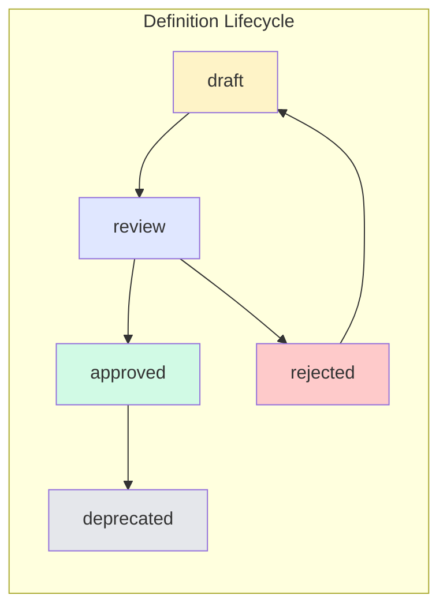
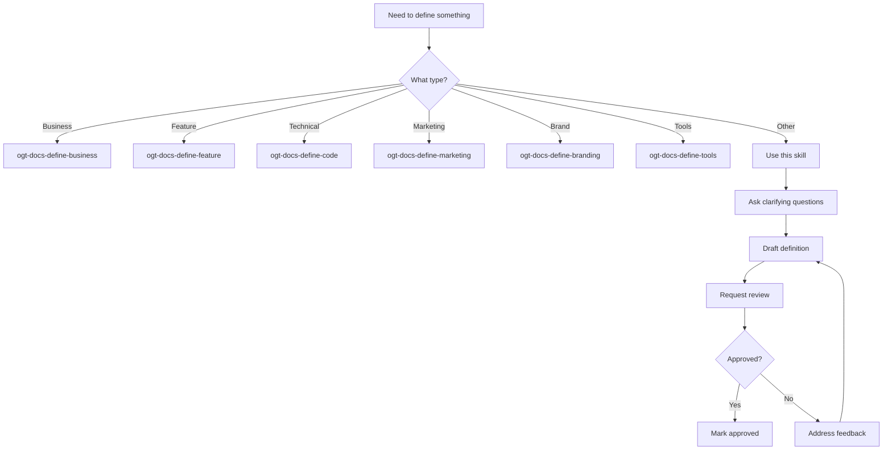

# OGT Docs - Define

Guide for creating definition documents that establish WHAT things ARE in your system.

## Philosophy

**Definitions are the foundation of shared understanding.**

Before anyone can implement, market, or discuss something, there must be a clear, agreed-upon definition of what it IS.

```
┌─────────────────────────────────────────────────────────────────┐
│                    THE DEFINITION PRINCIPLE                     │
├─────────────────────────────────────────────────────────────────┤
│  A definition answers:                                          │
│    • WHAT is this thing?                                        │
│    • WHY does it exist?                                         │
│    • WHAT are its boundaries? (what it is NOT)                  │
│    • HOW does it relate to other things?                        │
│                                                                 │
│  A definition does NOT specify:                                 │
│    • HOW to implement it (that's rules/)                        │
│    • WHAT to do with it (that's todo/)                          │
└─────────────────────────────────────────────────────────────────┘
```

## When to Use This Skill

Use `ogt-docs-define` when you need to:

- Understand the definitions folder structure
- Choose the right definition sub-skill
- Create a definition that doesn't fit specialized categories

**For specific definition types, use:**

| Type                   | Sub-Skill                   | Use When                               |
| ---------------------- | --------------------------- | -------------------------------------- |
| Business concepts      | `ogt-docs-define-business`  | Pricing, users, revenue, market        |
| Product features       | `ogt-docs-define-feature`   | New capabilities, user-facing features |
| Technical architecture | `ogt-docs-define-code`      | Services, data models, APIs            |
| Marketing concepts     | `ogt-docs-define-marketing` | Messaging, positioning, audience       |
| Brand identity         | `ogt-docs-define-branding`  | Visual identity, tone, guidelines      |
| Developer tools        | `ogt-docs-define-tools`     | CLI, scripts, dev workflows            |

## Folder Structure

```
docs/definitions/
├── business/                   # Business model and operations
│   ├── pricing_model/
│   │   ├── definition.md
│   │   ├── tiers.md
│   │   ├── limits.md
│   │   └── .approved_by_founder
│   ├── user_types/
│   ├── revenue_model/
│   └── market_position/
│
├── features/                   # Product features
│   ├── global_search/
│   │   ├── feature.md
│   │   ├── mvp.md
│   │   ├── phase_0.md
│   │   ├── phase_1.md
│   │   ├── nice_to_have.md
│   │   └── .version
│   ├── user_auth/
│   └── campaign_manager/
│
├── technical/                  # Architecture and systems
│   ├── service_layer/
│   │   ├── definition.md
│   │   ├── contracts.md
│   │   ├── patterns.md
│   │   └── .version
│   ├── data_model/
│   └── api_design/
│
├── domain/                     # Domain-specific concepts
│   ├── creatures/
│   ├── abilities/
│   └── campaigns/
│
├── marketing/                  # Marketing and communications
│   ├── value_proposition/
│   ├── target_audience/
│   └── messaging/
│
├── branding/                   # Brand identity
│   ├── visual_identity/
│   ├── tone_of_voice/
│   └── brand_guidelines/
│
└── tools/                      # Developer tooling
    ├── cli/
    ├── scripts/
    └── workflows/
```

## The Folder-as-Entity Pattern

Every definition is a **folder** containing:

```
{definition_slug}/
├── {type}.md                   # Primary definition file
├── {aspect}.md                 # Additional aspects/details
├── {related}.md                # Related concepts
└── .{signals}                  # Status and metadata
```

### Primary File Naming

| Definition Type | Primary File    |
| --------------- | --------------- |
| Business        | `definition.md` |
| Feature         | `feature.md`    |
| Technical       | `definition.md` |
| Domain          | `definition.md` |
| Marketing       | `definition.md` |
| Branding        | `definition.md` |
| Tools           | `definition.md` |

## Definition Lifecycle



### Draft State

Definition is being written, not yet ready for review.

```
{definition_slug}/
├── definition.md
├── .version
└── .draft                      # Empty signal: still in draft
```

### Review State

Definition is complete and awaiting approval.

```
{definition_slug}/
├── definition.md
├── .version
├── .ready_for_review           # Empty signal
└── .review_requested_at        # Timestamp
```

### Approved State

Definition is approved and can be referenced/implemented.

```
{definition_slug}/
├── definition.md
├── .version
├── .approved                   # Empty signal
├── .approved_by_{name}         # Who approved
└── .approved_at                # When approved
```

### Rejected State

Definition was rejected, needs rework.

```
{definition_slug}/
├── definition.md
├── .version
├── .rejected                   # Empty signal
├── .rejected_reason            # Why rejected
└── .rejected_at                # When rejected
```

### Deprecated State

Definition is outdated, replaced by something else.

```
{definition_slug}/
├── definition.md
├── .version
├── .deprecated                 # Empty signal
├── .deprecated_reason          # Why deprecated
├── .deprecated_at              # When deprecated
└── .superseded_by              # What replaces it
```

---

## Creating a Definition: The Process



### Step 1: Ask Clarifying Questions

Before writing any definition, gather information:

**Core Questions (always ask):**

1. What is the name/identifier for this concept?
2. In one sentence, what IS it?
3. Why does it need to exist? What problem does it solve?
4. What is it NOT? (boundaries)
5. What other concepts does it relate to?

**Context Questions (ask as relevant):** 6. Who are the stakeholders? 7. Are there existing similar concepts? 8. What decisions led to this concept? 9. What are the success criteria?

### Step 2: Draft the Definition

Use the appropriate template based on type (see sub-skills).

**Generic Definition Template:**

```markdown
# Definition: {Name}

## Overview

One paragraph explaining what this is and why it exists.

## Core Concept

Detailed explanation of the concept.

### Key Characteristics

- Characteristic 1
- Characteristic 2
- Characteristic 3

### Boundaries

What this is NOT:

- Not X
- Not Y
- Not Z

## Relationships

How this relates to other concepts.

| Related Concept | Relationship               |
| --------------- | -------------------------- |
| Concept A       | Uses/Contains/Depends on   |
| Concept B       | Parallel to/Alternative to |

## Examples

Concrete examples that illustrate the concept.

### Example 1: {Name}

Description of example.

### Example 2: {Name}

Description of example.

## Open Questions

Unresolved questions that need future discussion.

- Question 1?
- Question 2?
```

### Step 3: Add Signal Files

```bash
# Create version file
echo '{"schema": "1.0", "created": "'$(date -Iseconds)'"}' > .version

# Mark as draft
touch .draft
```

### Step 4: Request Review

```bash
# Remove draft signal
rm .draft

# Add review signals
touch .ready_for_review
echo "$(date -Iseconds)" > .review_requested_at
```

### Step 5: Handle Review Outcome

**If Approved:**

```bash
rm .ready_for_review .review_requested_at
touch .approved
touch .approved_by_{reviewer_name}
echo "$(date -Iseconds)" > .approved_at
```

**If Rejected:**

```bash
rm .ready_for_review .review_requested_at
touch .rejected
echo "Reason for rejection" > .rejected_reason
echo "$(date -Iseconds)" > .rejected_at
# Then address feedback and restart from Step 2
```

---

## Signal Files Reference

### Status Signals (empty files)

| Signal              | Meaning                |
| ------------------- | ---------------------- |
| `.draft`            | Still being written    |
| `.ready_for_review` | Ready for review       |
| `.approved`         | Approved for use       |
| `.rejected`         | Rejected, needs rework |
| `.deprecated`       | No longer current      |

### Attribution Signals (empty files)

| Signal                | Meaning      |
| --------------------- | ------------ |
| `.approved_by_{name}` | Who approved |
| `.created_by_{name}`  | Who created  |
| `.reviewed_by_{name}` | Who reviewed |

### Content Signals (contain text)

| Signal                 | Content                                     |
| ---------------------- | ------------------------------------------- |
| `.version`             | JSON: `{"schema": "1.0", "created": "..."}` |
| `.rejected_reason`     | Why rejected                                |
| `.deprecated_reason`   | Why deprecated                              |
| `.superseded_by`       | Path to replacement definition              |
| `.review_requested_at` | ISO timestamp                               |
| `.approved_at`         | ISO timestamp                               |
| `.rejected_at`         | ISO timestamp                               |
| `.deprecated_at`       | ISO timestamp                               |

---

## Referencing Definitions

When other documents reference a definition:

```markdown
See [Definition: User Types](docs/definitions/business/user_types/)
Per the [Service Layer Definition](docs/definitions/technical/service_layer/)
```

When code implements a definition, add a comment:

```typescript
/**
 * Implements: docs/definitions/technical/service_layer/
 * @see definition.md for contracts
 */
export class UserService implements IService {
  // ...
}
```

---

## Common Mistakes

| Mistake                      | Why It's Wrong                             | Correct Approach                        |
| ---------------------------- | ------------------------------------------ | --------------------------------------- |
| Mixing definition with rules | Conflates WHAT with HOW                    | Keep definition pure, put HOW in rules/ |
| No boundaries section        | Unclear scope leads to scope creep         | Always define what it is NOT            |
| Skipping review              | Unvalidated definitions cause misalignment | Always get approval                     |
| Editing approved definitions | Breaks references                          | Create new version or deprecate         |
| No relationships section     | Isolated definitions miss connections      | Map relationships explicitly            |
| Too abstract                 | Can't be implemented                       | Include concrete examples               |
| Too specific                 | Can't adapt to change                      | Keep at concept level                   |

---

## Quality Checklist

Before requesting review, verify:

- [ ] Overview explains WHAT and WHY in one paragraph
- [ ] Core concept is detailed enough to understand
- [ ] Boundaries clearly state what this is NOT
- [ ] Relationships map to other definitions
- [ ] At least 2 concrete examples provided
- [ ] Open questions listed (if any)
- [ ] .version file created
- [ ] .draft signal present (will be removed when requesting review)
