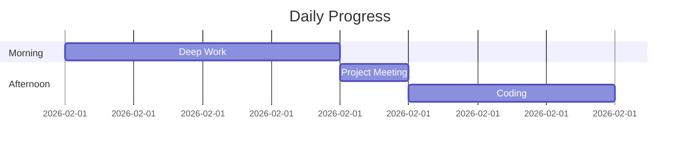

## YAML Frontmatter
All journals must begin with a YAML block for metadata:
```yaml
---
date: YYYY-MM-DD
weekday: Full Day Name
type: journal-type (e.g., daily, project, review)
mood: Emoji (🌅, ✨, 🌧️, ⚡)
energy: 1-10 or Emoji (🔋, 🪫)
tags: [category, project-name]
---
```

## Bidirectional Links
Connect notes using double brackets:
- Standard link: [[2026-02-01]]
- Link with alias: [[2026-02-01|Today's Entry]]
- Section link: [[Project Alpha#Milestones]]

## Tags
Use inline tags for categorization:
#achievement #milestone #reflection #insight #daily-win #blocker

## Callout Blocks
Use specific types to highlight content:

> [!moment] 🌅 Significant Moment
> Describe a fleeting or impactful moment.

> [!highlight] ✨ Highlight
> Key event or win of the day.

> [!reflection] 💭 Reflection
> Deep thoughts on experiences or feelings.

> [!insight] 💡 Insight
> Realizations or lessons learned.

> [!milestone] 🎯 Milestone
> Significant progress on a goal or project.

> [!gallery] 🖼️ Media
> Used for grouping images or visual logs.

## Image Embedding
Embed assets with optional size control:
![[../assets/2026/02/capture.jpg|400]]
![[screenshot.png|200]]

Path rules:
- Use relative paths from the current note location.
- Do not use absolute paths such as `/mnt/...` or `C:\\...`.
- Compute path depth dynamically from the note file and target asset file.

## Mermaid Charts
Visualize timelines or processes:


## Collapsible Sections
Hide dense technical logs or details:
<details>
<summary>Technical Logs (Click to expand)</summary>

- Debugged memory leak in worker
- Updated dependencies
- Ran benchmark suite

</details>

## Horizontal Rules
Use to separate distinct parts of the day:
---

## Emoji Usage Patterns
- 🌅 Morning / Start
- ✨ Key Highlight
- 🖼️ Visual/Gallery
- 💭 Internal Thought
- 🌱 Growth / Learning
- 🔥 Intensity / Focus
- 🎯 Goal / Achievement
- 🎉 Celebration
- 💡 Idea / Realization
- 🐛 Debugging / Problem
- 🔋 High Energy
- 🪫 Low Energy
