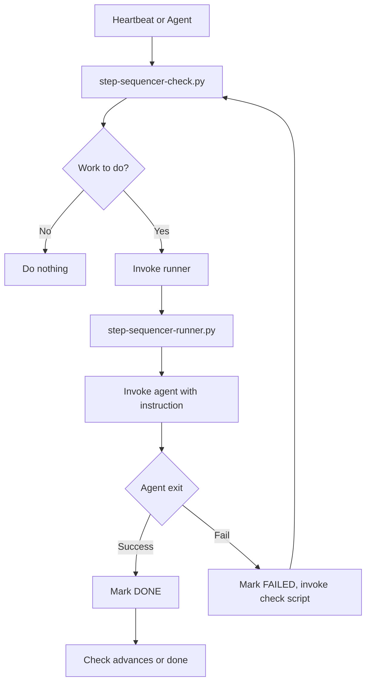
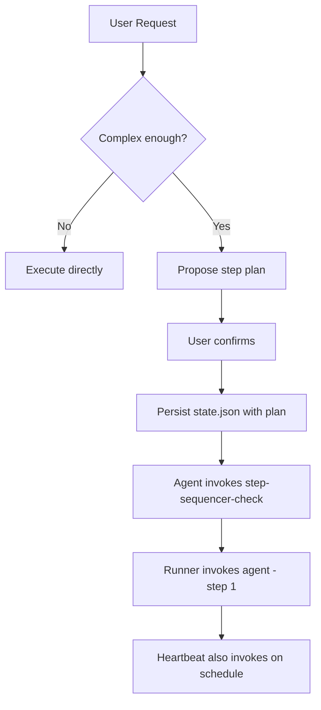

# Agent Step Sequencer

Multi-step scheduler for in-depth agent requests. Detects when a task needs multiple steps, suggests a plan, waits for confirmation, persists state, and runs a heartbeat-aware flow.

**Core pattern:** Agent proposes plan → user approves → persist state.json → check script invokes runner → runner invokes agent per step → heartbeat keeps it aligned.

---

## Why Agent Step Sequencer?

Tasks like "research X, summarize it, then write a paper" or "pull data from 5 sources and merge" need sequential execution. A single agent run stops when it finishes one step. 

Agent Step Sequencer:

- **Persists state** — survives gateway resets mid-step
- **Schedules steps** — check script invokes runner; runner invokes agent with each step instruction
- **Retries on failure** — troubleshoot prompt, immediate retry (no heartbeat wait)
- **Heartbeat-aware** — runs alongside email jobs and other heartbeat tasks

---

## Critical Rules

- **No cron** — Check script invokes runner directly; heartbeat drives the schedule
- **Delay as approval** — Agent asks during approval: "2-min delay between steps?" (for rate-limit–sensitive calls); user choice sets `stepDelayMinutes`
- **Agent suggests before executing** — When MULTI_STEP, propose plan and wait for confirmation
- **Check script invokes runner** — Check script never runs work; it invokes the runner
- **Runner invokes agent** — Runner passes step instruction to agent; agent executes
- **State is source of truth** — On heartbeat reset, check script reads state and resumes

---

## Flow

### Check script → Runner



### User flow (propose + persist)



---

## File Structure

```
agent-step-sequencer/
├── SKILL.md
├── README.md
├── references/
│   └── state-schema.md
├── scripts/
│   ├── step-sequencer-check.py   # Invoked by heartbeat
│   ├── step-sequencer-runner.py  # Invokes agent per step
│   └── README.md
└── test/
    └── test_step_sequencer.py
```

---

## Quick Start

**Install (ClawHub):**

```bash
clawhub install agent-step-sequencer
```

**Test:**

```bash
python3 test/test_step_sequencer.py
```

**Wire:**

1. Add to heartbeat:
   ```bash
   python3 ~/.openclaw/skills/agent-step-sequencer/scripts/step-sequencer-check.py ~/.openclaw/workspace/state.json
   ```
   (Use `~/.openclaw/workspace/skills/agent-step-sequencer/scripts/...` if skill lives in workspace.)
2. Agent invokes it immediately after persisting state
3. Set `STEP_AGENT_CMD` to your agent invocation (e.g. `openclaw ask`)

---

## Configuration

| Env | Description |
|-----|-------------|
| `STEP_AGENT_CMD` | Command to invoke agent (space-separated). Prompt appended. Default: `echo` |
| `STEP_MAX_RETRIES` | Max retries on FAILED before adding to blockers. Default: 3 |

**Security:** Use only your trusted agent binary (e.g. `openclaw ask`). Do not use `bash`, `sh`, or `-c`—the runner rejects these to prevent command injection.

---

See [SKILL.md](SKILL.md) for full documentation, plan format, and multi-step decision rules.
