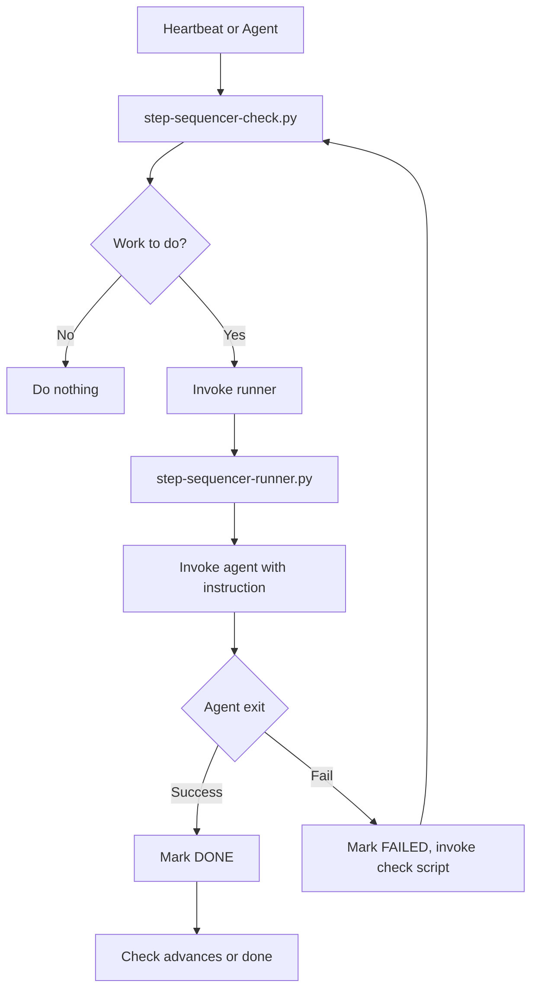
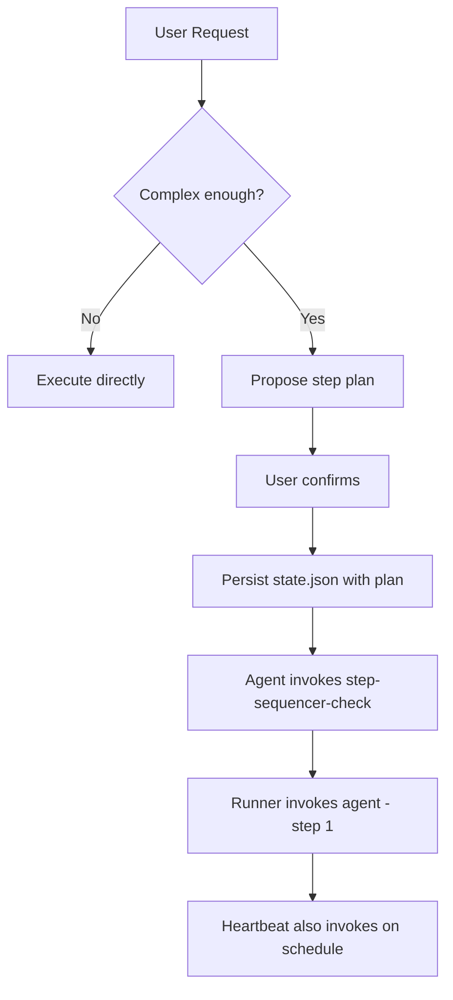

# Agent Step Sequencer

Multi-step scheduler for in-depth requests. Enables step-based actions with heartbeat integration—survives gateway reset mid-step.

## Core Pattern

1. **Interpret** when user request requires multiple steps
2. **Suggest** step plan, wait for confirmation
3. **Persist** state.json (with plan format)
4. **Agent invokes** `scripts/step-sequencer-check.py` immediately (no wait for heartbeat)
5. **Heartbeat** (e.g. every 5 min) also invokes the script—keeps sequencer aligned with email jobs and other heartbeat tasks

**Critical:** If gateway resets mid-step, next heartbeat reads state and resumes correctly.

---

## Plan Format

Agent builds a plan when user approves. During approval, agent asks: **Use 2-minute delay between steps?** Recommended for rate-limit–sensitive API calls. User chooses; agent sets `stepDelayMinutes` (0 or 2) in state. Each step has `title`, `instruction`, and optionally `requiredOutputs` (paths relative to workspace that must exist before the step is marked DONE):

```json
{
  "plan": {
    "steps": {
      "step-1": { "title": "Research topic X", "instruction": "Research topic X and produce a concise summary", "requiredOutputs": ["study/summary.md"] },
      "step-2": { "title": "Write paper", "instruction": "Using the summary from step 1, write a research paper..." }
    }
  },
  "stepQueue": ["step-1", "step-2"],
  "currentStep": 0,
  "stepRuns": {},
  "stepDelayMinutes": 0,
  "status": "IN_PROGRESS"
}
```

- **title**: Human-readable label
- **instruction**: Full instruction for the agent (research, summarize, pull X from Y, etc.)
- **requiredOutputs** (optional): List of paths (relative to workspace). Runner marks step DONE only if agent exits 0 and all these paths exist; otherwise step is FAILED with "Missing required outputs: …".

---

## Roles

- **Agent**: Builds plan, persists state; does not touch state during step execution. Takes prompts.
- **Runner** (`step-sequencer-runner.py`): Invokes agent with step instruction, waits for exit, marks DONE/FAILED. Applies stepDelayMinutes. On retry, agent gets troubleshoot prompt.
- **Check script** (`step-sequencer-check.py`): If work to do, invokes runner. Handles FAILED → retry (reset PENDING, invoke runner).
- **Heartbeat**: Invokes check script on schedule.

---

## Step execution: autonomous recovery

**Do not stop mid-step to ask the user.** When executing a step, if something fails (empty fetch, API error, source unavailable):

1. **Retry** once (same source/URL) if it might be transient.
2. **Try an alternative** (e.g. CoinGecko instead of CoinMarketCap, different endpoint or token) and complete the step with what you can.
3. **Document and exit** only if you truly cannot complete the step—then exit non-zero so the runner marks FAILED; the scheduler will retry with a troubleshoot prompt.

Do not stop silently. If you cannot complete the step after retry and alternatives: **actively prompt the user**—post a short message that you hit a snag, what failed, and what you tried (e.g. "Step 2 (research Meteora) failed: CoinMarketCap fetch empty, tried CoinGecko—also empty. Need another source or skip this token."). Then exit non-zero so the runner marks FAILED and the scheduler can retry or add to blockers. Never just stop without telling the user.

---

## How Agent Determines Multi-Step

**Agent must suggest before proceeding.** When MULTI_STEP, propose the step plan and wait for confirmation before executing.

```
MULTI_STEP =
  (action_count >= 3)
  OR has_sequential_language
  OR has_output_dependency
  OR high_scope_or_risk
  OR user_requests_steps
  OR contains_setup_keywords

SINGLE_STEP =
  (action_count == 1)
  AND NOT has_output_dependency
  AND immediate_execution

DECISION =
  IF MULTI_STEP THEN suggest_multi_step → wait for confirm → proceed
  ELSE single_step
```

**Definitions:**

| Criterion | Meaning |
|-----------|---------|
| `action_count` | Number of distinct actions (file edits, commands, etc.) |
| `has_sequential_language` | "then", "after", "first...then", "step 1" |
| `has_output_dependency` | Step B needs output from step A |
| `high_scope_or_risk` | Many files, destructive ops, migration |
| `user_requests_steps` | "step by step", "break this down", "one at a time" |
| `contains_setup_keywords` | "set up", "migrate", "implement from scratch", "full X", "complete Y" |

---

## State Schema

See [references/state-schema.md](references/state-schema.md). Key fields:

- `plan.steps`: step definitions (`title`, `instruction`, optional `requiredOutputs`)
- `stepQueue`, `currentStep`, `stepRuns`
- `stepDelayMinutes`: 0 = no delay; 2 = 2 min between steps
- `blockers`, `lastHeartbeatIso`, `artifacts`

---

## Heartbeat Flow

Heartbeat invokes `scripts/step-sequencer-check.py`. Agent also invokes it right after persisting state.

1. Read state.json
2. If no state or status=DONE → do nothing
3. If step FAILED → bump tries, reset to PENDING, invoke runner (immediate retry)
4. If step DONE → advance currentStep, invoke runner
5. If step PENDING or IN_PROGRESS → invoke runner
6. Update lastHeartbeatIso

Runner invokes agent (configurable via `STEP_AGENT_CMD`). Runner applies stepDelayMinutes.

---

## Failure Flow

1. Runner marks step FAILED, stores error in stepRuns
2. Runner invokes check script immediately (no heartbeat wait)
3. Check script bumps tries, resets status to PENDING, invokes runner
4. Runner invokes agent with troubleshoot prompt: "Step X failed (tries: N). Previous run ended with: [error]. Please troubleshoot and retry: [instruction]"
5. Repeats until DONE or max retries / blockers

---

## Flow Diagrams

### Check script → Runner



### User flow (propose + persist)



---

## Configuration

| Env | Description |
|-----|-------------|
| `STEP_AGENT_CMD` | Command to invoke agent (space-separated). Prompt appended as last arg. Default: `echo` |
| `STEP_RUNNER` | Path to step-sequencer-runner.py (optional) |
| `STEP_MAX_RETRIES` | Max retries on FAILED before adding to blockers. Default: 3 |

OpenClaw: Wire `STEP_AGENT_CMD` to OpenClaw's agent invocation (e.g. `openclaw ask`).

**Security:** Set `STEP_AGENT_CMD` only to your trusted agent binary. Do not use shell interpreters (`bash`, `sh`, etc.) or `-c`/`-e`—the runner rejects these to prevent command injection. The instruction from state.json is passed as a single argument; it is never executed by a shell.

---

## Final Deliverables Step

When all steps complete:

- Confirm all requirements of the steps are met
- Produce summary with links or paths to any files created/written
- Mark state DONE → on subsequent heartbeats, scheduler does nothing

---

## Installation

```bash
clawhub install agent-step-sequencer
```

Manual copy:

```bash
cp -r agent-step-sequencer ~/.openclaw/skills/agent-step-sequencer
```

**Heartbeat integration** — Add this to your heartbeat (or have the agent add it):

```bash
# Agent Step Sequencer check (add to heartbeat cycle)
python3 ~/.openclaw/skills/agent-step-sequencer/scripts/step-sequencer-check.py ~/.openclaw/workspace/state.json
```

Or if skill is in workspace: `python3 ~/.openclaw/workspace/skills/agent-step-sequencer/scripts/step-sequencer-check.py ~/.openclaw/workspace/state.json`

Set `STEP_AGENT_CMD` to your agent invocation before running. Agent should invoke the check script immediately after persisting state.
