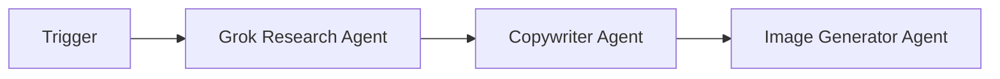
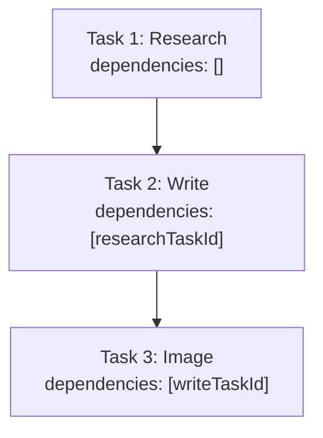
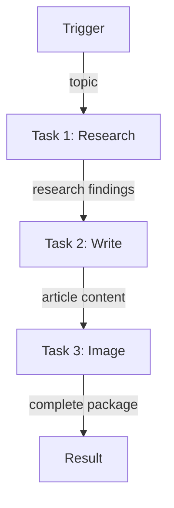

# Content Creation Pipeline Example

A 3-agent workflow that researches a topic, writes content, and generates a header image.

## Pipeline



## Task Dependencies (Sequential)



Each task waits for the previous to complete before starting.

---

## Complete Setup Script

### Project Structure

```
content-creation-pipeline/
├── src/
│   └── setup.ts
├── .env
├── package.json
└── tsconfig.json
```

### .env

```env
WALLET_PRIVATE_KEY=0x...
```

### Dependencies

```bash
npm init -y && npm pkg set type=module
npm i @openserv-labs/client dotenv
npm i -D @types/node tsx typescript
```

> **Note:** The project must use `"type": "module"` in `package.json`. Add a `"setup": "tsx src/setup.ts"` script for local development.

### src/setup.ts

```typescript
import 'dotenv/config'
import { PlatformClient, triggers } from '@openserv-labs/client'

async function setup() {
  const client = new PlatformClient()

  if (!process.env.WALLET_PRIVATE_KEY) {
    console.error('Missing WALLET_PRIVATE_KEY in .env')
    process.exit(1)
  }

  console.log('1. Authenticating with wallet...')
  await client.authenticate(process.env.WALLET_PRIVATE_KEY)

  console.log('2. Finding agents from marketplace...')
  const researchResult = await client.agents.listMarketplace({ search: 'grok research' })
  const writerResult = await client.agents.listMarketplace({ search: 'copywriter' })
  const imageResult = await client.agents.listMarketplace({ search: 'nano banana' })

  const researcher = researchResult.items[0]
  const writer = writerResult.items[0]
  const imageAgent = imageResult.items[0]

  if (!researcher || !writer || !imageAgent) {
    console.error('   Could not find required agents')
    const all = await client.agents.listMarketplace({})
    all.items.slice(0, 15).forEach(a => console.log(`   ID: ${a.id} | ${a.name}`))
    process.exit(1)
  }

  console.log(`   Researcher: ${researcher.name} (ID: ${researcher.id})`)
  console.log(`   Writer: ${writer.name} (ID: ${writer.id})`)
  console.log(`   Image Agent: ${imageAgent.name} (ID: ${imageAgent.id})`)

  console.log('3. Creating workflow...')
  const workflow = await client.workflows.create({
    name: 'Creative Powerhouse',
    goal: 'Research any topic in depth, craft polished written content, and generate professional visuals to complement the article',
    agentIds: [researcher.id, writer.id, imageAgent.id],
    // Define the complete workflow declaratively
    triggers: [
      triggers.webhook({
        name: 'content-request',
        waitForCompletion: true,
        timeout: 600,
        input: {
          topic: {
            type: 'string',
            title: 'Topic',
            description: 'The topic to research and create content about'
          }
        }
      })
    ],
    tasks: [
      {
        name: 'research',
        agentId: researcher.id,
        description: 'Research the topic',
        body: 'Research the given topic thoroughly. Find relevant information, key points, trends, and interesting facts. Provide a comprehensive research summary.',
        input: '{{trigger.topic}}'
      },
      {
        name: 'write',
        agentId: writer.id,
        description: 'Write content based on research',
        body: 'Based on the research findings, write an engaging and well-structured article. Include: 1) Compelling headline, 2) Introduction, 3) Main content with sections, 4) Key takeaways, 5) Conclusion.'
      },
      {
        name: 'image',
        agentId: imageAgent.id,
        description: 'Generate header image',
        body: 'Generate a visually appealing header image for the article. The image should be professional, eye-catching, and relevant to the content topic.'
      }
    ],
    // ⚠️ CRITICAL: Edges define how data flows through your workflow
    // Without edges, tasks won't execute even if dependencies are set!
    edges: [
      { from: 'trigger:content-request', to: 'task:research' },
      { from: 'task:research', to: 'task:write' },
      { from: 'task:write', to: 'task:image' }
    ]
  })
  console.log(`   Workflow ID: ${workflow.id}`)

  console.log('4. Activating workflow...')
  const trigger = workflow.triggers[0]
  await client.triggers.activate({ workflowId: workflow.id, id: trigger.id })
  await workflow.setRunning()

  console.log('\n============================================================')
  console.log('Content Creation Pipeline Setup Complete!')
  console.log('============================================================')
  console.log(`\nWorkflow ID: ${workflow.id}`)
  console.log(`\nPipeline: Trigger → Research → Write → Image`)
  console.log(`\nAgents:`)
  console.log(`  - ${researcher.name}`)
  console.log(`  - ${writer.name}`)
  console.log(`  - ${imageAgent.name}`)
  console.log(`\nWebhook URL:`)
  console.log(`  POST https://api.openserv.ai/webhooks/trigger/${trigger.token}`)
  console.log(`\nExample:`)
  console.log(`  curl -X POST https://api.openserv.ai/webhooks/trigger/${trigger.token} \\`)
  console.log(`    -H "Content-Type: application/json" \\`)
  console.log(`    -d '{"topic": "The future of AI agents in 2026"}'`)
  console.log('============================================================')
}

setup().catch(err => {
  console.error('Setup failed:', err.message)
  process.exit(1)
})
```

---

## How It Works

1. **Trigger fires** with `{ "topic": "The future of AI agents in 2026" }`
2. **Research Agent** searches for relevant information on the topic
3. **Research completes** → Writer task becomes ready
4. **Writer** receives the research and creates an engaging article
5. **Writer completes** → Image task becomes ready
6. **Image Agent** generates a header image for the article
7. **Image completes** → Full content package returned via webhook response

## Workflow Graph



## Usage

```bash
# Run setup (creates workflow, tasks, trigger)
npm run setup

# Trigger the workflow
curl -X POST https://api.openserv.ai/webhooks/trigger/{token} \
  -H "Content-Type: application/json" \
  -d '{"topic": "The future of AI agents in 2026"}'
```

## Key Points

1. **Input Schema Required**: When using `{{trigger.topic}}` in task inputs, you must define the `inputSchema` in the trigger props. Without it, the trigger won't know what fields to expect.

2. **Timeout Configuration**: With 3 agents in sequence, set a longer timeout (600 seconds in this example) to allow each agent sufficient time to complete.

3. **waitForCompletion: true**: This ensures the webhook response includes the final results from all tasks. The response will wait until all tasks complete.
