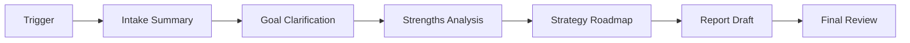
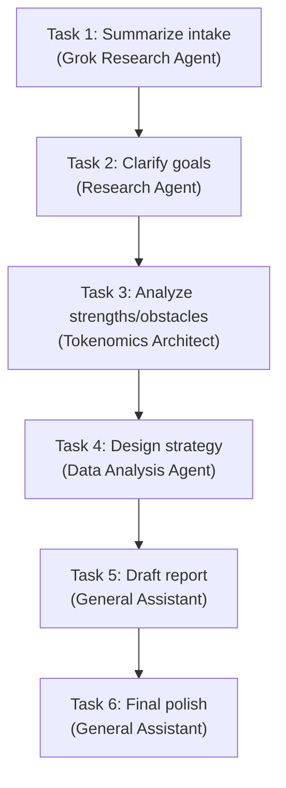
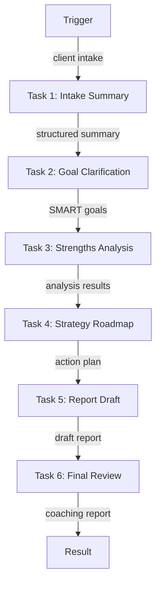

# Life Coaching Report Pipeline Example

A comprehensive 6-agent workflow that generates a tailored life coaching report and action plan from client intake data.

## Pipeline



## Task Flow



Each task builds on the output of the previous one, creating a comprehensive coaching report.

---

## Complete Setup Script

### Project Structure

```
life-coaching-pipeline/
├── src/
│   └── setup.ts
├── .env
├── package.json
└── tsconfig.json
```

### .env

```env
WALLET_PRIVATE_KEY=0x...
```

### Dependencies

```bash
npm init -y && npm pkg set type=module
npm i @openserv-labs/client dotenv
npm i -D @types/node tsx typescript
```

> **Note:** The project must use `"type": "module"` in `package.json`. Add a `"setup": "tsx src/setup.ts"` script for local development.

### src/setup.ts

```typescript
import 'dotenv/config'
import { PlatformClient, triggers } from '@openserv-labs/client'

async function setup() {
  const client = new PlatformClient()

  if (!process.env.WALLET_PRIVATE_KEY) {
    console.error('Missing WALLET_PRIVATE_KEY in .env')
    process.exit(1)
  }

  console.log('1. Authenticating with wallet...')
  await client.authenticate(process.env.WALLET_PRIVATE_KEY)

  console.log('2. Finding agents from marketplace...')

  // Search for agents with different capabilities
  const researcherResult = await client.agents.listMarketplace({ search: 'grok research' })
  const coachResult = await client.agents.listMarketplace({ search: 'research agent' })
  const analystResult = await client.agents.listMarketplace({ search: 'tokenomics' })
  const plannerResult = await client.agents.listMarketplace({ search: 'data analysis' })
  const writerResult = await client.agents.listMarketplace({ search: 'general assistant' })

  const researcher = researcherResult.items[0]
  const coach = coachResult.items[0]
  const analyst = analystResult.items[0]
  const planner = plannerResult.items[0]
  const writer = writerResult.items[0]

  if (!researcher || !coach || !analyst || !planner || !writer) {
    console.error('   Could not find required agents')
    const all = await client.agents.listMarketplace({})
    all.items.slice(0, 20).forEach(a => console.log(`   ID: ${a.id} | ${a.name}`))
    process.exit(1)
  }

  console.log(`   Researcher: ${researcher.name} (ID: ${researcher.id})`)
  console.log(`   Coach: ${coach.name} (ID: ${coach.id})`)
  console.log(`   Analyst: ${analyst.name} (ID: ${analyst.id})`)
  console.log(`   Planner: ${planner.name} (ID: ${planner.id})`)
  console.log(`   Writer: ${writer.name} (ID: ${writer.id})`)

  console.log('3. Creating workflow...')
  const workflow = await client.workflows.create({
    name: 'Life Catalyst Pro',
    goal: 'Assess client goals and challenges, develop personalized coaching strategies across wellness dimensions, and produce a comprehensive life coaching report with an actionable plan',
    agentIds: [researcher.id, coach.id, analyst.id, planner.id, writer.id],
    // Define the complete workflow declaratively
    triggers: [
      triggers.webhook({
        name: 'life-coaching-trigger',
        waitForCompletion: true,
        timeout: 900, // 15 minutes for 6 sequential tasks
        input: {
          clientName: {
            type: 'string',
            title: 'Client Name',
            description: 'Name of the coaching client'
          },
          currentSituation: {
            type: 'string',
            title: 'Current Situation',
            description: 'Briefly describe current life situation'
          },
          goals: {
            type: 'string',
            title: 'Goals',
            description: 'Primary goals the client wants to achieve'
          },
          obstacles: {
            type: 'string',
            title: 'Obstacles',
            description: 'Key challenges or obstacles'
          },
          timeframe: {
            type: 'string',
            title: 'Timeframe',
            description: 'Target timeline for progress'
          },
          coachingStyle: {
            type: 'string',
            title: 'Preferred Coaching Style',
            description: 'Supportive, direct, structured, or exploratory'
          }
        }
      })
    ],
    tasks: [
      {
        name: 'intake-summary',
        agentId: researcher.id,
        description: 'Summarize client intake into concise bullet points',
        body: 'Review the client intake information and create a structured summary with: 1) Client profile, 2) Current situation overview, 3) Stated goals, 4) Identified obstacles, 5) Timeline expectations, 6) Coaching preferences.',
        input:
          'Client: {{trigger.clientName}}\nSituation: {{trigger.currentSituation}}\nGoals: {{trigger.goals}}\nObstacles: {{trigger.obstacles}}\nTimeframe: {{trigger.timeframe}}\nPreferred Style: {{trigger.coachingStyle}}'
      },
      {
        name: 'goal-clarification',
        agentId: coach.id,
        description: 'Clarify goals into measurable outcomes and priorities',
        body: 'Based on the intake summary, transform vague goals into SMART goals (Specific, Measurable, Achievable, Relevant, Time-bound). Prioritize them and identify potential quick wins.'
      },
      {
        name: 'strengths-obstacles-analysis',
        agentId: analyst.id,
        description: 'Analyze strengths, risks, and obstacles based on intake',
        body: 'Perform a comprehensive analysis: 1) Identify hidden strengths from the situation description, 2) Analyze obstacles and their root causes, 3) Assess risks and potential blockers, 4) Find leverage points for change.'
      },
      {
        name: 'strategy-roadmap',
        agentId: planner.id,
        description: 'Design a strategy roadmap and milestone sequence',
        body: 'Create a detailed action roadmap with: 1) Phase breakdown aligned with timeframe, 2) Key milestones and checkpoints, 3) Specific action items per phase, 4) Success metrics for each milestone, 5) Contingency plans for obstacles.'
      },
      {
        name: 'report-draft',
        agentId: writer.id,
        description: 'Draft the life coaching report narrative',
        body: 'Write a professional life coaching report that includes: 1) Executive summary, 2) Client profile and goals, 3) Situation analysis, 4) Strategic recommendations, 5) Action roadmap, 6) Success metrics. Use an encouraging but realistic tone.'
      },
      {
        name: 'final-review',
        agentId: writer.id,
        description: 'Polish and assemble the final life coaching report',
        body: 'Review and polish the draft report. Ensure: 1) Consistent tone matching the coaching style preference, 2) Clear and actionable recommendations, 3) Professional formatting, 4) Motivational closing with next steps.'
      }
    ],
    // ⚠️ CRITICAL: Edges define how data flows through your workflow
    edges: [
      { from: 'trigger:life-coaching-trigger', to: 'task:intake-summary' },
      { from: 'task:intake-summary', to: 'task:goal-clarification' },
      { from: 'task:goal-clarification', to: 'task:strengths-obstacles-analysis' },
      { from: 'task:strengths-obstacles-analysis', to: 'task:strategy-roadmap' },
      { from: 'task:strategy-roadmap', to: 'task:report-draft' },
      { from: 'task:report-draft', to: 'task:final-review' }
    ]
  })
  console.log(`   Workflow ID: ${workflow.id}`)

  console.log('4. Activating workflow...')
  const trigger = workflow.triggers[0]
  await client.triggers.activate({ workflowId: workflow.id, id: trigger.id })
  await workflow.setRunning()

  console.log('\n============================================================')
  console.log('Life Coaching Report Pipeline Setup Complete!')
  console.log('============================================================')
  console.log(`\nWorkflow ID: ${workflow.id}`)
  console.log(`\nPipeline:`)
  console.log('  Trigger → Intake Summary → Goal Clarification →')
  console.log('  Strengths Analysis → Strategy Roadmap →')
  console.log('  Report Draft → Final Review')
  console.log(`\nAgents:`)
  console.log(`  - ${researcher.name}`)
  console.log(`  - ${coach.name}`)
  console.log(`  - ${analyst.name}`)
  console.log(`  - ${planner.name}`)
  console.log(`  - ${writer.name}`)
  console.log(`\nWebhook URL:`)
  console.log(`  POST https://api.openserv.ai/webhooks/trigger/${trigger.token}`)
  console.log(`\nExample:`)
  console.log(`  curl -X POST https://api.openserv.ai/webhooks/trigger/${trigger.token} \\`)
  console.log(`    -H "Content-Type: application/json" \\`)
  console.log(
    `    -d '${JSON.stringify({
      clientName: 'Taylor',
      currentSituation: 'Feeling stuck in career growth and work-life balance',
      goals: 'Transition to a leadership role and build sustainable habits',
      obstacles: 'Time constraints, low confidence, unclear next steps',
      timeframe: '6 months',
      coachingStyle: 'supportive and structured'
    })}'`
  )
  console.log('============================================================')
}

setup().catch(err => {
  console.error('Setup failed:', err.message)
  process.exit(1)
})
```

---

## How It Works

1. **Trigger fires** with comprehensive client intake data
2. **Intake Summary** (Grok Research) - Structures raw intake into organized summary
3. **Goal Clarification** (Research Agent) - Transforms goals into SMART format
4. **Strengths Analysis** (Tokenomics Architect) - Deep analysis of situation and obstacles
5. **Strategy Roadmap** (Data Analysis) - Creates phased action plan with milestones
6. **Report Draft** (General Assistant) - Writes the full coaching report
7. **Final Review** (General Assistant) - Polishes and finalizes the report

## Workflow Graph



## Usage

```bash
# Run setup (creates workflow, tasks, trigger)
npm run setup

# Trigger the workflow
curl -X POST https://api.openserv.ai/webhooks/trigger/{token} \
  -H "Content-Type: application/json" \
  -d '{
    "clientName": "Taylor",
    "currentSituation": "Feeling stuck in career growth and work-life balance",
    "goals": "Transition to a leadership role and build sustainable habits",
    "obstacles": "Time constraints, low confidence, unclear next steps",
    "timeframe": "6 months",
    "coachingStyle": "supportive and structured"
  }'
```

## Key Points

1. **Complex Input Schema**: This example shows how to define multiple required fields with descriptions. All fields are passed to the first task using template variables.

2. **Long Timeout**: With 6 sequential tasks, the timeout is set to 900 seconds (15 minutes) to allow sufficient processing time.

3. **Task Specialization**: Different agents handle different aspects - research agents for analysis, specialized agents for planning, and writing agents for report generation.

4. **Reusing Agents**: The same agent (General Assistant) can be used for multiple tasks with different instructions (Report Draft and Final Review).

5. **waitForCompletion: true**: The webhook response will wait for all 6 tasks to complete before returning the final coaching report.
