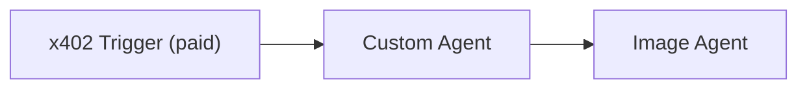

# Paid Image Pipeline Example

A 2-agent workflow using `provision()` with x402 monetization: a custom agent acknowledges a message, then a marketplace image agent generates a visual.

## Pipeline



## Complete Agent Code

### Project Structure

```
paid-image-pipeline/
├── src/
│   └── agent.ts
├── .env
├── package.json
└── tsconfig.json
```

### .env

```env
OPENAI_API_KEY=your-openai-key
# Auto-populated by provision():
WALLET_PRIVATE_KEY=
```

### Dependencies

```bash
npm init -y && npm pkg set type=module
npm i @openserv-labs/sdk @openserv-labs/client dotenv openai zod
npm i -D @types/node tsx typescript
```

> **Note:** The project must use `"type": "module"` in `package.json`. Add a `"dev": "tsx src/agent.ts"` script for local development.

### src/agent.ts

```typescript
import 'dotenv/config'
import { Agent, run } from '@openserv-labs/sdk'
import { provision, triggers } from '@openserv-labs/client'
import { z } from 'zod'

const IMAGE_AGENT_ID = 1044 // Nano Banana Pro Agent (from marketplace)

const agent = new Agent({
  systemPrompt:
    'You are a concise agent. When a user sends you any message, respond with "Roger that".'
})

agent.addCapability({
  name: 'roger-that',
  description: 'Acknowledge any message with "Roger that"',
  schema: z.object({
    message: z.string().describe('The incoming message')
  }),
  async run({ args }) {
    console.log(`Received: ${args.message}`)
    return 'Roger that'
  }
})

async function main() {
  const result = await provision({
    agent: {
      instance: agent,
      name: 'roger-that',
      description: 'Acknowledges messages with "Roger that"'
    },
    workflow: {
      name: 'Roger That Image',
      goal: 'Acknowledge user messages and generate a bold, eye-catching "Roger that" image in response',
      trigger: triggers.x402({
        name: 'Roger That Image',
        description: 'Send any message and get a "Roger that" image',
        price: '0.01',
        timeout: 600,
        input: {
          message: {
            type: 'string',
            title: 'Your Message',
            description: 'Say anything'
          }
        }
      }),
      tasks: [
        {
          name: 'acknowledge',
          description: 'Read the user message and respond with "Roger that" using the roger-that capability',
          input: '{{trigger.message}}'
          // No agentId -- defaults to the provisioned agent
        },
        {
          name: 'generate-image',
          description: 'Generate a bold image that says "Roger that" in a confident, eye-catching style',
          agentId: IMAGE_AGENT_ID // Marketplace agent
        }
      ]
      // No edges needed -- sequential edges auto-generated:
      //   trigger -> acknowledge -> generate-image
      // No agentIds needed -- derived from tasks automatically
    }
  })

  console.log(`Agent ID: ${result.agentId}`)
  console.log(`Paywall: ${result.paywallUrl}`)

  await run(agent)
}

main().catch(console.error)
```

## How It Works

1. `provision()` registers the custom agent on the platform
2. It creates a multi-agent workflow with:
   - **x402 trigger** -- paid paywall at $0.01 per request
   - **Task 1** (custom agent) -- acknowledges the message with "Roger that"
   - **Task 2** (Nano Banana Pro) -- generates an image based on the acknowledgment
3. `x402WalletAddress` is auto-injected from the provisioned wallet (no manual setup)
4. `agentIds` are derived from tasks (no need to specify `[agentId, 1044]` manually)
5. Sequential edges are auto-generated: trigger -> acknowledge -> generate-image
6. `run(agent)` starts the local agent with built-in tunnel

## Adding ERC-8004 On-Chain Registration

Add on-chain identity after provisioning so the agent is discoverable via the Identity Registry. **Requires ETH on Base** for gas. Always wrap in try/catch so failures don't prevent `run(agent)` from starting. Reload `.env` after `provision()` to pick up the freshly written `WALLET_PRIVATE_KEY`.

```typescript
import { PlatformClient } from '@openserv-labs/client'

// ... after provision(), before run():

// Reload .env to pick up WALLET_PRIVATE_KEY written by provision()
dotenv.config({ override: true })

try {
  const client = new PlatformClient()
  await client.authenticate(process.env.WALLET_PRIVATE_KEY)

  const erc8004 = await client.erc8004.registerOnChain({
    workflowId: result.workflowId,
    privateKey: process.env.WALLET_PRIVATE_KEY!,
    name: 'Roger That Image',
    description: 'Send any message and get a "Roger that" image',
  })

  console.log(`ERC-8004 Agent ID: ${erc8004.agentId}`)
  console.log(`Block Explorer: ${erc8004.blockExplorerUrl}`)
  console.log(`Scan: ${erc8004.scanUrl}`)
} catch (error) {
  console.warn('ERC-8004 registration skipped:', error instanceof Error ? error.message : error)
}

await run(agent)
```

**Re-runs update the agent card URI** — the agent ID stays the same. Never clear the wallet state unless you intentionally want a new on-chain identity.

## Key Points

1. **No manual wallet injection**: `provision()` handles `x402WalletAddress` automatically via `client.resolveWalletAddress()`
2. **No manual agentIds**: Derived from `tasks[].agentId` automatically
3. **No manual edges**: Sequential edges are auto-generated when no explicit edges are provided
4. **Backward compatible**: The `task` shorthand (single task) still works for simple agents
5. **Idempotent**: Re-running `npm run dev` updates the existing workflow via `sync()` rather than creating duplicates
6. **ERC-8004 re-deploy**: `registerOnChain` detects existing agent and calls `setAgentURI` instead of minting new
