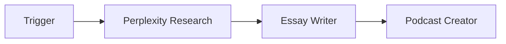
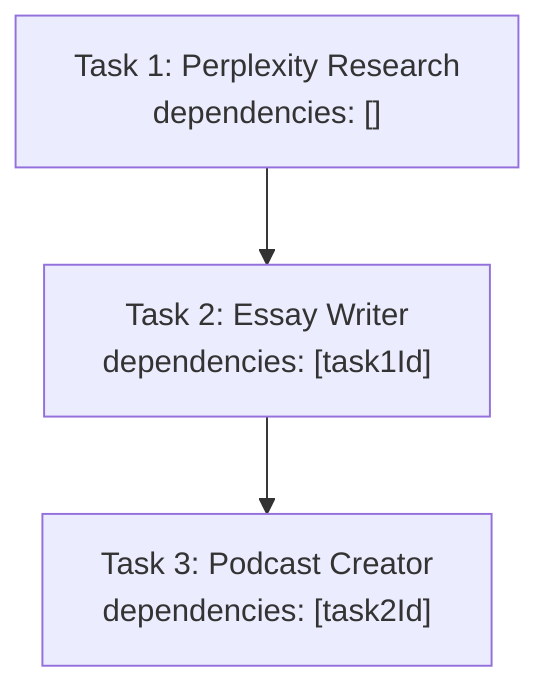
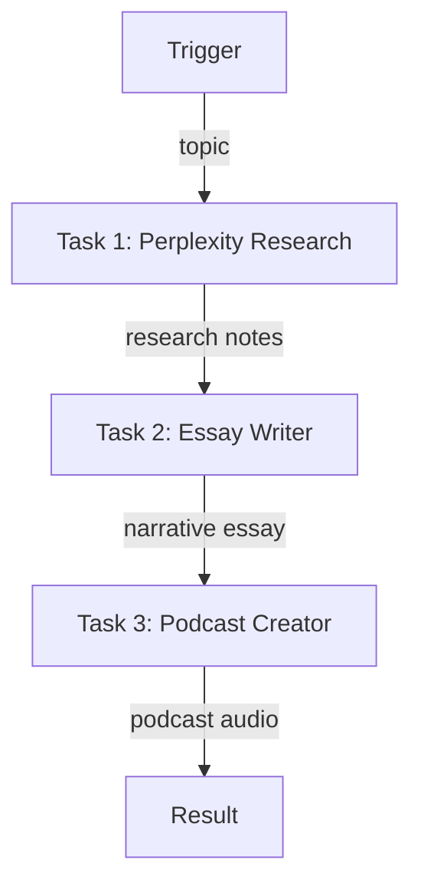

# Podcast Production Line

A 3-agent sequential workflow that researches a topic, writes a narrative essay, and produces a complete podcast.

## Pipeline



## Task Dependencies (Sequential)



Each task waits for the previous one to complete before starting.

---

## Complete Setup Script

### Project Structure

```
podcast-production-line/
├── src/
│   └── setup.ts
├── .env
├── package.json
└── tsconfig.json
```

### .env

```env
WALLET_PRIVATE_KEY=0x...
```

### Dependencies

```bash
npm init -y && npm pkg set type=module
npm i @openserv-labs/client dotenv
npm i -D @types/node tsx typescript
```

> **Note:** The project must use `"type": "module"` in `package.json`. Add a `"setup": "tsx src/setup.ts"` script for local development.

### src/setup.ts

```typescript
import 'dotenv/config'
import { PlatformClient, triggers } from '@openserv-labs/client'

async function setup() {
  const client = new PlatformClient()

  if (!process.env.WALLET_PRIVATE_KEY) {
    console.error('Missing WALLET_PRIVATE_KEY in .env')
    process.exit(1)
  }

  console.log('1. Authenticating with wallet...')
  await client.authenticate(process.env.WALLET_PRIVATE_KEY)

  console.log('2. Finding agents from marketplace...')
  const perplexityResult = await client.agents.listMarketplace({ search: 'perplexity' })
  const essayWriterResult = await client.agents.listMarketplace({ search: 'essay' })
  const podcastCreatorResult = await client.agents.listMarketplace({ search: 'podcast' })
  const perplexity = perplexityResult.items[0]
  const essayWriter = essayWriterResult.items[0]
  const podcastCreator = podcastCreatorResult.items[0]

  if (!perplexity || !essayWriter || !podcastCreator) {
    console.error('   Could not find required agents')
    const all = await client.agents.listMarketplace({})
    all.items.slice(0, 15).forEach(a => console.log(`   ID: ${a.id} | ${a.name}`))
    process.exit(1)
  }

  console.log(`   Perplexity Research: ${perplexity.name} (ID: ${perplexity.id})`)
  console.log(`   Essay Writer: ${essayWriter.name} (ID: ${essayWriter.id})`)
  console.log(`   Podcast Creator: ${podcastCreator.name} (ID: ${podcastCreator.id})`)

  console.log('3. Creating workflow...')
  const workflow = await client.workflows.create({
    name: 'Podcast Production Line',
    goal: 'Research any topic thoroughly, write an engaging narrative essay, and produce a professional podcast episode with AI-generated narration',
    agentIds: [perplexity.id, essayWriter.id, podcastCreator.id],
    triggers: [
      triggers.webhook({
        name: 'webhook',
        waitForCompletion: true,
        timeout: 900,
        input: {
          topic: { type: 'string', title: 'Topic', description: 'Topic for the podcast episode' }
        }
      })
    ],
    tasks: [
      {
        name: 'research',
        agentId: perplexity.id,
        description: 'Research the topic',
        body: 'Research the given topic thoroughly. Find authoritative sources, key facts, expert opinions, and interesting angles. Compile comprehensive research notes.',
        input: '{{trigger.topic}}'
      },
      {
        name: 'essay',
        agentId: essayWriter.id,
        description: 'Write narrative essay',
        body: 'Based on the research, write an engaging narrative essay suitable for podcast narration. Use storytelling techniques, include interesting anecdotes, and maintain a conversational tone.'
      },
      {
        name: 'podcast',
        agentId: podcastCreator.id,
        description: 'Produce podcast episode',
        body: 'Convert the essay into a complete podcast episode. Generate professional audio narration with appropriate pacing, tone, and production quality.'
      }
    ],
    // ⚠️ CRITICAL: Edges define the workflow execution path
    edges: [
      { from: 'trigger:webhook', to: 'task:research' },
      { from: 'task:research', to: 'task:essay' },
      { from: 'task:essay', to: 'task:podcast' }
    ]
  })
  console.log(`   Workflow ID: ${workflow.id}`)

  console.log('4. Activating workflow...')
  const trigger = workflow.triggers[0]
  await client.triggers.activate({ workflowId: workflow.id, id: trigger.id })
  await workflow.setRunning()

  console.log('\n========================================')
  console.log('Podcast Production Line Setup Complete!')
  console.log('========================================')
  console.log(`\nWorkflow ID: ${workflow.id}`)
  console.log(`\nWorkflow: Trigger → Perplexity Research → Essay Writer → Podcast Creator`)
  console.log(`\nWebhook URL:`)
  console.log(`  POST https://api.openserv.ai/webhooks/trigger/${trigger.token}`)
  console.log(`\nExample:`)
  console.log(`  curl -X POST https://api.openserv.ai/webhooks/trigger/${trigger.token} \\`)
  console.log(`    -H "Content-Type: application/json" \\`)
  console.log(`    -d '{"topic": "The history of artificial intelligence"}'`)
  console.log('========================================')
}

setup().catch(err => {
  console.error('Setup failed:', err.message)
  process.exit(1)
})
```

---

## How It Works

1. **Trigger fires** with `{ "topic": "The history of artificial intelligence" }`
2. **Perplexity Research** gathers comprehensive research on the topic
3. **Perplexity completes** → Essay Writer task becomes ready
4. **Essay Writer** creates a narrative essay suitable for narration
5. **Essay Writer completes** → Podcast Creator task becomes ready
6. **Podcast Creator** produces the final podcast episode with audio
7. **Podcast Creator completes** → Audio file returned via webhook response

## Workflow Graph



## Usage

```bash
# Run setup (creates workflow, tasks, trigger)
npm run setup

# Trigger the workflow
curl -X POST https://api.openserv.ai/webhooks/trigger/{token} \
  -H "Content-Type: application/json" \
  -d '{"topic": "The history of artificial intelligence"}'
```
