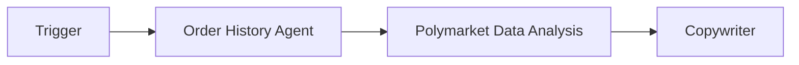
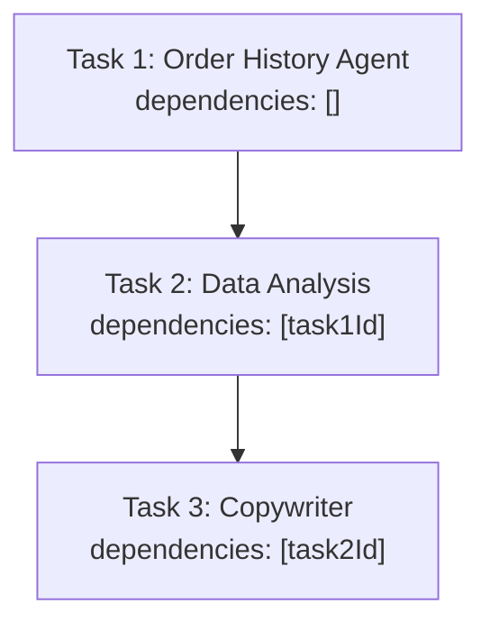
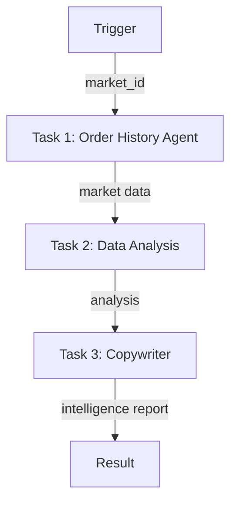

# Polymarket Intelligence

A 3-agent sequential workflow that fetches prediction market data, analyzes trends, and produces an intelligence report.

## Pipeline



## Task Dependencies (Sequential)



Each task waits for the previous one to complete before starting.

---

## Complete Setup Script

### Project Structure

```
polymarket-intelligence/
├── src/
│   └── setup.ts
├── .env
├── package.json
└── tsconfig.json
```

### .env

```env
WALLET_PRIVATE_KEY=0x...
```

### Dependencies

```bash
npm init -y && npm pkg set type=module
npm i @openserv-labs/client dotenv
npm i -D @types/node tsx typescript
```

> **Note:** The project must use `"type": "module"` in `package.json`. Add a `"setup": "tsx src/setup.ts"` script for local development.

### src/setup.ts

```typescript
import 'dotenv/config'
import { PlatformClient, triggers } from '@openserv-labs/client'

async function setup() {
  const client = new PlatformClient()

  if (!process.env.WALLET_PRIVATE_KEY) {
    console.error('Missing WALLET_PRIVATE_KEY in .env')
    process.exit(1)
  }

  console.log('1. Authenticating with wallet...')
  await client.authenticate(process.env.WALLET_PRIVATE_KEY)

  console.log('2. Finding agents from marketplace...')
  const orderHistoryResult = await client.agents.listMarketplace({ search: 'polymarket order history' })
  const dataAnalysisResult = await client.agents.listMarketplace({ search: 'polymarket data' })
  const copywriterResult = await client.agents.listMarketplace({ search: 'copywriter' })
  const orderHistory = orderHistoryResult.items[0]
  const dataAnalysis = dataAnalysisResult.items[0]
  const copywriter = copywriterResult.items[0]

  if (!orderHistory || !dataAnalysis || !copywriter) {
    console.error('   Could not find required agents')
    const all = await client.agents.listMarketplace({})
    all.items.slice(0, 15).forEach(a => console.log(`   ID: ${a.id} | ${a.name}`))
    process.exit(1)
  }

  console.log(`   Order History Agent: ${orderHistory.name} (ID: ${orderHistory.id})`)
  console.log(`   Data Analysis: ${dataAnalysis.name} (ID: ${dataAnalysis.id})`)
  console.log(`   Copywriter: ${copywriter.name} (ID: ${copywriter.id})`)

  console.log('3. Creating workflow...')
  const workflow = await client.workflows.create({
    name: 'Polymarket Intelligence',
    goal: 'Fetch real-time prediction market data, identify whale activity and sentiment shifts, and produce a comprehensive intelligence report with strategic insights',
    agentIds: [orderHistory.id, dataAnalysis.id, copywriter.id],
    triggers: [
      triggers.webhook({
        name: 'webhook',
        waitForCompletion: true,
        timeout: 600,
        input: {
          market_id: { type: 'string', title: 'Market ID', description: 'Polymarket market ID to analyze' }
        }
      })
    ],
    tasks: [
      {
        name: 'fetch',
        agentId: orderHistory.id,
        description: 'Fetch prediction market data',
        body: 'Fetch order history and market data for the specified Polymarket market. Include price movements, volume, and significant trades.',
        input: '{{trigger.market_id}}'
      },
      {
        name: 'analyze',
        agentId: dataAnalysis.id,
        description: 'Analyze market trends',
        body: 'Analyze the prediction market data. Identify trends, whale activity, sentiment shifts, and potential market inefficiencies. Provide data-driven insights.'
      },
      {
        name: 'report',
        agentId: copywriter.id,
        description: 'Write intelligence report',
        body: 'Based on the analysis, write a professional intelligence report. Include: market summary, key trends, whale activity analysis, probability assessment, and strategic insights.'
      }
    ],
    // ⚠️ CRITICAL: Edges define the workflow execution path
    edges: [
      { from: 'trigger:webhook', to: 'task:fetch' },
      { from: 'task:fetch', to: 'task:analyze' },
      { from: 'task:analyze', to: 'task:report' }
    ]
  })
  console.log(`   Workflow ID: ${workflow.id}`)

  console.log('4. Activating workflow...')
  const trigger = workflow.triggers[0]
  await client.triggers.activate({ workflowId: workflow.id, id: trigger.id })
  await workflow.setRunning()

  console.log('\n========================================')
  console.log('Polymarket Intelligence Setup Complete!')
  console.log('========================================')
  console.log(`\nWorkflow ID: ${workflow.id}`)
  console.log(`\nWorkflow: Trigger → Order History Agent → Data Analysis → Copywriter`)
  console.log(`\nWebhook URL:`)
  console.log(`  POST https://api.openserv.ai/webhooks/trigger/${trigger.token}`)
  console.log(`\nExample:`)
  console.log(`  curl -X POST https://api.openserv.ai/webhooks/trigger/${trigger.token} \\`)
  console.log(`    -H "Content-Type: application/json" \\`)
  console.log(`    -d '{"market_id": "0x..."}'`)
  console.log('========================================')
}

setup().catch(err => {
  console.error('Setup failed:', err.message)
  process.exit(1)
})
```

---

## How It Works

1. **Trigger fires** with `{ "market_id": "0x..." }`
2. **Order History Agent** fetches market data and order history
3. **Order History completes** → Data Analysis task becomes ready
4. **Data Analysis** analyzes trends, whale activity, and inefficiencies
5. **Data Analysis completes** → Copywriter task becomes ready
6. **Copywriter** produces a professional intelligence report
7. **Copywriter completes** → Report returned via webhook response

## Workflow Graph



## Usage

```bash
# Run setup (creates workflow, tasks, trigger)
npm run setup

# Trigger the workflow
curl -X POST https://api.openserv.ai/webhooks/trigger/{token} \
  -H "Content-Type: application/json" \
  -d '{"market_id": "0x..."}'
```
