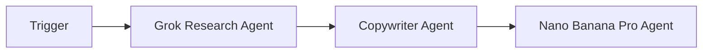
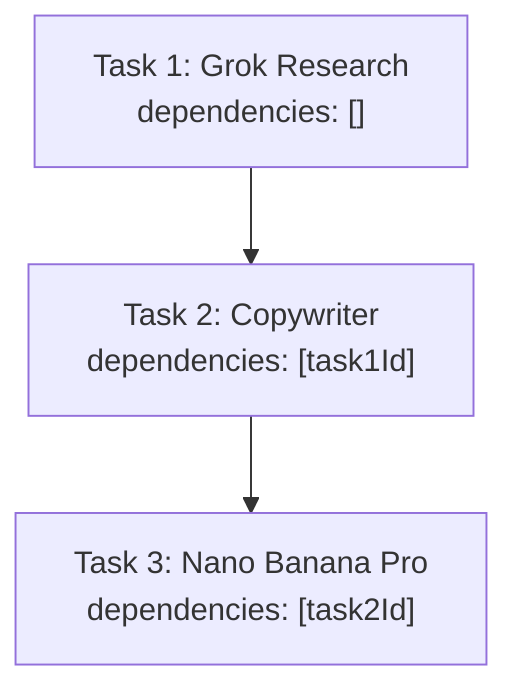
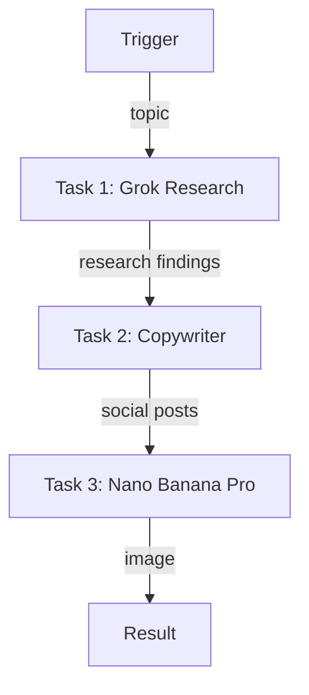

# Social Media Content Pipeline

A 3-agent sequential workflow that researches a topic, creates social media content, and generates visuals.

## Pipeline



## Task Dependencies (Sequential)



Each task waits for the previous one to complete before starting.

---

## Complete Setup Script

### Project Structure

```
social-media-pipeline/
├── src/
│   └── setup.ts
├── .env
├── package.json
└── tsconfig.json
```

### .env

```env
WALLET_PRIVATE_KEY=0x...
```

### Dependencies

```bash
npm init -y && npm pkg set type=module
npm i @openserv-labs/client dotenv
npm i -D @types/node tsx typescript
```

> **Note:** The project must use `"type": "module"` in `package.json`. Add a `"setup": "tsx src/setup.ts"` script for local development.

### src/setup.ts

**Recommended Approach: Using `workflows.sync()`**

```typescript
import 'dotenv/config'
import { PlatformClient, triggers } from '@openserv-labs/client'

async function setup() {
  const client = new PlatformClient()

  if (!process.env.WALLET_PRIVATE_KEY) {
    console.error('Missing WALLET_PRIVATE_KEY in .env')
    process.exit(1)
  }

  console.log('1. Authenticating with wallet...')
  await client.authenticate(process.env.WALLET_PRIVATE_KEY)

  console.log('2. Finding agents from marketplace...')
  const grokResult = await client.agents.listMarketplace({ search: 'grok research' })
  const copywriterResult = await client.agents.listMarketplace({ search: 'copywriter' })
  const nanoBananaResult = await client.agents.listMarketplace({ search: 'nano banana' })
  const grokResearch = grokResult.items[0]
  const copywriter = copywriterResult.items[0]
  const nanoBanana = nanoBananaResult.items[0]

  if (!grokResearch || !copywriter || !nanoBanana) {
    console.error('   Could not find required agents')
    const all = await client.agents.listMarketplace({})
    all.items.slice(0, 15).forEach(a => console.log(`   ID: ${a.id} | ${a.name}`))
    process.exit(1)
  }

  console.log(`   Grok Research: ${grokResearch.name} (ID: ${grokResearch.id})`)
  console.log(`   Copywriter: ${copywriter.name} (ID: ${copywriter.id})`)
  console.log(`   Nano Banana Pro: ${nanoBanana.name} (ID: ${nanoBanana.id})`)

  console.log('3. Creating workflow...')
  const workflow = await client.workflows.create({
    name: 'Viral Content Engine',
    goal: 'Research trending topics across the web and social media, create engaging multi-platform social posts, and generate eye-catching visual content',
    agentIds: [grokResearch.id, copywriter.id, nanoBanana.id],
    triggers: [
      triggers.webhook({
        name: 'webhook',
        waitForCompletion: true,
        timeout: 600,
        input: {
          topic: { type: 'string', title: 'Topic', description: 'Topic to create content for' }
        }
      })
    ],
    tasks: [
      {
        name: 'research',
        agentId: grokResearch.id,
        description: 'Research the topic using X and web',
        body: 'Research the given topic using X/Twitter and web search. Find trending discussions, key insights, and relevant content.',
        input: '{{trigger.topic}}'
      },
      {
        name: 'content',
        agentId: copywriter.id,
        description: 'Create social media content',
        body: 'Based on the research findings, create engaging social media content. Include: 1) A Twitter/X post (max 280 chars), 2) A LinkedIn post (professional tone), 3) Key hashtags.'
      },
      {
        name: 'visual',
        agentId: nanoBanana.id,
        description: 'Generate social media image',
        body: 'Generate an eye-catching image for the social media posts. The image should be visually appealing, modern, and relevant to the topic.'
      }
    ],
    // ⚠️ CRITICAL: Edges define the workflow execution path
    edges: [
      { from: 'trigger:webhook', to: 'task:research' },
      { from: 'task:research', to: 'task:content' },
      { from: 'task:content', to: 'task:visual' }
    ]
  })
  console.log(`   Workflow ID: ${workflow.id}`)

  console.log('4. Activating workflow...')
  const trigger = workflow.triggers[0]
  await client.triggers.activate({ workflowId: workflow.id, id: trigger.id })
  await workflow.setRunning()

  console.log('\n========================================')
  console.log('Social Media Pipeline Setup Complete!')
  console.log('========================================')
  console.log(`\nWorkflow ID: ${workflow.id}`)
  console.log(`\nWorkflow: Trigger → Grok Research → Copywriter → Nano Banana Pro`)
  console.log(`\nWebhook URL:`)
  console.log(`  POST https://api.openserv.ai/webhooks/trigger/${trigger.token}`)
  console.log(`\nExample:`)
  console.log(`  curl -X POST https://api.openserv.ai/webhooks/trigger/${trigger.token} \\`)
  console.log(`    -H "Content-Type: application/json" \\`)
  console.log(`    -d '{"topic": "AI agents transforming business automation"}'`)
  console.log('========================================')
}

setup().catch(err => {
  console.error('Setup failed:', err.message)
  process.exit(1)
})
```

---

## How It Works

1. **Trigger fires** with `{ "topic": "AI agents transforming business automation" }`
2. **Grok Research Agent** searches X/Twitter and web for relevant content
3. **Grok Research completes** → Copywriter task becomes ready
4. **Copywriter** creates Twitter post, LinkedIn post, and hashtags
5. **Copywriter completes** → Nano Banana Pro task becomes ready
6. **Nano Banana Pro** generates an eye-catching image for the posts
7. **Nano Banana Pro completes** → Results returned via webhook response

## Workflow Graph



## Usage

```bash
# Run setup (creates workflow, tasks, trigger)
npm run setup

# Trigger the workflow
curl -X POST https://api.openserv.ai/webhooks/trigger/{token} \
  -H "Content-Type: application/json" \
  -d '{"topic": "AI agents transforming business automation"}'
```
