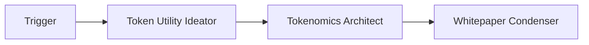
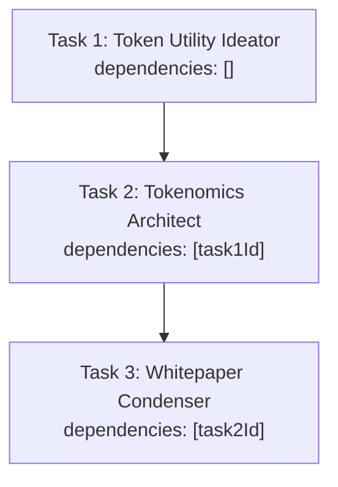
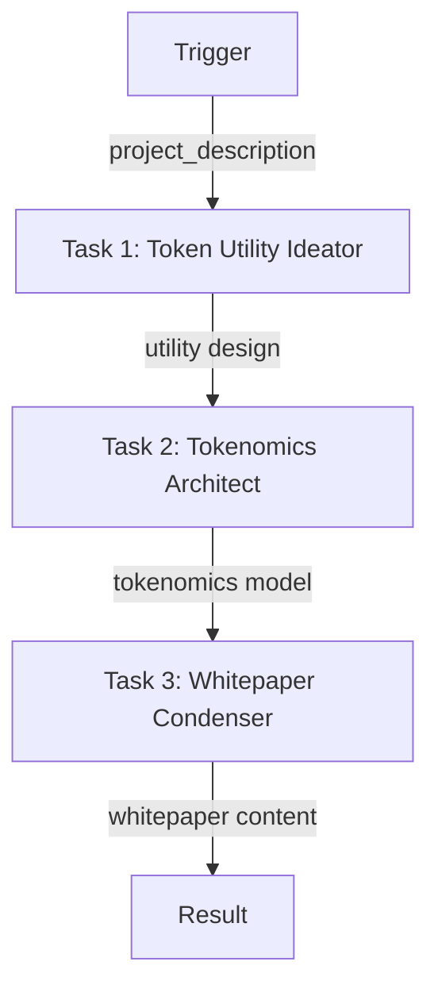

# Tokenomics Design Pipeline

A 3-agent sequential workflow that designs token utilities, builds tokenomics models, and drafts whitepaper content.

## Pipeline



## Task Dependencies (Sequential)



Each task waits for the previous one to complete before starting.

---

## Complete Setup Script

### Project Structure

```
tokenomics-design-pipeline/
├── src/
│   └── setup.ts
├── .env
├── package.json
└── tsconfig.json
```

### .env

```env
WALLET_PRIVATE_KEY=0x...
```

### Dependencies

```bash
npm init -y && npm pkg set type=module
npm i @openserv-labs/client dotenv
npm i -D @types/node tsx typescript
```

> **Note:** The project must use `"type": "module"` in `package.json`. Add a `"setup": "tsx src/setup.ts"` script for local development.

### src/setup.ts

```typescript
import 'dotenv/config'
import { PlatformClient, triggers } from '@openserv-labs/client'

async function setup() {
  const client = new PlatformClient()

  if (!process.env.WALLET_PRIVATE_KEY) {
    console.error('Missing WALLET_PRIVATE_KEY in .env')
    process.exit(1)
  }

  console.log('1. Authenticating with wallet...')
  await client.authenticate(process.env.WALLET_PRIVATE_KEY)

  console.log('2. Finding agents from marketplace...')
  const utilityIdeatorResult = await client.agents.listMarketplace({ search: 'token utility' })
  const tokenomicsArchitectResult = await client.agents.listMarketplace({ search: 'tokenomics architect' })
  const whitepaperCondenserResult = await client.agents.listMarketplace({ search: 'whitepaper' })
  const utilityIdeator = utilityIdeatorResult.items[0]
  const tokenomicsArchitect = tokenomicsArchitectResult.items[0]
  const whitepaperCondenser = whitepaperCondenserResult.items[0]

  if (!utilityIdeator || !tokenomicsArchitect || !whitepaperCondenser) {
    console.error('   Could not find required agents')
    const all = await client.agents.listMarketplace({})
    all.items.slice(0, 15).forEach(a => console.log(`   ID: ${a.id} | ${a.name}`))
    process.exit(1)
  }

  console.log(`   Token Utility Ideator: ${utilityIdeator.name} (ID: ${utilityIdeator.id})`)
  console.log(`   Tokenomics Architect: ${tokenomicsArchitect.name} (ID: ${tokenomicsArchitect.id})`)
  console.log(`   Whitepaper Condenser: ${whitepaperCondenser.name} (ID: ${whitepaperCondenser.id})`)

  console.log('3. Creating workflow...')
  const workflow = await client.workflows.create({
    name: 'Tokenomics Architect',
    goal: 'Design innovative token utility mechanisms, build a comprehensive tokenomics model with supply and distribution mechanics, and draft professional whitepaper content',
    agentIds: [utilityIdeator.id, tokenomicsArchitect.id, whitepaperCondenser.id],
    triggers: [
      triggers.webhook({
        name: 'webhook',
        waitForCompletion: true,
        timeout: 900,
        input: {
          project_description: {
            type: 'string',
            title: 'Project Description',
            description: 'Description of the project/protocol'
          }
        }
      })
    ],
    tasks: [
      {
        name: 'design',
        agentId: utilityIdeator.id,
        description: 'Design token utilities',
        body: 'Design innovative token utilities and flywheel mechanisms for the project. Consider: utility types, value capture, user incentives, and ecosystem synergies.',
        input: '{{trigger.project_description}}'
      },
      {
        name: 'model',
        agentId: tokenomicsArchitect.id,
        description: 'Build tokenomics model',
        body: 'Based on the utility design, create a comprehensive tokenomics model. Include: supply mechanics, distribution, vesting schedules, burn mechanisms, and economic sustainability analysis.'
      },
      {
        name: 'whitepaper',
        agentId: whitepaperCondenser.id,
        description: 'Draft whitepaper content',
        body: 'Compile the utility design and tokenomics model into professional whitepaper content. Include: token overview, utility details, economics, distribution, and roadmap sections.'
      }
    ],
    // ⚠️ CRITICAL: Edges define the workflow execution path
    edges: [
      { from: 'trigger:webhook', to: 'task:design' },
      { from: 'task:design', to: 'task:model' },
      { from: 'task:model', to: 'task:whitepaper' }
    ]
  })
  console.log(`   Workflow ID: ${workflow.id}`)

  console.log('4. Activating workflow...')
  const trigger = workflow.triggers[0]
  await client.triggers.activate({ workflowId: workflow.id, id: trigger.id })
  await workflow.setRunning()

  console.log('\n========================================')
  console.log('Tokenomics Design Pipeline Setup Complete!')
  console.log('========================================')
  console.log(`\nWorkflow ID: ${workflow.id}`)
  console.log(`\nWorkflow: Trigger → Token Utility Ideator → Tokenomics Architect → Whitepaper Condenser`)
  console.log(`\nWebhook URL:`)
  console.log(`  POST https://api.openserv.ai/webhooks/trigger/${trigger.token}`)
  console.log(`\nExample:`)
  console.log(`  curl -X POST https://api.openserv.ai/webhooks/trigger/${trigger.token} \\`)
  console.log(`    -H "Content-Type: application/json" \\`)
  console.log(`    -d '{"project_description": "A DeFi protocol for..."}'`)
  console.log('========================================')
}

setup().catch(err => {
  console.error('Setup failed:', err.message)
  process.exit(1)
})
```

---

## How It Works

1. **Trigger fires** with `{ "project_description": "A DeFi protocol for..." }`
2. **Token Utility Ideator** designs innovative utilities and flywheels
3. **Token Utility Ideator completes** → Tokenomics Architect task becomes ready
4. **Tokenomics Architect** builds comprehensive tokenomics model
5. **Tokenomics Architect completes** → Whitepaper Condenser task becomes ready
6. **Whitepaper Condenser** drafts professional whitepaper content
7. **Whitepaper Condenser completes** → Whitepaper content returned via webhook response

## Workflow Graph



## Usage

```bash
# Run setup (creates workflow, tasks, trigger)
npm run setup

# Trigger the workflow
curl -X POST https://api.openserv.ai/webhooks/trigger/{token} \
  -H "Content-Type: application/json" \
  -d '{"project_description": "A DeFi protocol for decentralized lending"}'
```
