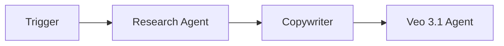
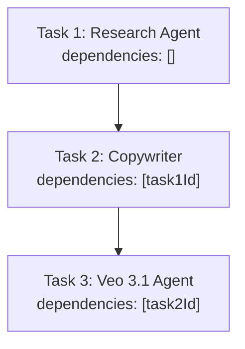
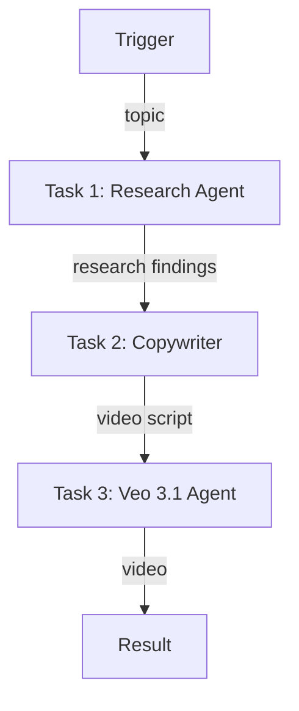

# Video Content Factory

A 3-agent sequential workflow that researches a topic, writes a video script, and generates AI video.

## Pipeline



## Task Dependencies (Sequential)



Each task waits for the previous one to complete before starting.

---

## Complete Setup Script

### Project Structure

```
video-content-factory/
├── src/
│   └── setup.ts
├── .env
├── package.json
└── tsconfig.json
```

### .env

```env
WALLET_PRIVATE_KEY=0x...
```

### Dependencies

```bash
npm init -y && npm pkg set type=module
npm i @openserv-labs/client dotenv
npm i -D @types/node tsx typescript
```

> **Note:** The project must use `"type": "module"` in `package.json`. Add a `"setup": "tsx src/setup.ts"` script for local development.

### src/setup.ts

```typescript
import 'dotenv/config'
import { PlatformClient, triggers } from '@openserv-labs/client'

async function setup() {
  const client = new PlatformClient()

  if (!process.env.WALLET_PRIVATE_KEY) {
    console.error('Missing WALLET_PRIVATE_KEY in .env')
    process.exit(1)
  }

  console.log('1. Authenticating with wallet...')
  await client.authenticate(process.env.WALLET_PRIVATE_KEY)

  console.log('2. Finding agents from marketplace...')
  const researchResult = await client.agents.listMarketplace({ search: 'research' })
  const copywriterResult = await client.agents.listMarketplace({ search: 'copywriter' })
  const veoResult = await client.agents.listMarketplace({ search: 'veo' })
  const research = researchResult.items[0]
  const copywriter = copywriterResult.items[0]
  const veo = veoResult.items[0]

  if (!research || !copywriter || !veo) {
    console.error('   Could not find required agents')
    const all = await client.agents.listMarketplace({})
    all.items.slice(0, 15).forEach(a => console.log(`   ID: ${a.id} | ${a.name}`))
    process.exit(1)
  }

  console.log(`   Research Agent: ${research.name} (ID: ${research.id})`)
  console.log(`   Copywriter: ${copywriter.name} (ID: ${copywriter.id})`)
  console.log(`   Veo 3.1 Agent: ${veo.name} (ID: ${veo.id})`)

  console.log('3. Creating workflow...')
  const workflow = await client.workflows.create({
    name: 'AI Video Studio',
    goal: 'Research any topic in depth, craft a compelling video script, and produce a high-quality AI-generated video with audio',
    agentIds: [research.id, copywriter.id, veo.id],
    triggers: [
      triggers.webhook({
        name: 'webhook',
        waitForCompletion: true,
        timeout: 900,
        input: {
          topic: { type: 'string', title: 'Topic', description: 'Topic for the video' }
        }
      })
    ],
    tasks: [
      {
        name: 'research',
        agentId: research.id,
        description: 'Research the topic',
        body: 'Search the internet about the given topic. Compile research findings into a structured report with key facts, statistics, and insights.',
        input: '{{trigger.topic}}'
      },
      {
        name: 'script',
        agentId: copywriter.id,
        description: 'Write video script',
        body: 'Based on the research findings, write a compelling video script. Structure it with: 1) Hook/intro, 2) Main points with supporting evidence, 3) Call-to-action/conclusion.'
      },
      {
        name: 'video',
        agentId: veo.id,
        description: 'Generate AI video',
        body: 'Generate a high-quality 8-second video with integrated audio based on the script. Use 16:9 wide format.'
      }
    ],
    // ⚠️ CRITICAL: Edges define the workflow execution path
    edges: [
      { from: 'trigger:webhook', to: 'task:research' },
      { from: 'task:research', to: 'task:script' },
      { from: 'task:script', to: 'task:video' }
    ]
  })
  console.log(`   Workflow ID: ${workflow.id}`)

  console.log('4. Activating workflow...')
  const trigger = workflow.triggers[0]
  await client.triggers.activate({ workflowId: workflow.id, id: trigger.id })
  await workflow.setRunning()

  console.log('\n========================================')
  console.log('Video Content Factory Setup Complete!')
  console.log('========================================')
  console.log(`\nWorkflow ID: ${workflow.id}`)
  console.log(`\nWorkflow: Trigger → Research Agent → Copywriter → Veo 3.1`)
  console.log(`\nWebhook URL:`)
  console.log(`  POST https://api.openserv.ai/webhooks/trigger/${trigger.token}`)
  console.log(`\nExample:`)
  console.log(`  curl -X POST https://api.openserv.ai/webhooks/trigger/${trigger.token} \\`)
  console.log(`    -H "Content-Type: application/json" \\`)
  console.log(`    -d '{"topic": "The future of autonomous AI agents"}'`)
  console.log('========================================')
}

setup().catch(err => {
  console.error('Setup failed:', err.message)
  process.exit(1)
})
```

---

## How It Works

1. **Trigger fires** with `{ "topic": "The future of autonomous AI agents" }`
2. **Research Agent** searches the internet for relevant content and compiles findings
3. **Research Agent completes** → Copywriter task becomes ready
4. **Copywriter** creates a video script
5. **Copywriter completes** → Veo 3.1 Agent task becomes ready
6. **Veo 3.1 Agent** generates an 8-second AI video with integrated audio
7. **Veo 3.1 Agent completes** → Video returned via webhook response

## Workflow Graph



## Usage

```bash
# Run setup (creates workflow, tasks, trigger)
npm run setup

# Trigger the workflow
curl -X POST https://api.openserv.ai/webhooks/trigger/{token} \
  -H "Content-Type: application/json" \
  -d '{"topic": "The future of autonomous AI agents"}'
```
