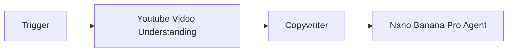
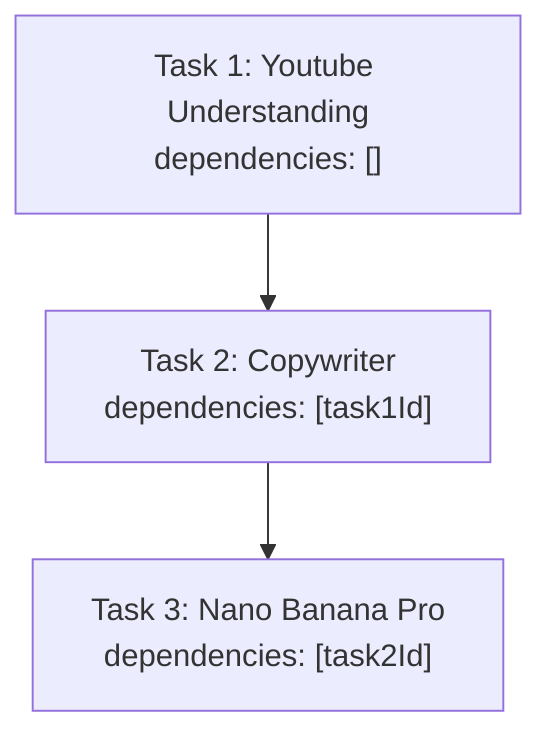
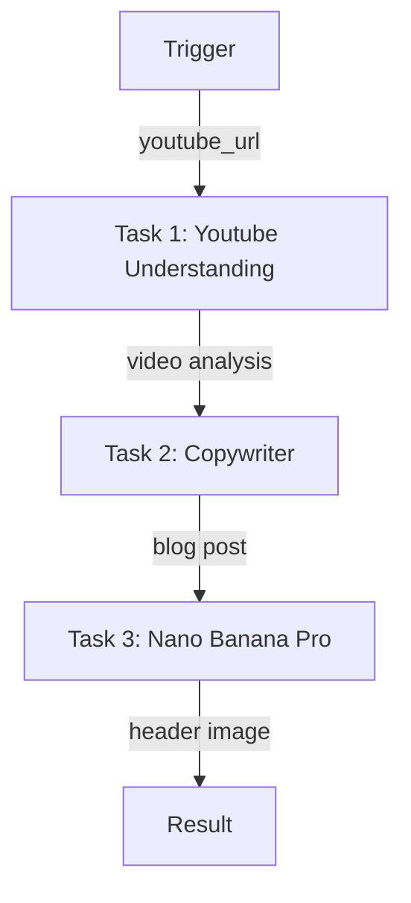

# YouTube to Blog Pipeline

A 3-agent sequential workflow that analyzes a YouTube video, writes a blog post, and generates a header image.

## Pipeline



## Task Dependencies (Sequential)



Each task waits for the previous one to complete before starting.

---

## Complete Setup Script

### Project Structure

```
youtube-to-blog-pipeline/
├── src/
│   └── setup.ts
├── .env
├── package.json
└── tsconfig.json
```

### .env

```env
WALLET_PRIVATE_KEY=0x...
```

### Dependencies

```bash
npm init -y && npm pkg set type=module
npm i @openserv-labs/client dotenv
npm i -D @types/node tsx typescript
```

> **Note:** The project must use `"type": "module"` in `package.json`. Add a `"setup": "tsx src/setup.ts"` script for local development.

### src/setup.ts

**Recommended Approach: Using `workflows.sync()`**

```typescript
import 'dotenv/config'
import { PlatformClient, triggers } from '@openserv-labs/client'

async function setup() {
  const client = new PlatformClient()

  if (!process.env.WALLET_PRIVATE_KEY) {
    console.error('Missing WALLET_PRIVATE_KEY in .env')
    process.exit(1)
  }

  console.log('1. Authenticating with wallet...')
  await client.authenticate(process.env.WALLET_PRIVATE_KEY)

  console.log('2. Finding agents from marketplace...')
  const youtubeResult = await client.agents.listMarketplace({ search: 'youtube' })
  const copywriterResult = await client.agents.listMarketplace({ search: 'copywriter' })
  const nanoBananaResult = await client.agents.listMarketplace({ search: 'nano banana' })
  const youtubeUnderstanding = youtubeResult.items[0]
  const copywriter = copywriterResult.items[0]
  const nanoBanana = nanoBananaResult.items[0]

  if (!youtubeUnderstanding || !copywriter || !nanoBanana) {
    console.error('   Could not find required agents')
    const all = await client.agents.listMarketplace({})
    all.items.slice(0, 15).forEach(a => console.log(`   ID: ${a.id} | ${a.name}`))
    process.exit(1)
  }

  console.log(`   Youtube Understanding: ${youtubeUnderstanding.name} (ID: ${youtubeUnderstanding.id})`)
  console.log(`   Copywriter: ${copywriter.name} (ID: ${copywriter.id})`)
  console.log(`   Nano Banana Pro: ${nanoBanana.name} (ID: ${nanoBanana.id})`)

  console.log('3. Creating workflow...')
  const workflow = await client.workflows.create({
    name: 'YouTube to Blog Converter',
    goal: 'Analyze YouTube videos to extract key insights, transform them into comprehensive blog posts, and generate eye-catching header images',
    agentIds: [youtubeUnderstanding.id, copywriter.id, nanoBanana.id],
    triggers: [
      triggers.webhook({
        name: 'webhook',
        waitForCompletion: true,
        timeout: 900,
        input: {
          youtube_url: { type: 'string', title: 'YouTube URL', description: 'YouTube video URL to convert' }
        }
      })
    ],
    tasks: [
      {
        name: 'analyze',
        agentId: youtubeUnderstanding.id,
        description: 'Analyze YouTube video',
        body: 'Analyze the YouTube video at the given URL. Provide a comprehensive summary including: main topics covered, key points and arguments, notable quotes, and overall message.',
        input: '{{trigger.youtube_url}}'
      },
      {
        name: 'write',
        agentId: copywriter.id,
        description: 'Write blog post',
        body: 'Based on the video analysis, write a comprehensive blog post. Structure it with: 1) Engaging headline, 2) Introduction that hooks the reader, 3) Main content sections with subheadings, 4) Key takeaways, 5) Conclusion.'
      },
      {
        name: 'image',
        agentId: nanoBanana.id,
        description: 'Generate blog header image',
        body: 'Generate an eye-catching header image for the blog post. The image should be visually appealing, professional, and relevant to the blog topic.'
      }
    ],
    // ⚠️ CRITICAL: Edges define the data flow
    edges: [
      { from: 'trigger:webhook', to: 'task:analyze' },
      { from: 'task:analyze', to: 'task:write' },
      { from: 'task:write', to: 'task:image' }
    ]
  })
  console.log(`   Workflow ID: ${workflow.id}`)

  console.log('4. Activating workflow...')
  const trigger = workflow.triggers[0]
  await client.triggers.activate({ workflowId: workflow.id, id: trigger.id })
  await workflow.setRunning()

  console.log('\n========================================')
  console.log('YouTube to Blog Pipeline Setup Complete!')
  console.log('========================================')
  console.log(`\nWorkflow ID: ${workflow.id}`)
  console.log(`\nWorkflow: Trigger → Youtube Understanding → Copywriter → Nano Banana Pro`)
  console.log(`\nWebhook URL:`)
  console.log(`  POST https://api.openserv.ai/webhooks/trigger/${trigger.token}`)
  console.log(`\nExample:`)
  console.log(`  curl -X POST https://api.openserv.ai/webhooks/trigger/${trigger.token} \\`)
  console.log(`    -H "Content-Type: application/json" \\`)
  console.log(`    -d '{"youtube_url": "https://www.youtube.com/watch?v=..."}'`)
  console.log('========================================')
}

setup().catch(err => {
  console.error('Setup failed:', err.message)
  process.exit(1)
})
```

---

## How It Works

1. **Trigger fires** with `{ "youtube_url": "https://www.youtube.com/watch?v=..." }`
2. **Youtube Video Understanding Agent** analyzes the video content
3. **Youtube Understanding completes** → Copywriter task becomes ready
4. **Copywriter** writes a blog post
5. **Copywriter completes** → Nano Banana Pro task becomes ready
6. **Nano Banana Pro** generates a header image for the blog
7. **Nano Banana Pro completes** → Blog post and image returned via webhook response

## Workflow Graph



## Usage

```bash
# Run setup (creates workflow, tasks, trigger)
npm run setup

# Trigger the workflow
curl -X POST https://api.openserv.ai/webhooks/trigger/{token} \
  -H "Content-Type: application/json" \
  -d '{"youtube_url": "https://www.youtube.com/watch?v=..."}'
```
