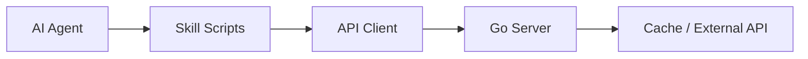

# 🪙 Crypto Market Data Skill (No Key Required)

[](https://opensource.org/licenses/MIT)
[](https://www.python.org/downloads/)
[](https://github.com/liamsu/ai-agent)

A high-performance, professional-grade AI agent skill for fetching real-time and historical cryptocurrency market data. This skill provides a suite of standalone Python scripts that interface with a dedicated market data server, delivering structured JSON output optimized for AI agents and automated workflows.

---

## 🏗️ Architecture

This skill acts as a lightweight client for the **Go Crypto Market Data Server**. It abstracts complex API interactions, authentication, and caching, providing a simple CLI interface for AI agents.



## 🚀 Key Features

*   **⚡ Real-time Market Data**: Instant access to prices, market cap, volume, and 24h performance.
*   **📊 Advanced Charting**: State-of-the-art OHLC candlestick data and historical time-series.
*   **🔍 Power Search**: Advanced fuzzy search for identifying assets by name or symbol.
*   **🌍 Macro Insights**: Global market statistics and public company treasury holdings (BTC/ETH).
*   **⚙️ Zero Dependencies**: Pure Python implementation using only the standard library.
*   **🔐 Seamless Auth**: Integrated session management with automatic token rotation.

---

## 📁 Project Structure

```text
crypto-market-data-skill/
├── SKILL.md                              # Machine-readable logic for AI agents
├── README.md                             # Human-readable documentation
└── scripts/                              # Core toolset
    ├── api_client.py                     # Shared authenticated API client
    ├── check_api_status.py               # Health monitoring tool
    ├── get_coin_details.py               # Deep metadata retrieval
    ├── get_coin_historical_chart.py      # Historical time-series charts
    ├── get_coin_ohlc_chart.py            # Technical analysis OHLC data
    ├── get_crypto_price.py               # Real-time multi-coin prices
    ├── get_global_market_data.py         # Global market overview
    ├── get_public_companies_holdings.py  # Treasury analytics
    ├── get_supported_currencies.py       # Valuation options list
    ├── get_top_coins.py                  # Market capitalization rankings
    ├── get_trending_coins.py             # Hot assets discovery
    └── search_coins.py                   # Asset search engine
```

---

## 🛠️ Getting Started

### Prerequisites
*   **Python 3.7+**
*   Access to a running [Crypto Market Data Server](../crypto-market-data-server) (Default: `https://api.igent.net/api`)

### Configuration
By default, the scripts point to the production API. To use a local server, set the following environment variable:

```bash
export API_BASE_URL="http://localhost:8080/api"
```

---

## 📖 Quick Start & Examples

### 📉 Multi-Asset Price Tracking
Fetch the latest prices for multiple coins in your preferred currency.
```bash
# Get Bitcoin, Ethereum, and Solana prices in USD (Default)
python3 scripts/get_crypto_price.py bitcoin ethereum solana

# Get prices in Japanese Yen
python3 scripts/get_crypto_price.py bitcoin ethereum --currency=jpy
```

### 📊 Technical Analysis (OHLC)
Retrieve candlestick data for technical indicators.
```bash
# Get 7 days of Bitcoin OHLC data
python3 scripts/get_coin_ohlc_chart.py bitcoin --days=7
```

### 🔍 Discovery & Search
Find coins and see what's trending across the global market.
```bash
# Search for a coin ID
python3 scripts/search_coins.py "polka"

# Get the current trending coins
python3 scripts/get_trending_coins.py
```

### 🌍 Global Market Overviews
```bash
# Total market cap, volume, and dominance
python3 scripts/get_global_market_data.py

# Public companies holding Bitcoin
python3 scripts/get_public_companies_holdings.py bitcoin
```

---

## ⚠️ Essential Guidelines

### 🆔 Identifying Assets
The system relies on **Unique Coin IDs** (slugs) rather than ticker symbols to prevent ambiguity.
*   ✅ `bitcoin` (Not `BTC`)
*   ✅ `binancecoin` (Not `BNB`)

Always use `search_coins.py` if the ID is unknown.

### 🔐 Token Management
Authentication is handled internally. `api_client.py` manages a `.token` file in the `scripts/` directory. If requests fail with 401/403, the client will automatically attempt to refresh the session.

### 🚦 Rate Limiting & Performance
*   **Recommended Frequency**: 10-30 requests per minute.
*   **Response Format**: All tools return standardized JSON for easy parsing by logic layers.

---

## 🩺 Troubleshooting

| Issue | Potential Cause | Resolution |
| :--- | :--- | :--- |
| `Connection Refused` | Server is down or URL is wrong | Verify `API_BASE_URL` or check server status. |
| `Invalid Token` | Session expired | Delete `scripts/.token` to force a re-authentication. |
| `Coin Not Found` | Incorrect Coin ID used | Use `search_coins.py` to find the exact ID. |

---

## 🤖 AI Agent Integration

This skill is designed to be **Agent-Native**. It follows the **AgentSkills** specification, making it plug-and-play for:
*   [OpenClaw](https://github.com/OpenClaw/OpenClaw)
*   Custom LangChain / AutoGPT implementations
*   MCP-compatible orchestrators

Refer to [SKILL.md](./SKILL.md) for full tool definitions and input schemas.

---

## 📜 License
This project is licensed under the MIT License. Data is provided by the integrated Crypto Market Data Server.
