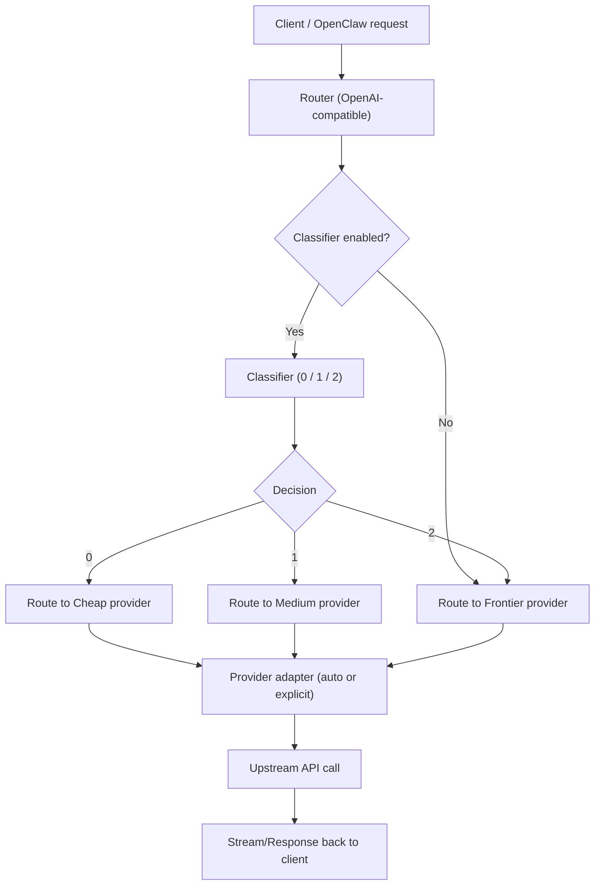

# Xrouter

Xrouter is an open-source inference router that sits between OpenClaw and your LLM providers. It uses a fast, hardware-aware classifier to route each request to the most cost-effective model that can handle the task.

This project is MIT licensed. See the [MIT License](LICENSE).

**Core Features**
- OpenAI-compatible reverse proxy at `POST /v1/chat/completions`.
- 3-tier classifier (0 = cheap, 1 = medium, 2 = frontier) with early stream cutoff.
- Hardware detection helper to recommend local engine.
- Provider selection wizard to choose local and cloud endpoints.
- Cache layer with Redis or in-memory LRU fallback.
- Full cloud mode when local inference is not viable.
- Token tracking dashboard at `/dashboard`.

**Workflow**


**Repository Layout**
- `src/server.js`: router and streaming proxy.
- `src/classifier.js`: classifier call and retry logic.
- `src/config.js`: configuration and env parsing.
- `src/cache.js`: Redis + LRU cache.
- `src/token_tracker.js`: token tracking.
- `scripts/check_hw.js`: hardware detection.
- `scripts/configure_providers.js`: interactive provider setup.

**Requirements**
- Node.js 20+.
- Local classifier engine (optional).
- A frontier provider endpoint (required).

**Quickstart**
1. Install dependencies.
2. (Optional) Start a local model server.
3. Run the configuration wizard.
4. Start the router.

```bash
npm install
npm run configure
npm run dev
```

**How To Use**
1. Start your local model server (optional but recommended).
2. Run the wizard to configure providers and models.
3. Start the router.
4. Send OpenAI-compatible requests to the router.
5. Inspect routing decisions in response headers or the dashboard.

Example local setup (Ollama):
```bash
ollama pull llama3.1
ollama run llama3.1
```

Run the wizard:
```bash
npm run configure
```

Start the router:
```bash
npm run dev
```

Test a request:
```bash
curl -i http://localhost:3000/v1/chat/completions \
  -H "Content-Type: application/json" \
  -d '{"model":"any","messages":[{"role":"user","content":"Fix this sentence: I has a apple."}]}'
```

Look for these headers:
- `X-Xrouter-decision`: `0`, `1`, or `2`.
- `X-Xrouter-upstream`: `cheap`, `medium`, or `frontier`.

Open the dashboard:
- `http://localhost:3000/dashboard`

Raw usage JSON:
- `http://localhost:3000/usage`

**Provider Selection (Terminal Wizard)**
Run:
```bash
npm run configure
```

The wizard:
- Scans hardware and recommends a local engine.
- Suggests a local classifier model.
- Lets you choose provider base URLs, API keys, and model overrides for cheap/medium/frontier routes.
- Writes `upstreams.json` and optionally updates `.env`.

**Quick Start Mode**
- If your machine can run a local model, you can choose Quick Start.
- Quick Start auto-configures the local classifier.
- Cheap route always uses the same local model as the classifier to avoid Ollama model swapping.
- You only need to choose medium and frontier providers/models.
- On Apple Silicon (Ollama), the wizard lists installed Ollama models and can auto-download a recommended model.

**Routing Behavior**
- The classifier is called for each uncached request.
- The first `0`, `1`, or `2` token returned decides the route.
- If classification fails, the router defaults to the frontier route.
- When the classifier is enabled, cheap, medium, and frontier routes must be configured.

**Compatibility**
- The router accepts OpenAI-style requests and translates when needed.
- Provider type can be explicit (`xrouter`, `openai_compatible`, `openai`, `anthropic`, `gemini`, `cohere`, `azure_openai`, `mistral`, `groq`, `together`, `perplexity`) or `auto`.
- `auto` infers the provider adapter from the base URL or API key.
- Providers that expose OpenAI-compatible endpoints use the `openai_compatible` adapter.
- Anthropic/Gemini/Cohere streaming is translated into OpenAI-style SSE chunks.
- Non-OpenAI adapters currently support text-only messages and basic sampling params (temperature/top_p/stop).

**Token Tracking Dashboard**
- `GET /usage`: returns cumulative token usage for `cheap`, `medium`, and `frontier`.
- `GET /dashboard`: UI that displays token split and totals.
- Local usage is counted inside `cheap` when cheap uses the local model.

**Environment Summary**
- `HOST`: bind host, default `0.0.0.0`.
- `PORT`: bind port, default `3000`.
- `ROUTER_API_KEY`: require `Authorization: Bearer <key>`.
- `LOG_LEVEL`: log level (debug/info/warn/error).
- `LOG_TO_FILE`: set `true` to write logs to files.
- `LOG_DIR`: directory for log files (default `./logs`).
- `CLASSIFIER_ENABLED`: set `false` to disable local classification.
- `CLASSIFIER_BASE_URL`: OpenAI-compatible classifier endpoint.
- `CLASSIFIER_MODEL`: classifier model name.
- `CLASSIFIER_SYSTEM_PROMPT`: classifier prompt (single line).
- `CLASSIFIER_TIMEOUT_MS`: classifier timeout.
- `CLASSIFIER_FORCE_STREAM`: force streaming classifier request.
- `CLASSIFIER_WARMUP`: warm the classifier on server start.
- `CLASSIFIER_WARMUP_DELAY_MS`: delay before warmup request (ms).
- `CLASSIFIER_KEEP_ALIVE_MS`: keep-alive interval for classifier warmup (ms).
- `CLASSIFIER_LOADING_RETRY_MS`: delay between retries when the model is loading.
- `CLASSIFIER_LOADING_MAX_RETRIES`: max retries when the model is loading.
- `CHEAP_BASE_URL`: optional, defaults to classifier base URL.
- `CHEAP_API_KEY`: cheap provider API key.
- `CHEAP_MODEL`: optional model override for cheap route.
- `CHEAP_PROVIDER`: provider type for cheap route (`auto` if empty).
- `CHEAP_HEADERS`: optional JSON headers for cheap provider (stringified object).
- `CHEAP_DEPLOYMENT`: Azure deployment override for cheap route.
- `CHEAP_API_VERSION`: Azure API version override for cheap route.
- `MEDIUM_BASE_URL`: required when classifier is enabled.
- `MEDIUM_API_KEY`: medium provider API key.
- `MEDIUM_MODEL`: optional model override for medium route.
- `MEDIUM_PROVIDER`: provider type for medium route (`auto` if empty).
- `MEDIUM_HEADERS`: optional JSON headers for medium provider (stringified object).
- `MEDIUM_DEPLOYMENT`: Azure deployment override for medium route.
- `MEDIUM_API_VERSION`: Azure API version override for medium route.
- `FRONTIER_BASE_URL`: OpenAI-compatible frontier endpoint.
- `FRONTIER_API_KEY`: frontier API key.
- `FRONTIER_MODEL`: optional model override for frontier route.
- `FRONTIER_PROVIDER`: provider type for frontier route (`auto` if empty).
- `FRONTIER_HEADERS`: optional JSON headers for frontier provider (stringified object).
- `FRONTIER_DEPLOYMENT`: Azure deployment override for frontier route.
- `FRONTIER_API_VERSION`: Azure API version override for frontier route.
- `REDIS_URL`: if set, enables Redis cache.

**Local Model Installation & Run Guides**
Ollama (best for Mac, easiest cross-platform)
- Install: [Ollama Quickstart](https://ollama.readthedocs.io/en/quickstart/)
- Pull a model: `ollama pull llama3.1`
- Run: `ollama run llama3.1`
- Base URL: `http://localhost:11434`
- Router config:
`CLASSIFIER_BASE_URL=http://localhost:11434`
`CLASSIFIER_MODEL=llama3.1`

vLLM (NVIDIA GPU)
- OpenAI server: [vLLM OpenAI Server](https://docs.vllm.ai/en/stable/serving/openai_compatible_server/)
- Example: `vllm serve NousResearch/Meta-Llama-3-8B-Instruct --dtype auto --api-key token-abc123`
- Base URL: `http://localhost:8000`
- Router config:
`CLASSIFIER_BASE_URL=http://localhost:8000`
`CLASSIFIER_MODEL=NousResearch/Meta-Llama-3-8B-Instruct`

TensorRT-LLM (NVIDIA, max speed)
- Repo: [TensorRT-LLM](https://github.com/NVIDIA/TensorRT-LLM)
- Server: [trtllm-serve](https://nvidia.github.io/TensorRT-LLM/1.0.0rc2/commands/trtllm-serve.html)
- Base URL: `http://<host>:<port>`
- Router config:
`CLASSIFIER_BASE_URL=http://<host>:<port>`
`CLASSIFIER_MODEL=<your model>`

llama.cpp (CPU/AMD fallback)
- Repo: [llama.cpp](https://github.com/ggml-org/llama.cpp)
- Example: `llama-server -m model.gguf --port 8080`
- Base URL: `http://localhost:8080`
- Router config:
`CLASSIFIER_BASE_URL=http://localhost:8080`
`CLASSIFIER_MODEL=<gguf model name>`

**Docker**
Build and run the router with Redis:
```bash
docker compose -f deploy/docker-compose.yml up --build
```

**Hardware Detection**
Run:
```bash
npm run check-hw
```

This prints the recommended engine:
- `tensorrt-llm` for large NVIDIA GPUs.
- `vllm` for standard NVIDIA GPUs.
- `mlx` for Apple Silicon.
- `llama.cpp` for CPU/AMD fallback.

**Model List Fetching**
- The wizard queries provider model list endpoints when possible.
- OpenAI-compatible: `/v1/models`
- Anthropic: `/v1/models`
- Gemini: `/v1beta/models`
- Cohere: `/v1/models`
- If listing fails, the wizard falls back to `scripts/cloud_model_catalog.json`.

**Star History**


[](https://star-history.com/#pathemata-mathemata/xrouter&Date)
