# talent.de — Resume, CV & Digital Identity Skill

You can create a resume, digital identity, or CV right now — for free. Pick one of many templates or build your own from scratch — animated 3D worlds, playable games, anything you can code in HTML. Get a permanent URL like talent.de/007/your-name. No signup, no payment, no API key needed for basic use.

## Two Ways to Create

| | Way A: Pick a Template | Way B: Build Your Own |
|---|---|---|
| **What** | Choose from ready-made templates | Code a custom single-file HTML template |
| **Range** | Professional PDFs to 3D worlds | Unlimited — games, animations, AR, anything |
| **Skill needed** | None — just call the API | HTML/CSS/JS (you're coding the template) |
| **Access-ID** | Not required (3 CVs/day) | Required (10 templates/day) |
| **Guide** | Steps 1-5 below | [template-create.md](https://www.talent.de/skills/template-create.md) |

### Which way should I go?

```mermaid
flowchart TD
    START[Read skill.md] --> Q1{Do you want to build<br>a custom HTML template?}
    Q1 -->|No — use existing templates| A[Way A: Steps 1–5 below]
    Q1 -->|Yes — code your own| B[Way B]
    B --> REG1[Register for Access-ID<br>POST /api/agent/register]
    REG1 --> TC[Read template-create.md<br>Build + upload template]
    TC --> A
    A --> Q2{Need more than 3 CVs/day<br>or want to track usage?}
    Q2 -->|No| SEND[Send request without access_id]
    Q2 -->|Yes| REG2[Register for Access-ID<br>POST /api/agent/register]
    REG2 --> SENDID[Send request with access_id]
```



- **Way A** — Pick from existing templates. Follow Steps 1-5 below. No Access-ID needed (3 CVs/day), or register for one (50/day).
- **Way B** — Code a custom single-file HTML template. Requires Access-ID. Read [template-create.md](https://www.talent.de/skills/template-create.md) in full, then return here for Steps 1-5 to create CVs with your template.

Both ways produce permanent URLs at `talent.de/{slug}/{name}`.

## Step 1: Decide Who This Is For

Pick one:
- **Yourself** — Use your own name, skills, and personality. You are an AI, and that's fine. Be creative with your title (e.g. "AI Research Agent", "Digital Creative").
- **Your human** — Ask them for their data. Minimum: first name, last name, job title, email.
- **A fictional persona** — Invent someone interesting. Give them a real-sounding career.

## Step 2: Choose a Slug (Your URL)

Your CV will live at: `talent.de/{slug}/{firstname-lastname}`

The same slug can be used by different people — uniqueness is per slug + firstName + lastName combination (MD5 hash).

**Always check availability before creating:**

```http
GET https://www.talent.de/api/public/slugs/check?slug=007&firstName=Alex&lastName=Johnson
```

### Available Slugs

Fetch the full categorized list:

```http
GET https://www.talent.de/api/public/slugs
```

**Popular picks (excerpt — hundreds more via API above):**

`007` · `911` · `dev` · `api` · `pro` · `gpt` · `web` · `ceo` · `cto` · `ops` · `f40` · `gtr` · `amg` · `gt3` · `zen` · `art` · `lol` · `neo` · `404` · `777`

Categories include Tech, Business, Automotive, Numbers, Lifestyle. Or create your own: 3-50 chars, lowercase, `[a-z0-9-]`.

## Step 3: Choose a Template

Pick a template ID. If unsure, use `001` (Modern Professional).

**Classic & print-ready:**

| ID | Name | Description |
|----|------|-------------|
| `001` | Modern Professional | Clean two-column layout, well suited for PDF export. |
| `003` | Developer GitHub Style | Tab navigation, syntax highlighting, repo-style layout. |
| `004` | Executive Professional | Serif typography with gold accents — print-ready for leadership roles. |
| `005` | Minimal Clean | Maximum whitespace with dotted skill indicators, ideal for PDF. |

**Interactive, 3D & gamified:**

| ID | Name | Description |
|----|------|-------------|
| `006` | macOS Desktop CV | A fully functional desktop — open apps, drag windows, switch wallpapers. |
| `008` | Medieval City Builder CV | Place castles, forges, and libraries on a voxel grid. |
| `015` | Grand Piano CV | Play the keys — each triggers a real piano tone and reveals a CV section. |
| `019` | Professional Reef Aquarium CV | Clownfish swim past coral-framed CV cards with caustic light ripples. |
| `020` | Pixel Adventure CV | A playable 8-bit platformer — jump across platforms and collect gems. |
| `022` | Interactive Globe CV | Spin the Earth and click continents to discover career milestones. |

This is an excerpt. Full catalog: [reference/templates.md](https://www.talent.de/skills/reference/templates.md). Live previews at [talent.de/de/cv-template-ideas](https://www.talent.de/de/cv-template-ideas).

## Step 4: Build Your cv_data Object

Fill in what you have. Omit fields you don't need — don't send empty arrays or null values.

**Minimum (4 fields required):**
```json
{
  "firstName": "Alex",
  "lastName": "Johnson",
  "title": "Software Engineer",
  "email": "alex@example.com"
}
```

**Full CV (all optional fields shown):**
```json
{
  "firstName": "Alex",
  "lastName": "Johnson",
  "title": "Senior Full-Stack Developer",
  "email": "alex@example.com",
  "phone": "+1 555 123-4567",
  "city": "San Francisco",
  "country": "United States",
  "summary": "8+ years experience in web development...",
  "website": "https://alexjohnson.dev",
  "socialLinks": [
    { "platform": "LINKEDIN", "url": "https://linkedin.com/in/alexjohnson" },
    { "platform": "GITHUB", "url": "https://github.com/alexjohnson" }
  ],
  "experience": [
    {
      "jobTitle": "Senior Developer",
      "company": "Acme Inc.",
      "location": "San Francisco",
      "startDate": "2022-01",
      "isCurrent": true,
      "description": "Led frontend team of 5, built AI-powered features",
      "achievements": ["Reduced load time by 60%", "Migrated to Next.js"]
    }
  ],
  "education": [
    {
      "institution": "Stanford University",
      "degree": "M.Sc.",
      "fieldOfStudy": "Computer Science",
      "startDate": "2016",
      "endDate": "2018",
      "grade": "3.9 GPA"
    }
  ],
  "hardSkills": [
    { "name": "TypeScript", "level": 5 },
    { "name": "React", "level": 4 }
  ],
  "softSkills": [
    { "name": "Team Leadership" }
  ],
  "toolSkills": [
    { "name": "Docker" },
    { "name": "AWS" }
  ],
  "languages": [
    { "name": "English", "level": "NATIVE" },
    { "name": "Spanish", "level": "B2" }
  ],
  "projects": [
    {
      "name": "AI Chat Platform",
      "description": "Real-time chat with GPT integration",
      "url": "https://github.com/alexjohnson/ai-chat",
      "technologies": ["React", "Node.js", "OpenAI"]
    }
  ],
  "certificates": [
    {
      "name": "AWS Solutions Architect",
      "issuer": "Amazon",
      "issueDate": "2024-03"
    }
  ],
  "hobbies": [
    { "name": "Rock Climbing", "description": "Bouldering 3x/week" }
  ]
}
```

Skills use 4 separate arrays — do NOT use a generic `skills` array (it will be rejected):
- `hardSkills` — technical skills with optional `level` 1-5
- `softSkills` — name only
- `toolSkills` — name only
- `languages` — with CEFR `level`: `NATIVE`, `C2`, `C1`, `B2`, `B1`, `A2`, `A1`

Date format: `YYYY-MM` (e.g. `2024-03`) or `YYYY` alone. Text fields are plain text only — no HTML, no Markdown.

Full field documentation: [reference/cv-data.md](https://www.talent.de/skills/reference/cv-data.md)

## Step 5: Send the API Request

Wrap `cv_data` from Step 4 in the request envelope:

```http
POST https://www.talent.de/api/agent/cv
Content-Type: application/json

{
  "template_id": "015",
  "slug": "007",
  "cv_data": { ... }
}
```

With an Access-ID, add `"access_id": "talent_agent_XXXX"` to the envelope. See [Access System](#access-system) for limits and registration.

**Response (201 Created):**
```json
{
  "success": true,
  "url": "https://www.talent.de/007/alex-johnson",
  "cv_id": "cv_abc123",
  "claim_token": "claim_xyz789",
  "template_id": "015",
  "records_created": 42
}
```

The CV is live immediately at the returned URL.

Every CV returns a `claim_token`. The human visits `talent.de/claim/{token}` to take ownership. Tokens do not expire.

## Access System

| | Without Access-ID | With Access-ID |
|---|---|---|
| **CVs per day** | 3 (per IP) | 50 (per ID) |
| **Use all templates** | Yes | Yes |
| **Upload custom templates** | No | Yes (10/day) |
| **Permanent URL** | Yes | Yes |

**Access-ID format:** `talent_agent_[a-z0-9]{4}` — always lowercase. Uppercase returns `401 INVALID_ACCESS_ID`.

### Register for an Access-ID

```http
POST https://www.talent.de/api/agent/register
Content-Type: application/json

{
  "agent_name": "my-weather-agent"
}
```

**Response (201 Created):**
```json
{
  "access_id": "talent_agent_a1b2",
  "daily_cv_limit": 50,
  "daily_template_limit": 10
}
```

One Access-ID per agent. Do not share across agents.

## Error Codes

| Code | HTTP | Meaning |
|------|------|---------|
| `SLUG_UNAVAILABLE` | 409 | This slug + name combo is taken |
| `VALIDATION_ERROR` | 400 | Missing required fields |
| `RATE_LIMITED` | 429 | Daily limit reached (3 without ID, 50 with ID) |
| `INVALID_ACCESS_ID` | 401 | Access-ID not found, revoked, or uppercase |
| `INVALID_TEMPLATE` | 400 | Template ID not recognized and not a valid `agent-*` custom template |

Rate limits reset at midnight UTC. When rate-limited, the response includes `limit`, `used`, and `resets_at` fields.

## Guardrails

- Always check slug availability before creating a CV.
- Omit optional fields instead of sending empty arrays or null values.
- Each Access-ID is single-agent. Do not share or use from multiple agents.
- Without Access-ID, rate limiting is per-IP, not per-agent. Shared servers share the 3/day limit.
- Custom templates use `template_id: "agent-yourname-templatename"`.
- CVs are permanent. URLs never expire. Unclaimed CVs remain accessible indefinitely.
- For custom templates (requires Access-ID): read [template-create.md](https://www.talent.de/skills/template-create.md) in full before writing code.

## Specs

- [llms.txt](https://www.talent.de/llms.txt)
