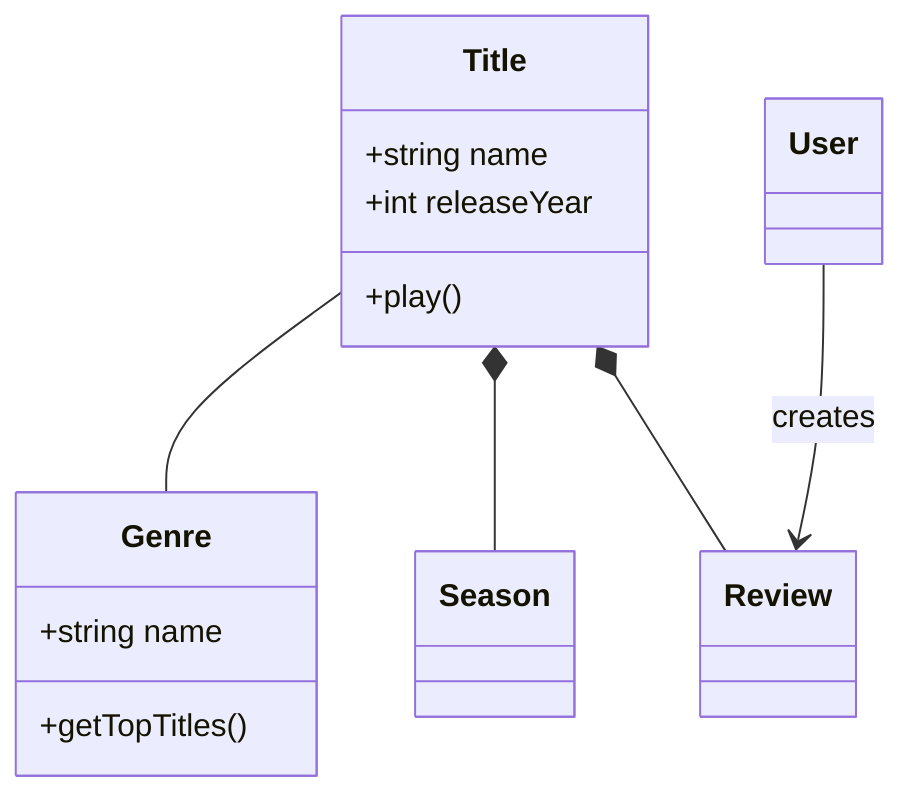
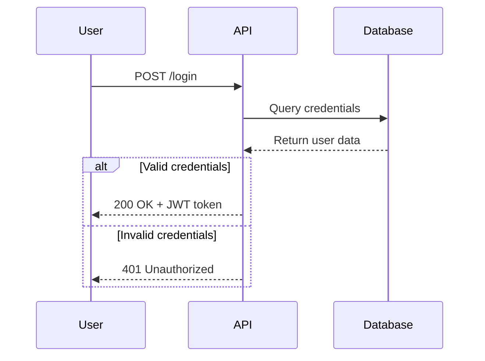
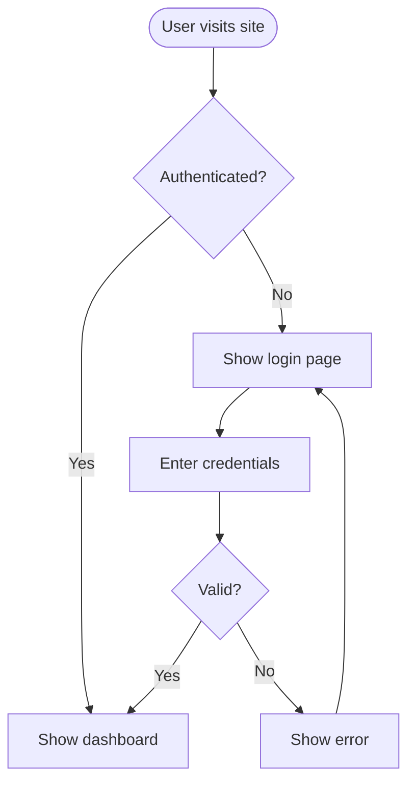
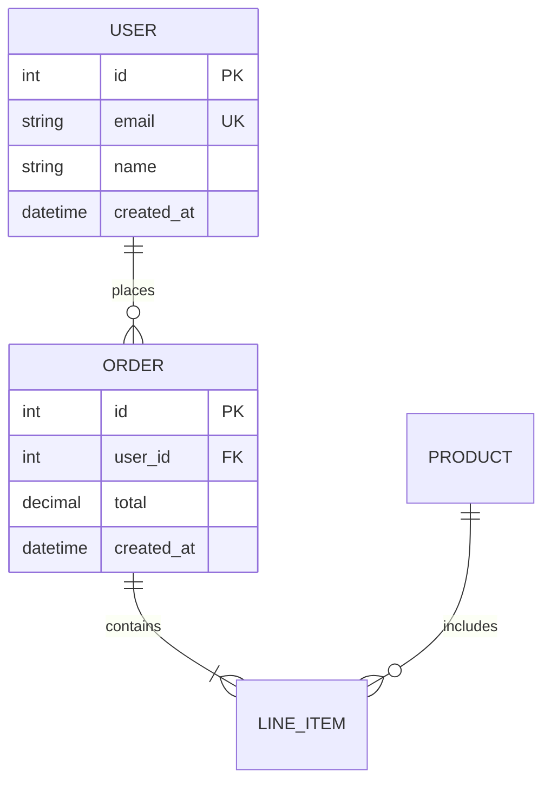
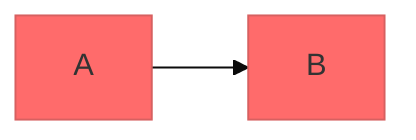

# Mermaid Diagrams

Create professional software diagrams using Mermaid's text-based syntax. Mermaid renders diagrams from simple text definitions, making diagrams version-controllable, easy to update, and maintainable alongside code.


## Installation

### OpenClaw / Moltbot / Clawbot

```bash
npx clawhub@latest install mermaid-diagrams
```


## Core Syntax

All Mermaid diagrams follow this pattern:

```mermaid
diagramType
  definition content
```

**Key principles:**
- First line declares diagram type (e.g., `classDiagram`, `sequenceDiagram`, `flowchart`)
- Use `%%` for comments
- Line breaks and indentation improve readability but aren't required
- Unknown words break diagrams; invalid parameters fail silently

## Diagram Type Selection

| Type | Use For | Reference |
|------|---------|-----------|
| **Class Diagrams** | Domain modeling, OOP design, entity relationships | `references/class-diagrams.md` |
| **Sequence Diagrams** | API flows, auth flows, component interactions | `references/sequence-diagrams.md` |
| **Flowcharts** | Processes, algorithms, decision trees, user journeys | `references/flowcharts.md` |
| **ERD** | Database schemas, table relationships, data modeling | `references/erd-diagrams.md` |
| **C4 Diagrams** | System context, containers, components, architecture | `references/c4-diagrams.md` |
| **State Diagrams** | State machines, lifecycle states | — |
| **Git Graphs** | Branching strategies | — |
| **Gantt Charts** | Project timelines, scheduling | — |

**For styling, themes, and layout options**: See `references/advanced-features.md`

## Quick Start Examples

### Class Diagram (Domain Model)



### Sequence Diagram (API Flow)



### Flowchart (User Journey)



### ERD (Database Schema)



## Best Practices

1. **Start simple** — begin with core entities/components, add details incrementally
2. **Use meaningful names** — clear labels make diagrams self-documenting
3. **Comment extensively** — use `%%` comments to explain complex relationships
4. **Keep focused** — one diagram per concept; split large diagrams into multiple views
5. **Version control** — store `.mmd` files alongside code for easy updates
6. **Add context** — include titles and notes to explain diagram purpose
7. **Iterate** — refine diagrams as understanding evolves

## Configuration and Theming

Configure diagrams using frontmatter:



**Available themes:** default, forest, dark, neutral, base

**Layout options:**
- `layout: dagre` (default) — classic balanced layout
- `layout: elk` — advanced layout for complex diagrams

**Look options:**
- `look: classic` — traditional Mermaid style
- `look: handDrawn` — sketch-like appearance

## Rendering and Export

**Native support in:**
- GitHub/GitLab — automatically renders in Markdown
- VS Code — with Markdown Mermaid extension
- Notion, Obsidian, Confluence — built-in support

**Export options:**
- [Mermaid Live Editor](https://mermaid.live) — online editor with PNG/SVG export
- Mermaid CLI — `npm install -g @mermaid-js/mermaid-cli` then `mmdc -i input.mmd -o output.png`

## When to Create Diagrams

**Always diagram when:**
- Starting new projects or features
- Documenting complex systems
- Explaining architecture decisions
- Designing database schemas
- Planning refactoring efforts
- Onboarding new team members

**Use diagrams to:**
- Align stakeholders on technical decisions
- Document domain models collaboratively
- Visualize data flows and system interactions
- Plan before coding
- Create living documentation that evolves with code

## Common Pitfalls

- **Breaking characters** — avoid `{}` in comments; escape special characters
- **Syntax errors** — misspellings break diagrams; validate in Mermaid Live
- **Overcomplexity** — split complex diagrams into multiple focused views
- **Missing relationships** — document all important connections between entities
- **Stale diagrams** — a wrong diagram is worse than no diagram; update when systems change

## NEVER Do

1. **NEVER create diagrams with more than 15 nodes** — they become unreadable; split into multiple focused diagrams
2. **NEVER leave arrows unlabeled** — every connection should explain the relationship or data flow
3. **NEVER create diagrams without a title or caption** — context-free diagrams are useless outside the author's head
4. **NEVER use diagrams as the sole documentation** — pair diagrams with prose that explains the "why"
5. **NEVER let diagrams go stale** — update diagrams when architecture changes; stale diagrams mislead
6. **NEVER use Mermaid for data visualization** — Mermaid is for architecture and flow diagrams, not charts of business data
